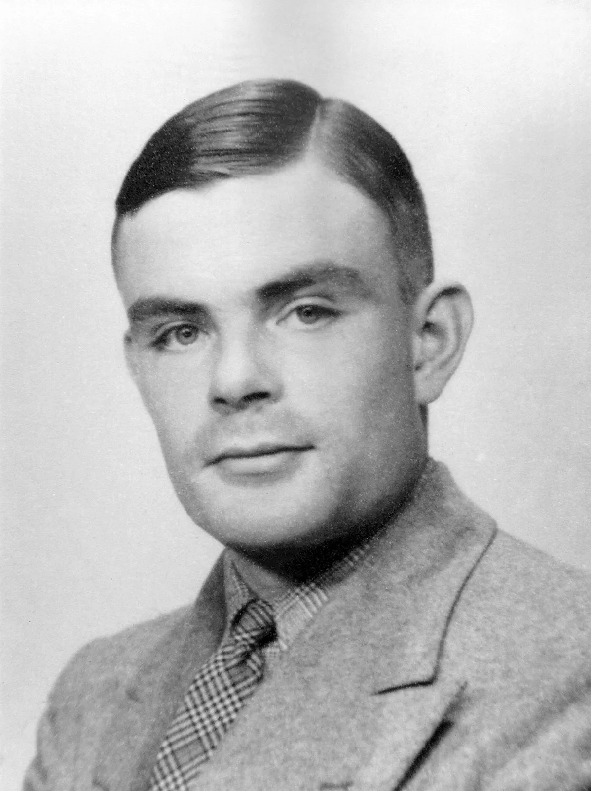
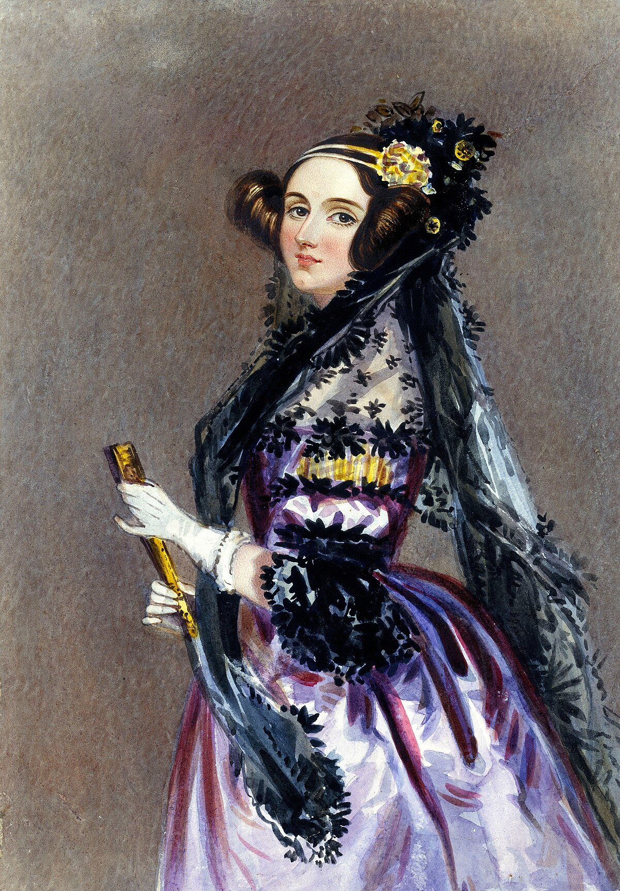
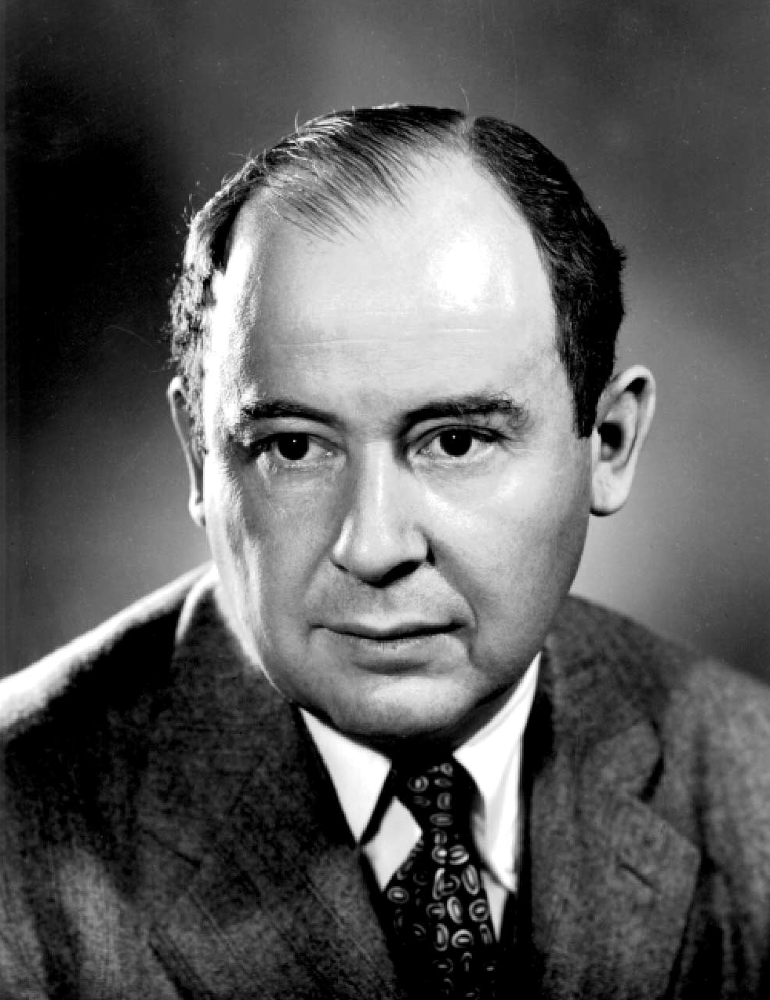

--- 
layout: home
title: Minicurso de Matemática aplicada à Computação
---

# {{ page.title }}

 

Bem vindo ao site oficial do Minicurso de Estruturas de Dados e Agoritmos ofertado pelo PET de Ciência da Computação.

O Minicurso será ofertado do perído de xx-xx???/02/2026, e as aulas serão das 14h até as 18h, no LCC2 do Departamento de Informática e Matemática Aplicada (DIMAP), UFRN.

Você pode consultar o material das aulas que foram ministradas até agora em [`/aulas`](/aulas.md) e saber mais sobre o Minicurso em geral em [`/sobre`](/sobre.md).



<!--## Objetivo do Curso

Esse curso foi desenvolvido pelo PETCC com o objetivo de introduzir conceitos matemáticos e suas utilidades na computação e programação - sobretudo aos calouros do BTI e do BCC - com o objetivo de facilitar o entendimento de materiais em disciplinas futuras e estabelecer uma ligação entre elas e a área da computação.

Assim, guiados por pesquisas de demanda e interesse realizadas anteriormente pelo PET, procuramos introduzir conceitos matemáticos como Lógica, Teoria dos Conjuntos, Indução, Recursão e Teoria dos números de forma simples e compreensível, os relacionando com as áreas da Computação e Programação
-->
## Introdução ao curso

Olá a todos! Sejam bem-vindos ao curso de Estruturas de Dados e Algoritmos do PET-CC.

Você sabe como as Estruturas de Dados que usamos enquanto programamos são implementadas? Neste curso, vamos dar uma olhada por baixo dos panos e entender como os nossos computadores organizam as nossas informações para rodarem um programa! Com isso, buscamos mostrar a vocês como entender tal funcionamento pode melhorar e expandir as nossas maneiras de pensar algoritmos e interagir com computadores.

<!--

### Matemática e Computação

A Computação tem suas raízes profundamente entrelaçadas com a Matemática, visto que toda a sua base teórica veio do trabalho de diversos matemáticos ao longo dos últimos séculos. Ada Lovelace, no século XIX, criou o primeiro algoritmo para a Máquina Analítica de Babbage, mostrando como máquinas poderiam processar lógica além de números. No século XX, Turing definiu os fundamentos teóricos da computação, Von Neumann revolucionou a arquitetura dos processadores, e Boole forneceu a base lógica para a programação moderna. Hoje, toda essa herança alimenta algoritmos de inteligência artificial, sustenta a criptografia, otimiza sistemas e modela gráficos digitais.

  

    
    
<em>Alan Turing (1912-1954)</em>

  

  

    
    
<em>Ada Lovelace (1815-1852)</em>

  

  
  

    
    
<em>John von Neumann (1903-1957)</em>

  

-->

## Programação do curso



---

&copy; PET-CC/UFRN 2025 Licenciado sob <a href="https://creativecommons.org/licenses/by-nc-sa/4.0/deed.pt-br">CC BY-NC-SA</a>.

