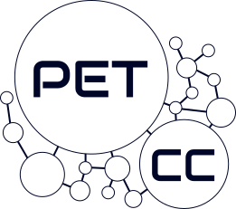

--- 
layout: home
title: Minicurso de Matemática aplicada à Computação
---

# {{ page.title }}

 

Bem vindo ao site oficial do Minicurso de Estruturas de Dados e Agoritmos ofertado pelo PET de Ciência da Computação.

O Minicurso será ofertado do perído de 23-27/02/2026, e as aulas serão das 14h até as 18h, no *LabEnsino* do Departamento de Informática e Matemática Aplicada (DIMAP), UFRN.

Você pode consultar o material das aulas que foram ministradas até agora em [`/aulas`](https://petcc-ufrn.github.io/minicurso-estruturas-de-dados/aulas) e saber mais sobre o Minicurso em geral em [`/sobre`](https://petcc-ufrn.github.io/minicurso-estruturas-de-dados/sobre).



## Introdução ao curso

Olá a todos! Sejam bem-vindos ao curso de Estruturas de Dados e Algoritmos do PET-CC.

Você sabe como as Estruturas de Dados que usamos enquanto programamos são implementadas? Neste curso, vamos dar uma olhada por baixo dos panos e entender como os nossos computadores organizam as nossas informações para rodarem um programa! Com isso, buscamos mostrar a vocês como entender tal funcionamento pode melhorar e expandir as nossas maneiras de pensar algoritmos e interagir com computadores.

## Programação do curso



---

&copy; PET-CC/UFRN 2025 Licenciado sob <a href="https://creativecommons.org/licenses/by-nc-sa/4.0/deed.pt-br">CC BY-NC-SA</a>.

