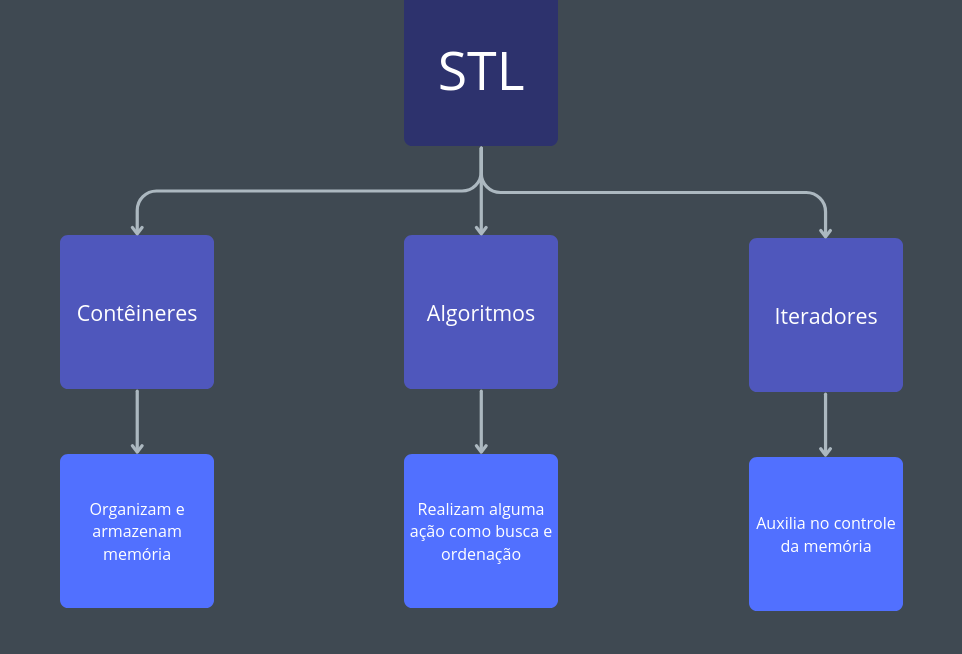

<div id="sumario" class="sumario-git">
    <h1>Dia 1</h1>
    <details>
        <summary><a href="#introdução-à-algoritmos">Introdução à Algoritmos</a></summary>
        <ul>
            <li><a href="#definição-e-história">Definição e História</a></li>
            <li><a href="#importância-nos-dias-atuais">Importância nos Dias Atuais</a></li>
        </ul>
    </details>  
    <details>
         <summary><a href="#revisão-de-c">Revisão de C++</a></summary>
        <ul>
            <li><a href="#motivação">Motivação</a></li>
            <li><a href="#diferença-de-sintaxe">Diferença de Sintaxe</a></li>
            <li><a href="#comandos-simples">Comandos Simples</a></li>
            <li><a href="#análise-de-códigos-em-c">Análise de Códigos em C++</a></li>
            <li><a href="#qual-é-o-melhor">Qual é o melhor?</a></li>
        </ul>
    </details>
    <details>
        <summary><a href="#análise-assintótica"> Análise Assintótica</a></summary>
        <ul>
            <li><a href="#introdução"> Introdução</a></li>
            <ul>
                <li><a href="#pior-caso"> Pior Caso </a></li>
                <li><a href="#melhor-caso"> Melhor Caso</a></li>
                <li><a href="#caso-médio"> Caso Médio </a></li>
            </ul>
            <li><a href="#notações-o-θ-e-𝝮"> Notações O, Θ e 𝝮 </a></li>
            <li><a href="#exercícios"> Exercícios</a></li>
        </ul>
    </details>
    <details>
        <summary><a href="#cálculo-assintótico"> Cálculo Assintótico </a></summary>
        <ul>
            <li><a href="#tabela-de-complexidade"> Tabela de Complexidade</a></li>
            <li><a href="#o-que-é-eficiência"> O que é Eficiência? </a></li>
                <li> <a href="#eficiência-de-tempo-x-espaço"> Eficiência de Tempo X Espaço</a></li>
                <ul>
                    <li><a href="#stl"> STL </a></li>
                </ul>
            <li><a href="#exercícios-1"> Exercícios </a></li>
        </ul>
    </details>
  <button class="toggle-button" id="toggle-button">
      Esconder Sumário
  </button>
</div>
<br>


# Introdução à Complexidade Assintótica

## Introdução à Algoritmos  
<!--

Como o nome surgiu

definição

Timeline de acontecimentos históricos sobre algoritmos 

-->


### Definição de Algoritmos

De forma informal, um **algoritmo** pode ser definido como qualquer procedimento computacional bem definido, que recebe um valor (ou conjunto de valores) como **entrada** e produz um valor (ou conjunto de valores) como **saída** (Cormen, 2002).

Outra forma de enxergar algoritmos é como ferramentas para **resolver problemas computacionais específicos**. Nessa perspectiva, o algoritmo descreve a relação **entrada-saída** de um programa (Cormen, 2002).

Assim, pode-se entender um algoritmo como um **conjunto de instruções** destinadas a realizar uma tarefa.

**Exemplo:**  
Dada a sequência `<4, 6, 2, 7, 8>` como entrada, um algoritmo de ordenação pode seguir os seguintes passos:
1. Comparar os elementos da sequência;
2. Identificar pares fora de ordem;
3. Trocar esses elementos de posição;
4. Repetir o processo até que não existam mais elementos fora de ordem.

Assim, o algoritmo retorna `<2, 4, 6, 7, 8>` como saída.

### Etapas para resolver problemas

---

### História e Evolução dos Algoritmos

#### Antiguidade

- **Algoritmo de Euclides (300 a.C.)**  
  Técnica para encontrar rapidamente o **MDC** (máximo divisor comum) de dois inteiros.

#### Idade de Ouro Islâmica (Século IX)

- **Muhammad ibn Musa al-Khwarizmi**, matemático que contribuiu para o desenvolvimento da álgebra.  
- Para resolver equações matemáticas, al-Khwārizmī seguia sistematicamente uma sequência de passos, conceito fundamental de **algoritmo**.  
- Após ser traduzido para o latim, seu livro sobre numerais hindus recebeu o título *Algorithmi de Numero Indorum*, origem da palavra *algoritmo*.

#### Século XIX

- **Ada Lovelace** criou o que é considerado o **primeiro algoritmo de computador**, projetado para calcular números de Bernoulli na máquina analítica de Babbage.

#### Década de 1930


- **Alan Turing**: Formalizou o conceito de computação com a **Máquina de Turing**, estabelecendo a base teórica da ciência da computação moderna.
- Introduziu a noção de “computável”.

---

<!-- 
Acho que essa parte pode ser no final
-->

## "Introdução" à Estruturas de Dados

Para compreender o conceito de Estruturas de Dados, é fundamental conhecer primeiro os Tipos Abstratos de Dados (TADs). Esses dois conceitos estão diretamente relacionados, mas não são a mesma coisa.

### Tipos Abstrados de Dados (TAD)
Um TAD é formado por:
- um **conjunto de dados**
- um **conjunto de operações** para manipular esses dados

Vamos exemplificar a seguir.

Podemos definir o TAD Pilha da seguinte forma:
- `Pilha{topo, tamanho}`

Para manipular esse conjunto podemos usar as operações:
- `criarPilha()` - cria uma pilha com tamanho n
- `push(x)` - empilha um elemento x
- `pop()` - remove o elemento do topo
- `top()` - consulta o topo
- `isEmpty()` - verifica se está vazia
- `destruirPilha()` - apaga uma pilha

Note que foi definido apenas quais dados existem e quais operações podem ser feitas, sem dizar como isso é implementado.

### Definição de Estruturas de Dados
Uma Estrutura de Dados é a implementação concreta de um TAD em uma linguagem de programação, usando algoritmos.

As estruturas estabelecem:
- a forma que os dados são dispostos na memória
- como as operações são realizadas

Vamos implementar a Pilha, usando um array:

```cpp
struct Pilha {
    int* dados;        // array que armazena os elementos
    int topo;          // índice do topo da pilha
    int capacidade;    // tamanho máximo da pilha
};

Pilha* criarPilha(int capacidade) {
    Pilha* p = new Pilha;
    p->dados = new int[capacidade];
    p->capacidade = capacidade;
    p->topo = -1;
    return p;
}

void push(Pilha* p, int x) {
    if (p->topo == p->capacidade - 1)
        throw std::overflow_error("Pilha cheia");

    p->dados[++p->topo] = x;
}

int pop(Pilha* p) {
    if (isEmpty(p))
        throw std::underflow_error("Pilha vazia");

    return p->dados[p->topo--];
}

bool isEmpty(Pilha* p) {
    return p->topo == -1;
}

void destruirPilha(Pilha* p) {
    delete[] p->dados;
    delete p;
}
```

## Importância nos Dias Atuais <!-- JOGOS :o -->


##  Revisão de C++
### Motivação             <!-- Explicar por que estamos usando C++-->

Uma dúvida comum sobre as matérias introdutórias de Algoritmos e Estruturas de Dados é sobre a linguagem utilizada, tanto que raramente vemos aulas utilizando linguagens de alto nível como Python e Java, mesmo que as aplicações estejam presentes nos dois.

O motivo disso é o controle de memória poderoso que as linguagens de baixo nível como C, C++ e Rust possuem. Por exemplo, por que nós deveríamos implementar listas em Java, sendo que C++ permite a manipulação direta de memória (além de ser BEM mais rápido...).
No fim, utilizamos linguagens de baixo nível para matérias como essas por conta de sua praticidade em torno do controle de memória, onde, mesmo não impedindo a implementação em linguagens de alto nível, definitivamente é a opção mais eficiente.


#### Porém, por que nós iremos utilizar C++ ao invés de C e Rust?

Excelente pergunta!

<details>
<summary> SPOILER! </summary>

    Simplicidade :)

</details>

Escolhemos o C++ principalmente por conta de seu alto uso em disciplinas de graduação e pela sua grande versatilidade de ferramentas, tornando esse curso uma porta de entrada mais segura para disciplinas futuras.


### C++ x C

Como o nome já diz, o C++ tem como objetivo principal adicionar novas funcionalidades para o C, sendo as principais adições: 

* Suporte para programação orientada ao objeto (POO).

* Inclusão do STL (Standard Template Library). 

* Sistema de gerenciamento de memória mais seguro.

Essas mudanças não tornam C++ uma linguagem "superior" ao C, mas diferenciam o principal uso das duas. Veremos a seguir as principais "diferenças" entre cada sintaxe, de forma a se preparar para analisar alguns algoritmos em C++.


### Comandos Simples

#### Variáveis, Condicionais, Loops e Funções

Pelo incrivel que pareça, a sintaxe de C++ é extremamente similar à sintaxe de C (um pouco óbvio, mas é bom assentuar).

Em geral, todas essas estruturas irão funcionar exatamente da mesma forma em C++, logo, revisaremos cada uma delas de forma rápida.

##### Variáveis 

A declaração de variáveis segue o padrão `tipo` + `nome da variável`:

```cpp

int main() {

    int inteiro;
    float flutuante;
    long  woooooooow;
    bool booleano;
    char caractere1, caractere2; // Ao colocar a vírgula, estamos declarando 2 (duas) variáveis do tipo char.


    return 0;
}

```

Do mesmo jeito, as operações vistas nos tipos int, float, long em C funcionam exatamente da mesma forma em C++:

```cpp

int main(){

    int num1, num2, num3, num4;
    num1 = 2;
    num2 = 5;
    num3 = 10;

    
    num1 += num2 // num1 = 2 + 5 = 7 
    num4 = num2 * num3; // num4 = 5 * 10 = 50
    num2 -= 1; // num2 = 5 - 1 = 4
    
    
    // (...)

    return 0;
}

```

##### Arrays

Embora arrays também sejam tipos, separamos em outro sub-tópico por ser importante para tópicos futuros.

Arrays são apenas "coleções ordenadas" de elementos de algum tipo. Declaramos algum array da seguinte forma:

`tipo` + `nome do array[tamanho do array]`.

Cada elemento de um array pode ser acessado após a declaração, apenas colocando sua posição dentro dos colchetes:

```cpp
int arrayInt[4];

arrayInt[0] // Primeiro elemento do array
arrayInt[1] // Segundo elemento do array
arrayInt[2] // Terceiro elemento do array
arrayInt[3] // Quarto elemento do array


```

Após isso, podemos atribuir seus valores de duas maneiras, individualmente (atribuindo um por um), ou de forma direta (igualando à alguma lista de mesmo tamanho durante a declaração):

```cpp

// podemos "encher" um array das seguintes formas:

int arrayInt[4];


arrayInt[0] = 0;
arrayInt[1] = 1;
arrayInt[2] = 2;
arrayInt[3] = 3;


// ou também podemos atribuir seu valor durante a declaração:

int arrayInt[] = {0, 1, 2, 3}

```

##### Condicionais

As condicionais serão, como o nome sugere, estruturas que irão executar alguma ação com base em alguma condição, onde em geral será dada por um booleano, ou uma expressão que retorne um booleano.

Iremos utilizar, similar ao C, o comando `if` (se) e `else`(senão) para representar essa estrutura, tendo como padrão:
```cpp

if(condição){
    //(...)
}

//ou, caso queira utilizar um caso contrário:

if(condição){
    //(...)
}
else{
    //(...)
}

```

Caso você queira encontrar algum caso que não seja exatamente o contrário de sua condição, você pode juntar os dois comandos, formando um `else if`, como visto abaixo:


```cpp

if(condição1){
    //(...)
}
else if(condição2){     // note que o que irá acontecer nesse "else if" apenas acontece se a 
                        // condição 1 for falsa e a condição 2 for verdadeira
    //(...)
}

```

Podemos utilizar condicionais para garantir que um pedaço de nosso programa funcione de formas específicas para cada caso:

```cpp

int main() {

    int num1, num2, num3, num4;

    num2 = 5;
    num3 = 10;

    if(num1 == num2){
        num4 = num1;
    }
    else if(num1 == num2 * num3){
        num4 = num3;
    }
    else{
        num4 = 0;
    }                            

    return 0;
}

```
Existe também outra estrutura em C++ que é o switch case. Ele irá funcionar de forma similar ao `if`, porém ao invés de escolher um caso com base em uma proposição, ela irá escolher com base no valor de alguma variável.

O comando `switch` segue o padrão:

```cpp

tipo variavel;

switch(variavel) {

    case(valor1):
        //(...)
        break;
    case(valor2):
        //(...)
        break;

    //(...)

    default:        //default é um "caso padrão", mas é opcional.
        //(...)
}

```
Geralmente o uso do switch case é focado em números inteiros, principalmente para ver casos onde algum número se iguala a outro.

```cpp

int main(){

    int dia;
    dia = 2;
    switch(dia){
        case 1:
            // é domingo
            break;
        case 2:
            // é segunda
            break;
        case 3:
            // é terça
            break;
        case 4:
            // é quarta
            break;
        case 5:
            // é quinta
            break;
        case 6:
            // é sexta
            break;
        case 7:
            // é sábado
            break
    }
    
    return 0;
}

```

##### Loops

Os loops tem 3 (três) "tipos de estrutura" principais, onde cada uma tem algum uso específico.
Elas seguem, respectivamente, os seguintes padrões de escrita: 

```cpp

    for(variavel de controle; condição ; contador)


    while(condição)


    do{
        //(...)
    }while(condição)


```
Caso você nunca tenha visto C ou C++, talvez esteja se perguntando: `qual a diferença entre eles?`, o que é bem normal.

Em geral, cada um deles possuem pequenas coisas que os tornam diferentes e "melhores" em determinados casos:

```c++

for() := Quando você precisa saber qual passo do loop você está

while() := Quando você não precisa saber o passo que você está.

do{}while() := Quando você quer realizar uma ação antes da condição acontecer.

```

No fim, você até consegue utilizar qualquer um deles de forma análoga, porém por questões de boas práticas e performance, o recomendado é utilizar cada um em seu respectivo contexto.


```cpp 

int main(){

    int array[5];

    for(int i = 0; i < 5; i += 1){
        array[i] = i;
    }

    return 0;
    }


```

Você sabe dizer o que esse loop faz?

<details>
<summary> SPOILER! </summary>

    transforma o array em {0, 1, 2, 3, 4}, passando por cada posição dele.

</details>


##### Funções

Em geral, funções são basicamente blocos de codigos que retornam algum valor. Nelas, podemos passar valores (que chamamos de parâmetros ou argumentos), esses valores não tem quantidade máxima e podem ser alterados dentro das funções, porém, retornam ao valor inicial após ela terminar.

Futuramente iremos descobrir como fazer essas funções alterarem permanentemente os parâmetros, porém, por agora assumiremos que elas são "funções puras" que não afetam eles.

As funções são declaradas da seguinte forma:

```cpp
tipo nome_da_função(){
    // conteúdo da função
    //(...)
    return valor // esse valor é do tipo da função.
}

//para adicionar parâmetros, basta declara-los em seus parênteses:

tipo nome_da_função(tipo1 valor1, tipo2, valor2){
    // conteúdo da função
    //(...)
    return valor // esse valor é do tipo da função.
}

```

Após a declaração e definir o que está na função, você poderá chamá-la em qualquer corpo, apenas colocando o nome dela e seus parâmetros:

```cpp

int modulo(int a){
    if(a < 0){
        return -a;
    }
    
    return a;
    
}

int main(){

    int valor1, valor2;

    valor1 = -9;
    valor2 = modulo(valor1);
                            // valor2 será 9.
    return 0;
}

```
#### Ponteiros

Calma, não se assuste.

Sabemos que esse tópico é meio chatinho para algumas pessoas, porém é de extrema importância. Não iremos abordar tanta coisa sobre ponteiros, apenas entender por cima como eles funcionam e aplicar na criação de estruturas de dados mais complexas.

Basicamente, ponteiros são variáveis que guardam endereços de objetos na memória. Mas... O que são realmente endereços?


##### Endereços de Memória e Referências

Suponha que temos algum valor em nosso código, por exemplo, uma variável inteira `num = 2`.

Quando declaramos essa variável `num`, armazenamos ela em um pequeno espaço na nossa memória para não perdê-la durante a execução do programa. O endereço da variável `num` seria uma representação numérica de onde ela está armazenada.

Em C++ utilizamos o operador `&` para "recolher" o endereço de alguma variável.

```cpp
int main(){

    int numero = 2;

    printf("%d", &numero); // suponha que "printf()" seja apenas uma função que mostra os seus parâmetros.
    
                // A saída do programa será algo como "0x6dfed4", que seria o endereço da variavel numero.
    return 0;
}

```

Nesse sentido, também podemos utilizar o operador `&` como um "alias" de outras variáveis, ou seja, caso ele seja alterado, o valor original também será:

```cpp

int main(){

    int numero = 2;
    int &ref = numero;    //faz referência ao numero

    printf("%d", numero);
    printf("%d", ref);         //a saída dos dois será 2.

    
    //caso você altere a ref:

    ref = 3;

    printf("%d", numero);
    printf("%d", ref);     // a saída dos dois será 3.


    return 0;
}

```
##### Agora sim, Ponteiros

Como dito anteriormente, ponteiros são simplesmente variáveis que guardam endereços de objetos na memória, ou seja, falamos que eles "apontam" para um objeto na memória. Todos os ponteiros tem um tipo associado que especifica o tipo do objeto que estará apontando. Utilizamos também o prefixo (*) na declaração de ponteiros, como visto no exemplo abaixo:

```cpp

int main() {

    int obj = 2; // apenas uma declaração de um inteiro.

    int* ptr;    // apenas uma declaração de um ponteiro de inteiro.
    int *ptr2;   // outra declaração de um ponteiro de inteiro.

    return 0;
}

```
Além disso, os ponteiros podem ser inicializados recebendo a referência de objetos do mesmo tipo (ou seja, utilizando o prefixo (&)), além de outros ponteiros de mesmo tipo.

```cpp
int main() {

    int obj = 2;


    int *ptr = &obj;    // atribui o endereço de "obj" para "ptr". 

    
    printf("%d", ptr);      // print do endereço de obj (0x...).
    printf("%d", *ptr);     // print do valor em obj (2).


    int *ptr2 = ptr; // atribui o endereço em "ptr" (ou seja, o endereço de "obj") para "ptr2".

    printf("%d", ptr2);      // print do endereço de obj (0x...).
    printf("%d", *ptr2);     // print do valor em obj (2).

    return 0;
}

```


#### Tipos Estruturados

Ao contrário das estruturas acima, essa tem uma grande diferença comparado ao C.

Em geral, tipos estruturados (ou structs), são tipos definidos por nós, podendo armazenar outros tipos dentro dela. Elas seguem o seguinte padrão de escrita:

```cpp

struct TipoEstruturado {

    tipo1 valor1;
    tipo2 valor2;

    //(...)
}

```

Podemos também acessar cada um desses valores dentro de nosso código, por exemplo:

```cpp

struct Par{
    int direita;
    int esquerda;
}


int main(){

    Par parzinho;         //declara uma variável do tipo Par

    parzinho.direita = 1;   
    parzinho.esquerda = 2;

    return 0;
}

```

Mas, isso vocês já devem saber.

O grande diferencial entre structs em C e C++ é a possibilidade de colocar funções dentro delas!

Chamaremos essas "funções dentro do struct" de métodos, e eles podem ser acessados da mesma forma que uma variável é acessada.

```cpp

struct Par {
    int direita;
    int esquerda;


    int soma_dos_dois(){
        return direita + esquerda;
    }

    void adicionar_na_direita(int valor){
        direita += valor;
    }
}


int main(){

    Par parzinho;
    int soma;

    parzinho.direita = 1;
    parzinho.esquerda = 2;

    soma = parzinho.soma_dos_dois(); // soma = 1 + 2 = 3.

    parzinho.adicionar_na_direita(soma) // parzinho.direita = 1 + 3 = 4.


    return 0;
}

```

### Recursão

A recursão é uma técnica de programação em que uma função se chama para resolver um problema.
Geralmente ela é utilizada em problemas onde para chegar na esposta precisa se dividir em pequenos sub-problemas.

Para criar uma função recursiva, primeiro precisamos definir dois casos principais:


Caso de parada : caso onde a função irá parar de se chamar.

Caso recursivo : caso onde a função irá se chamar com um sub-problema menor.


```cpp

int fatorial(int n){

    if(n <= 1){     // caso de parada: n <= 1
        return 1;
    }
    else{           // caso recursivo: n > 1
        return n * fatorial(n - 1); // chamada recursiva
    }
}


int main(){

    int fat = fatorial(3); // fat = 3 * 2 * 1.

    return 0;
}

```

Iremos analisar essa função **fatorial** para entender melhor como a recursão está funcionando:

Inicialmente na função main, chamamos fatorial(3).

Logo, realizamos a seguinte iteração:

```cpp

fatorial(3);

if(3 <= 1) return 1; // como 3 > 1, passa para o else.

else{
    return 3 * fatorial(3 - 1); // Retorno de fatorial(3)
}

```
Logo, teremos que ver o retorno de fatorial(3 - 1).

```cpp
fatorial(3 - 1) = fatorial(2)

if(2 <= 1) return 1; // como 2 > 1, passa para o else:

else{
    return 2 * fatorial(2 - 1); // Retorno de fatorial(2)
}

```
Logo, teremos que ver o retorno de fatorial(2 - 1).

```cpp
fatorial(2 - 1) = fatorial(1)

if(1 <= 1) return 1; // como 1 = 1, fatorial(1) = 1

```

Logo, como fatorial(3) =  3 * fatorial(2), fatorial(2) = 2 * fatorial(1) e fatorial(1) = 1

Então, fatorial(3) = 3 * fatorial(2) =  3 * 2 * fatorial(1) = 3 * 2 * 1 = 6.


### STL

A STL (Standard Template Library) é uma coleção de classes e funções pré-montadas (chamadas de Headers) com o foco em facilitar o programador.

Os componentes da STL se dividem em 3 tipos:

<div class="figure" style="flex: 1; text-align: center;">
    
    <p style="margin: 0.5rem auto 0; text-align: center;"><em>STL -> tipo do componente -> explicação<br /></em></p>
  </div>


#### Como utilizar a STL?

Inicialmente, colocamos no topo do nosso código o comando **#include** para "chamar" o conteúdo de algum header para o nosso código.
Esse comando é utilizado para (literalmente) copiar e colar o conteúdo de algum arquivo dado o diretório do próprio.

Utilizamos o **#include** de duas formas:

```cpp

#include <alguma_coisa>// podemos chamar o arquivo com angle brackets <>
#include "outra_coisa" // ou com aspas ""

```

A diferença entre os dois está no propósito de cada um.
As aspas ("") são usadas para achar arquivos em diretórios específicos do usuário (o que é desnecessário durante esse minicurso), enquanto os angle brackets (<>) são utilizados para chamar headers da STL.

Além disso, para diferenciar possiveis funções de mesmo nome, também devemos colocar o prefixo **std::** antes de nossas classes/funções recebidas da STL.

A seguir, veremos alguns headers básicos que serão utilizados futuramente.

#### Iostream

Esse header é o verdadeiro substituto do clássico **printf()** do C.

O header Iostream é a junção de outros 4 templates básicos, sendo os principais o **Istream** e o **Ostream**. O nome deles vem da junção da primeira letra de (I)nput e (O)utput, somado à Stream (fluxo), ou seja:

istream : fluxo de entrada (controla a leitura de dados colocados pelo usuário).

ostream : fluxo de saída   (controla a saída de informações gerados pelo programa).


Logo, o Iostream será basicamente o header que armazena as funções de entrada e saída do programa.
Nele, temos os seguintes comandos principais:

std::cin : "função" que será utilizada para a entrada de dados.

std::cout : "função" que será utilizada para a saída de dados.

std::endl : "constante" que será utilizada para iniciar outra linha na saída (similar ao "/n").


obs: note as aspas que coloquei em cada "definição" dos comandos, apenas chamarei daquelas formas para facilitar o entendimento.


```cpp

#include <iostream> // chamada do header

int main() {

    int var;

    std::cin >> var;                 // comando para entrada de variáveis.
    std::cout << var << std::endl;   // comando para a saída do programa.

    return 0;
}               

```

Note que, utilizaremos os brackets para relacionar a entrada e saída de cada comando, usando ">>" para a entrada e "<<" para a saída.

Em geral, sempre que precisarmos trabalhar com entrada/saída de programas, utilizaremos esse header.

Mas vocês não acham que escrever sempre "std::" é cansativo?

#### Namespaces

Como dito anteriormente: "**para diferenciar possiveis funções de mesmo nome, também devemos colocar o prefixo std:: antes de nossas classes/funções recebidas da STL.**". O motivo disso é por que a STL está dentro de um namespace.

Namespaces são uma "artimanha" criada para evitar repetições de nomes em projetos grandes, mas, que em projetos pequenos irritam alguns programadores. Nesse caso, a STL criou um namespace chamado **std** (STandarD) para afunilar suas classes e funções.

##### Como criamos Namespaces?

Na verdade isso é até bem fácil...

Apenas devemos declarar um espaço com o comando **namespace nome_do_namespace** e escrever nosso código nele :) .


```cpp

#include <iostream>

namespace heitor {     

    void chamarMeuNome(){  //função dentro do meu namespace
        std::cout << "Heitor" << std::endl;
    }

}


int main(){

    heitor::chamarMeuNome(); // saída: Heitor

    return 0;
}


```

Porém, note que caso eu não use o prefixo "heitor::", o código daria erro.

```cpp

int main(){

    chamarMeuNome(); // erro: chamarMeuNome não está no escopo.

    return 0;
}

```

Como namespaces não são utilizados em projetos pequenos, também temos a possibilidade de não ter que sempre escrever o prefixo deles!

Para isso, utilizamos o comando **using namespace nome_do_namespace**.

```cpp
#include <iostream>

using namespace std;

int main(){

    int var;
    
    cin >> var;          // nesse caso não precisamos do std::
    cout << var << endl;

    return 0;
}


```

A partir de agora, por simplicidade, todos os nossos exemplos utilizando a STL terão esse comando.

#### Algorithm

O Algorithm é um dos maiores headers da STL, contendo mais de 100 algoritmos de busca, ordenação, contagem, manipulação e comparação de elementos em contêineres.

Nele, apresentarei apenas 2 funções importantes, Min e Max.

##### Min & Max

Essas duas funções tem objetivos claros, verificar 2 elementos e retornar o maior ou menor valor dentre os dois. Não só isso, mas as duas também podem receber um contêiner como parâmetro e retornar o maior ou menor elemento dentro do mesmo.

```cpp
#include <iostream>
#include <algorithm>

using namespace std;


int main(){

    int valor1 = 2;
    int valor2 = 5;

    cout << min(valor1, valor2) << endl; // saída: 2.
    cout << max(valor1, valor2) << endl; // saída: 5.

    cout << min({2, 5, 10, 3, 1}) << endl; // saída: 1.
    cout << max({2, 5, 10, 3, 1}) << endl; // saída: 10.

    return 0;
}

```

#### String

Ao contrário de C, a STL oferece uma biblioteca completa que adiciona o tipo **String** sem ter que criar um array de caracteres. Além disso, a biblioteca também fornece diversas funções que facilitam o uso dos objetos do tipo String.

```cpp 
#include <iostream>
#include <string>

using namespace std;


int main(){

    string nome = "Heitor";

    cout << nome << endl; // saída: Heitor
    
    return 0;
}
```

Porém, podemos também verificar elementos de strings dado seu índice, similar ao C:

```cpp
#include <iostream>
#include <string>

using namespace std;


int main(){

    string hoje = "Segunda-feira";

    cout << hoje[0] << endl; // saída: S

    return 0;
}
```

Dentre as diferenças principais de strings nas duas linguagens, a principal está no gerenciamento de memória. Ao contrário de C, em C++ não precisamos nos preocupar em alocar o tamanho exato da string durante sua declaração, pois as strings crescem ou diminuem dinâmicamente conforme o necessário.

Outra diferênça importante ocorre na manipulação das strings, onde em C++ elas possuem métodos internos e operadores mais intuitivos.
Por exemplo, temos funções como size() e empty() internamente, além de utilizarmos o operador "+" para concatenar e o operador "==" para comparar strings.

```cpp
#include <iostream>
#include <string>

using namespace std;


int main(){

    string nome = "Heitor";
    string sobrenome = "Campos";

    string nomeCompleto = "";

    if(!nome.empty() and !sobrenome.empty()){ // caso o nome e o sobrenome tenham elementos
        nomeCompleto = nome + " " + sobrenome; // nomeCompleto = Heitor Campos
    }
    

    cout << nomeCompleto << endl;


    return 0;
}
```

Algumas funções disponíveis para as strings são:


**size** : retorna um inteiro que corresponde ao tamanho da string.

**empty** : retorna um booleano que corresponde se a string está vazia ou não.

**stoi** : converte a string em um inteiro.

**begin** : retorna um iterador que aponta para o primeiro elemento da string.

**end** : retorna um iterador para o a posição após o último elemento da string.


#### Array

Ao contrário dos últimos headers, este foi adicionado na versão C++11.


**obs: chamarei o array do header de std::array e o array com colchetes ([]) de array clássico.**


Sim, o std::array funciona de forma bem parecida com os arrays clássicos, mas possui vantagens nítidas sobre seu irmão mais velho.

Embora tenhamos que escrever um pouco mais, o std::array fornece algumas funções internas, funcionalidades extras e suporte completo para outros algoritmos da STL.


A declaração do std::array é um pouco diferente do convencional. Além de declarar colocando std::array no começo, também utilizamos os angle brackets para definir o tipo e o tamanho do array.

```cpp
#include <array>

using namespace std;

int main(){

    array<int, 5> arr = {1, 2, 3, 4, 5}; // declaração

    return 0;
}

```

Além disso, como não temos colchetes, acessamos os elementos com a função interna **at(índice)**:

```cpp

#include <array>

using namespace std;

int main(){

    array<int, 5> arr = {1, 2, 3, 4, 5}; 

    cout << arr.at(2) << endl; //saída: 3  

    return 0;
}

```

Essa mudança torna o acesso de elementos mais seguro, possuindo tratamento adequado caso o índice esteja fora do tamanho do array.

Outro problema "resolvido" pelo std::array é na cópia entre arrays.
Originalmente, não podemos copiar dois arrays clássicos sem funções externas (criadas pelo usuário ou por outras bibliotecas), mas, que são feitas de forma instantânea na std::array com o operador "=".

```cpp
#include <array>

using namespace std;

int main(){

    array<int, 5> arr = {1, 2, 3, 4, 5}; 

    array<int, 5> arr2;

    arr2 = arr; // arr2 = {1, 2, 3, 4, 5}

    return 0;
}
```

Além disso, o std::array também providencia comandos como **size**, **begin**, **end**, **empty** (vistos também em strings), onde:

**size** : retorna o tamanho do array.

**empty**: retorna um booleano que corresponde se o array está vazio ou não.

**begin**: retorna um iterador que aponta para o primeiro elemento do array.

**end**  : retorna um iterador para o a posição após o último elemento do array.

**front** : retorna o primeiro elemento do array.

**back** : retorna o último elemento do array.


### Análise de códigos em C++ <!-- Mostrar Busca Binária e Linear -->
###  Qual é o melhor?         <!-- Apenas introduz essa dúvida -->

## Análise de Algoritmos

Um mesmo problema pode ser resolvido por diferentes algoritmos. Nesse contexto, a **análise de algoritmos** permite quantificar o custo computacional de cada solução, possibilitando a comparação entre elas e a escolha do algoritmo mais eficiente.

### Modelo RAM

Uma forma simples de medir a eficiência de um algoritmo é por meio da medição do tempo de execução. No entanto, essa abordagem é fortemente influenciada por fatores externos, como o hardware utilizado, a quantidade de memória disponível e o compilador, o que dificulta comparações justas entre algoritmos.

Para contornar esse problema, utiliza-se uma **abstração do modelo de computação**, chamada **RAM (_Random Access Machine_)**. Nesse modelo, assume-se que o algoritmo é executado em uma máquina ideal que possui instruções aritméticas, de movimentação de dados e de controle, e que cada instrução leva um tempo constante para ser executada.

### Função de Complexidade de Tempo

A função de complexidade de tempo, denotada por `T(n)`, representa o tempo necessário para a execução de um algoritmo em função do tamanho da entrada `n`, considerando o modelo RAM. Essa função permite analisar como o custo do algoritmo cresce à medida que o tamanho da entrada aumenta.

**Exemplo:**

```
  int menorElemento(int v[], int n){
      int i;
      int menor = v[0];

      for(i = 1; i < n; i++){
          if(v[i] < menor){
              menor = v[i];
          }
      }

      return menor;
  }

```
A função de complexidade de tempo desse algoritmo é dada pelo número de comparações entre os elementos do vetor `v[]`. Como o laço realiza uma comparação para cada elemento, exceto o primeiro, temos:

`T(n) = n - 1`. 

Nesse caso, o tempo de execução é **uniforme** para qualquer entrada de tamanho `n`, ou seja, independe da ordem ou dos valores dos elementos.

Porém, existem algoritmos que gastam menos tempo dependendo da organização da entrada. Um exemplo clássico é a **busca sequencial**, cujo tempo de execução varia conforme a posição do elemento procurado.

**Exemplo:**

```
	int buscaSequencial(int v[], int n, int chave){
    	int i;
        
        for (i = 0; i < n; i++){
        	if(v[i] == chave){
            	return i;
            }
        }
        
        return -1;
    }

```
Nesse algoritmo, identificam-se **três casos de análise**: o melhor caso, o pior caso e o caso médio.

#### Melhor Caso

O melhor caso ocorre quando o valor que estamos procurando (`chave`) se encontra no primeiro elemento do vetor. Nesse cenário, apenas uma comparação é realizada. Logo:

`T(n) = 1`

#### Pior Caso

O pior caso ocorre quando o valor `chave` se encontra no último elemento do vetor ou não está presente. Nesse caso, é necessário percorrer todo o vetor`v[]`, realizando n comparações. Assim:

`T(n) = n`.

#### Caso Médio

O **caso médio** representa o tempo de execução esperado do algoritmo considerando **todas as possíveis posições** do elemento procurado no vetor, assumindo que cada posição tem **a mesma probabilidade** de conter a chave buscada.

Na busca sequencial, se o elemento `chave` estiver presente no vetor `v[]`, ele pode estar em qualquer uma das `n` posições com probabilidade igual a `1/n`. Nesse caso, o número de comparações realizadas será igual à posição do elemento no vetor (considerando indexação iniciando em 1).

Assim, o tempo médio é dado pela **média aritmética** do número de comparações necessárias em cada posição:

`T(n) = (1 + 2 + 3 + ... + n) / n`

Sabemos que a soma dos primeiros `n` números naturais é:

`1 + 2 + ... + n = n(n + 1) / 2`

Substituindo na expressão do tempo médio, temos:

`T(n) = [n(n + 1) / 2] / n`

`T(n) = (n + 1) / 2`

#### Importância da Análise Assintótica

Para valores pequenos de `n`, qualquer algoritmo, mesmo que ineficiente, tende a apresentar um tempo de execução baixo. No entanto, à medida que o tamanho da entrada aumenta, a complexidade do algoritmo torna-se um fator crítico.

Ao escolher um algoritmo, deve-se analisar aquele que possui **maior escalabilidade**, de acordo com o seu **comportamento assintótico**.

## Notações Assintóticas

As notações assintóticas são utilizadas para representar o **comportamento assintótico** das funções de complexidade de tempo, descrevendo como o custo de execução de um algoritmo cresce à medida que o tamanho da entrada aumenta.

### Notação O

Uma função `f(n)` é dita **O(g(n))** se existem constantes positivas `c` e `n₀` tais que:

f(n) ≤ c · g(n), para todo n ≥ n₀.

Essa notação fornece um **limite superior assintótico** para a função de complexidade, ou seja, descreve o pior crescimento possível do tempo de execução de um algoritmo a partir de um determinado tamanho de entrada, ignorando constantes e termos de menor ordem.

#### Exemplos

1. Seja f(n) = (n + 1)².  
   Para n ≥ 2, temos:

   (n + 1)² = n² + 2n + 1 ≤ 3n²

   Logo, f(n) é **O(n²)**, considerando c = 3 e n₀ = 2.

2. Seja f(n) = 2n³ + 3n² + n.  
   Para n ≥ 8, temos:

   2n³ + 3n² + n ≤ 4n³

   Assim, f(n) é **O(n³)**, considerando c = 4 e n₀ = 8.
   
Quando dizemos que um algoritmo é **O(n²)**, por exemplo, queremos dizer que o seu tempo de execução cresce, no pior caso, de forma proporcional a `n²` à medida que o tamanho da entrada aumenta. 

### Notação Θ

### Notação 𝝮 

##   Análise Assintótica
###  Introdução 
<!--


Definição e uso 

Olhando um gráfico, e vendo a similaridade com funções matemáticas
Definição formal
Gatilho puxando para análise de pior/melor/medio caso.

-->

#### Pior Caso
#### Melhor Caso
#### Caso Médio
###  Exemplo <!-- Pegar um código como exemplo e ver seu pior/melhor/médio caso -->
###  Notações O, Θ e 𝝮 
###  Exercícios

## Cálculo Assintótico
###  Tabela de Complexidade
<!-- Mostrar que 1 << logn << n <<...  -->
###  O que é Eficiência?
###  Eficiência de Tempo X Espaço
#### Aplicação com STL
###  Exercícios

