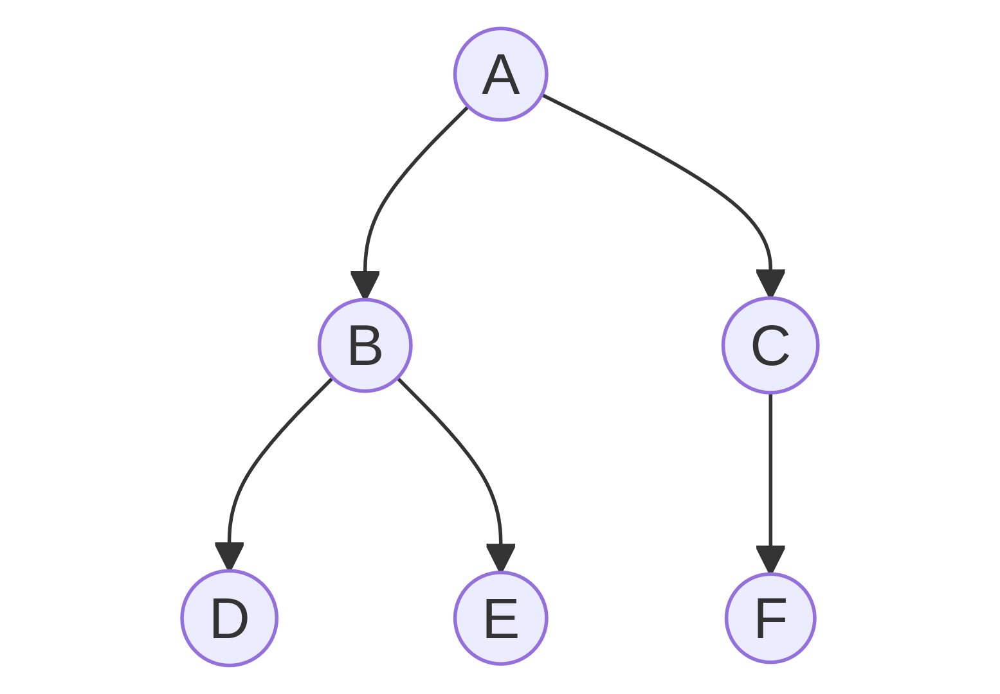
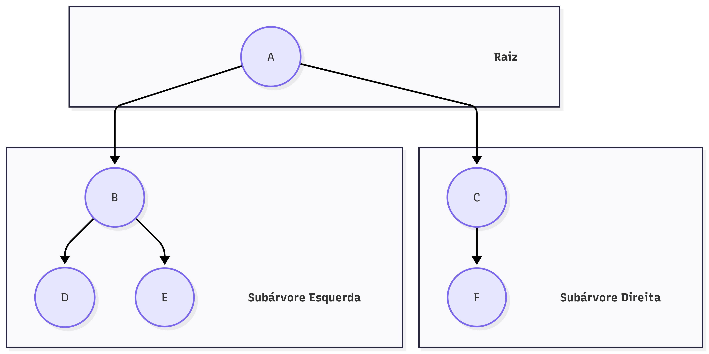
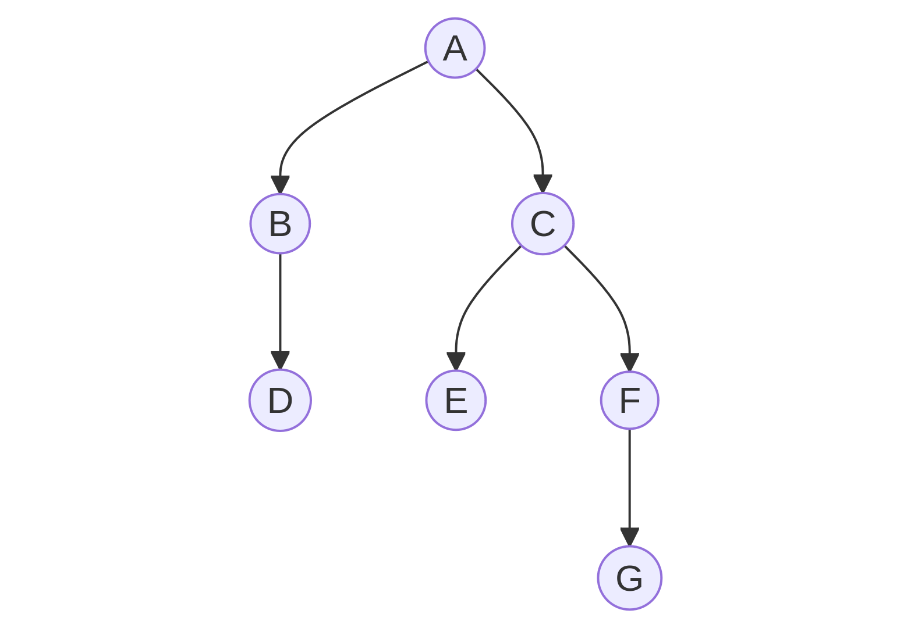
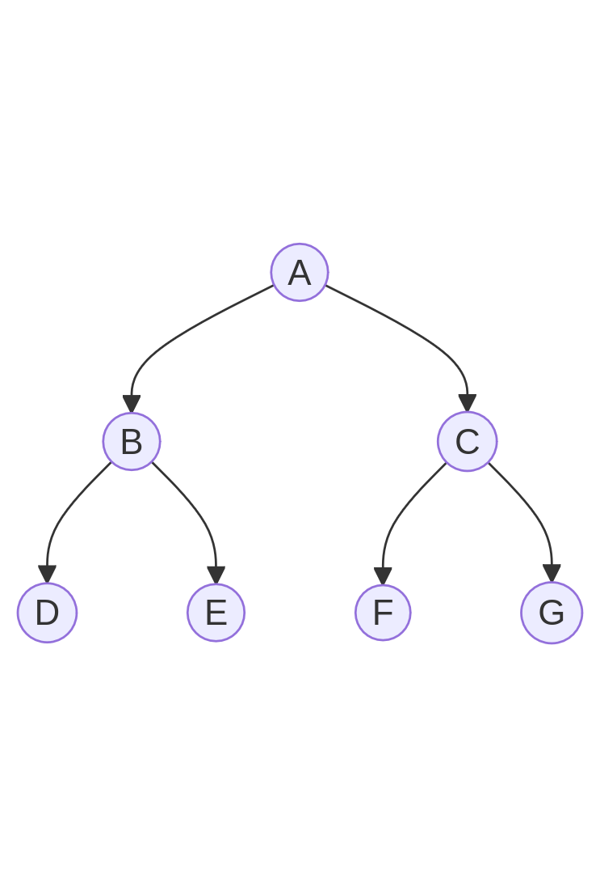
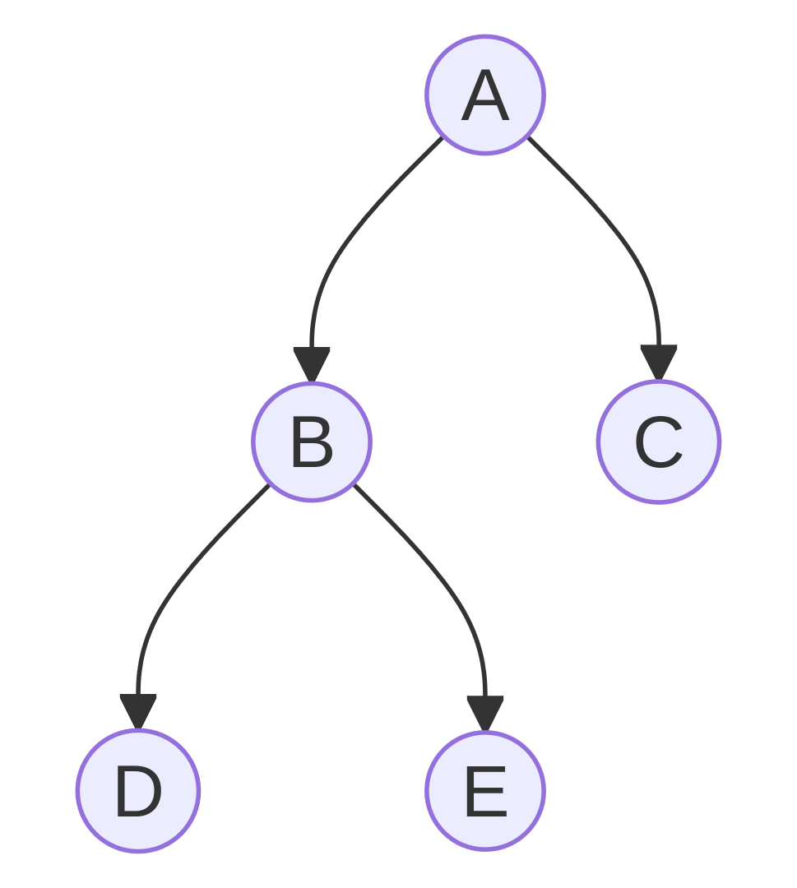
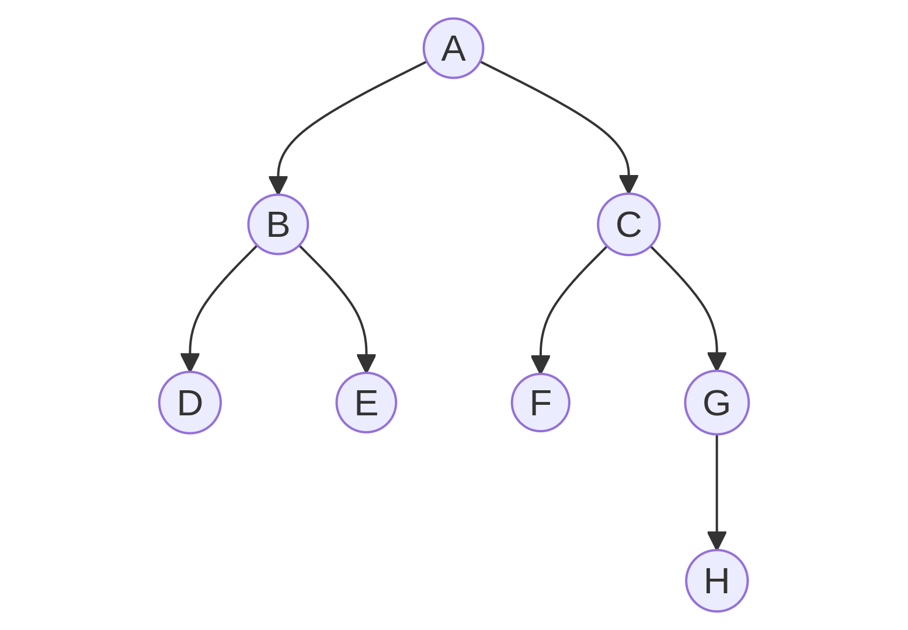

<div id="sumario" class="sumario-git">
    <h1>Dia 4</h1>
    <details open>
        <summary><a href="#introdução-a-árvores-binárias">Introdução a Árvores Binárias</a></summary>
        <ul>
            <li><a href="#definição">Definição</a></li>
            <li>
                <a href="#propriedades-das-árvores-binárias">Propriedades das Árvores Binárias</a>
                <ul>
                    <li><a href="#estrutura-recursiva">Estrutura Recursiva</a></li>
                    <li><a href="#altura">Altura</a></li>
                    <li><a href="#profundidade">Profundidade</a></li>
                    <li><a href="#grau">Grau</a></li>
                    <li><a href="#caminho">Caminho</a></li>
                    <li><a href="#número-máximo-de-nós-em-un-nível">Número Máximo de Nós em um Nível</a></li>
                    <li><a href="#exemplos">Exemplos</a></li>
                </ul>
            </li>
            <li>
                <a href="#classificações-de-árvores">Classificações de Árvores</a>
                <ul>
                    <li><a href="#árvore-estritamente-binária">Árvore Estritamente Binária</a></li>
                    <li><a href="#árvore-completa">Árvore Completa</a></li>
                    <li><a href="#árvore-cheiaperfeita">Árvore Cheia / Perfeita</a></li>
                </ul>
            </li>
            <li>
                <a href="#percursos">Percursos</a>
                <ul>
                    <li><a href="#pré-ordem">Pré-Ordem</a></li>
                    <li><a href="#em-ordem-simétrica">Em Ordem (Simétrica)</a></li>
                    <li><a href="#pós-ordem">Pós-Ordem</a></li>
                </ul>
            </li>
            <li><a href="#operações">Operações</a></li>
        </ul>
    </details>
    <details>
        <summary><a href="#árvore-binária-de-busca-bst">Árvore Binária de Busca (BST)</a></summary>
        <ul>
            <li><a href="#probiedades-da-bst">Propriedades da BST</a></li>
            <li><a href="#estrutura">Estrutura</a></li>
            <li><a href="#busca-na-bst">Busca na BST</a></li>
            <li><a href="#inserção-na-bst">Inserção na BST</a></li>
            <li><a href="#remoção-na-bst">Remoção na BST</a></li>
        </ul>
    </details>
    <details>
        <summary><a href="#árvore-avl">Árvore AVL</a></summary>
    </details>
    <details>
        <summary><a href="#árvore-rubro-negra">Árvore Rubro-Negra</a></summary>
    </details>
    <details>
        <summary><a href="#map">&lt;map&gt;</a></summary>
    </details>
    <details>
        <summary><a href="#set">&lt;set&gt;</a></summary>
    </details>
    <button class="toggle-button" id="toggle-button">
        Esconder Sumário
    </button>
</div>


# Introdução a Árvores Binárias

## Definição 

Árvores são estruturas de dados **não lineares**, caracterizadas por uma organização hierárquica, na qual cada elemento pode estar ligado a vários outros, diferentemente de listas ou vetores, que possuem uma organização sequencial.

**Exemplos:**

<div class="figure" style="flex: 1; text-align: center;">
    
    <p style="margin-top: 0.5rem; text-align: center;">
        <em>Exemplo Básico de Árvore Binária</em>
    </p>
</div>

Uma **árvore binária** é formada por um número finito de elementos, chamados de **nós**.

- O primeiro nó da árvore é denominado **raiz**.

- A partir da raiz, os nós se ramificam.

- Os nós que não possuem filhos são chamados de **folhas**.

Cada nó de uma árvore binária pode possuir nenhum ou **no máximo dois filhos**:

- um filho à **esquerda**.

- um filho à **direita**.

Sendo assim, quando não está vazia, ela pode ser dividida em três **subconjuntos disjuntos**:
	
1. **Nó raiz**.
    
2. **Sub-árvore esquerda**.

3. **Sub-árvore direita**.
    
**Exemplo:**

<div class="figure" style="flex: 1; text-align: center;">
    
    <p style="margin-top: 0.5rem; text-align: center;">
        <em>Conjuntos da Árvore Binária</em>
    </p>
</div>

## Propriedades das Árvores Binárias

As árvores binárias possuem as seguintes **propriedades principais**:

### Estrutura Recursiva

Cada sub-árvore é, por si mesma, uma árvore binária. Isso torna a **estrutura recursiva**, em que cada nó pode ser considerado a raiz de uma nova árvore binária.

### Altura 

A **altura de uma árvore** é o comprimento do caminho entre a raiz e a folha mais profunda da árvore. Ela impacta diretamente na eficiência das operações.

### Profundidade

A **profundidade de um nó** é a distância entre esse nó e a raiz da árvore.

### Grau 

O **grau de um nó** é o número de subárvores (filhos) que ele possui. Em uma árvore binária, o **grau máximo de um nó é 2**.

O **grau de uma árvore** é definido como o maior grau entre todos os seus nós.

### Caminho

Um caminho é uma **sequência de nós** conectados entre si.

O **comprimento de um caminho** é o número de nós (ou arestas, dependendo da definição adotada) que o compõem.

### Número Máximo de Nós em un Nível
O número máximo de nós em um nível `n` de uma árvore binária é dado por: `2^n`

### Exemplos 
<!-- mostre exemplos e suas propriedades --->

- Exemplo 1

<div class="figure" style="flex: 1; text-align: center;">
    
    <p style="margin-top: 0.5rem; text-align: center;"><em>Árvore Degenerada</em></p>
</div>

Vamos analisar as propriedades dessa árvore.

<details>
<summary>Altura</summary>
    h = 3
</details>

<details>
<summary>Profundidade</summary>
  <p><strong>Profundidade 0:</strong> Nó A (raiz).</p>
  <p><strong>Profundidade 1:</strong> Nós B e C.</p>
  <p><strong>Profundidade 2:</strong> Nós D, E e F.</p>
  <p><strong>Profundidade 3:</strong> Nó G (nó mais profundo).</p>
</details>

<details>
<summary>Grau</summary>
  <p><strong>Grau 2:</strong> Nós A e C.</p>
  <p><strong>Grau 1:</strong> Nós B e F.</p>
  <p><strong>Grau 0 (Folhas):</strong> Nós D, E e G.</p>
</details>

<details>
<summary>Caminho mais longo</summary>
  Tem comprimento 3 e passa por 4 nós: A → C → F → G.
</details>

<details>
<summary>Número de Nós por Nível</summary>
  <p><strong>Nível 0:</strong> 1 nó (A). Máximo teórico: 2⁰ = 1. (Completo).</p>
  <p><strong>Nível 1:</strong> 2 nós (B, C). Máximo teórico: 2¹ = 2. (Completo).</p>
  <p><strong>Nível 2:</strong> 3 nós (D, E, F). Máximo teórico: 2² = 4. (Incompleto).</p>
  <p><strong>Nível 3:</strong> 1 nó (G). Máximo teórico: 2³ = 8. (Incompleto).</p>
</details>

---

- Exemplo 2

<div class="figure" style="flex: 1; text-align: center;">
    
    <p style="margin-top: 0.5rem; text-align: center;"><em>Árvore Balanceada</em></p>
</div>

Vamos analisar as propriedades dessa árvore.

<details> 
<summary>Altura</summary> 
    h = 2 
</details>

<details> 
<summary>Profundidade</summary> 
    <p><strong>Profundidade 0:</strong> Nó A (raiz).</p> 
    <p><strong>Profundidade 1:</strong> Nós B e C.</p> 
    <p><strong>Profundidade 2:</strong> Nós D, E, F e G (folhas).</p> 
</details>

<details> 
<summary>Grau</summary> 
    <p><strong>Grau 2:</strong> Nós A, B e C.</p> 
    <p><strong>Grau 0 (Folhas):</strong> Nós D, E, F e G.</p> 
</details>

<details> 
<summary>Caminho mais longo</summary> 
    Tem comprimento 2 e passa por 3 nós. Como a árvore é perfeitamente balanceada, todos os caminhos da raiz até as folhas possuem o mesmo tamanho (ex.: A → B → D ou A → C → G). 
</details>

<details> 
<summary>Número de Nós por Nível</summary> 
    <p><strong>Nível 0:</strong> 1 nó (A). Máximo teórico: 2⁰ = 1. (Completo).</p> 
    <p><strong>Nível 1:</strong> 2 nós (B, C). Máximo teórico: 2¹ = 2. (Completo).</p> 
    <p><strong>Nível 2:</strong> 4 nós (D, E, F, G). Máximo teórico: 2² = 4. (Completo).</p> 
</details>


## Classificações de Árvores

### Árvore Estritamente Binária

É uma árvore em que todos os nós possuem exatamente **nenhum ou dois filhos**.

A expressão que representa o **número de nós** de uma árvore estritamente binária é dada po: `2n - 1`.

**Exemplo**:

O exemplo dado no inicio desse máterial trata-se de uma árvore estritamente binária.

<div class="figure" style="flex: 1; text-align: center;">
    
    <p style="margin-top: 0.5rem; text-align: center;">
        <em>Exemplo de Árvore Estritamente Binária</em>
    </p>
</div>

### Árvore Completa

É uma árvore em que todos os nós com menos de dois filhos ficam no **último e penúltimo nível**.

**Exemplo**:

<div class="figure" style="flex: 1; text-align: center;">
    
    <p style="margin-top: 0.5rem; text-align: center;">
        <em>Exemplo de Árvore Completa</em>
    </p>
</div>

### Árvore Cheia/Perfeita

É uma árvore **estritamente binária e completa**.

**Exemplo**: O exemplo 2 dado anteriomente trata-se de uma árvore cheia.

## Percursos

### Pré Ordem

### Em Ordem (Simétrica)

### Pós Ordem

## Operações

Neste tipo de estrutura serão abordadas as seguintes operações:

- Consultar um nó na árvore.

- Inserir um nó na árvore.

- Remover um nó da árvore.

# Árvore Binária de Busca (BST)

## Probiedades da BST

1. Todos os nós de uma sub-ávore **direita** são **maiores** que o valor da raiz.

2. Todos os nós de uma sub-ávore **esquerda** são **menores** que o valor da raiz. 

Essa organização permite operações eficientes de **busca**, **inserção** e **remoção**, especialmente quando a árvore está **balanceada**, mantendo uma estrutura **hieráquica**.

## Estrutura

Na implementação da BST, podemos utilizar uma struct para
representar os nós da árvore. Cada nó contém três componentes principais: 

- Um valor, representado pela chave.
- Dois ponteiros, um para a subárvore à esquerda e outro para a subárvore à direita. 

A seguir, temos a definição da estrutura:

```c++
    struct arvore_t {
        int chave;
        arvore_t *esq;
        arvore_t *dir;
    };
```

## Busca na BST

**Função**:

```c++
    arvore_t *buscar(arvore_t *arvore, int chave) {
        if (arvore == NULL) {
            return NULL;
        }

        if (chave < arvore->chave) {
            return buscar(arvore->esq, chave);
        } else if (chave > arvore->chave) {
            return buscar(arvore->dir, chave);
        } else {
            return arvore; // achou
        }
    }
```

Nesse exemplo de operação de busca, o valor procurado é comparado **recursivamente** com a chave do nó atual, começando pela raiz. 

- Se o valor for **menor** que a chave, a busca continua na sub-árvore **esquerda**.
- Se for **maior**, prossegue na sub-árvore **direita**.

Esse processo se repete até que o valor seja encontrado ou até alcançar uma folha(nó nulo), indicando que o valor não está presente na árvore.

**Complexidade**:

Para analisar a complixade dessa operação é importante saber a relação de altura da árvore (`h`) e o número de nós (`n`). 

- Uma árvore possui **altura máxima** quando cada nível possuir um único nó. Nesse caso, `h = n`.
- Já uma árvore completa possui **altura miníma**, dada por: `h = 1 + |log n|`.

A operação de busca depende do número de nós existentes no caminho da raiz até o nó procurado.

## Inserção na BST

**Função**:

**Complexidade**:

## Remoção na BST

**Função**:

**Complexidade**:

# Árvore AVL

# Árvore Rubro-Negra

# `<map>`

# `<set>`


