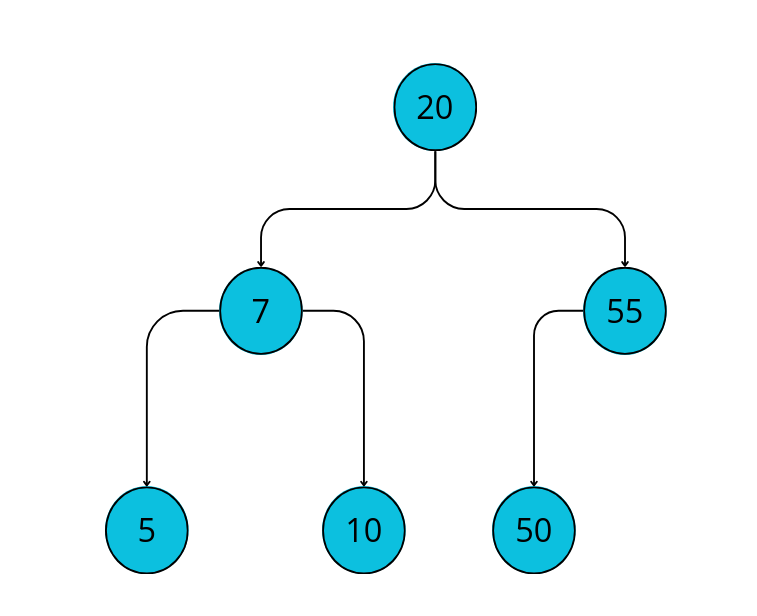
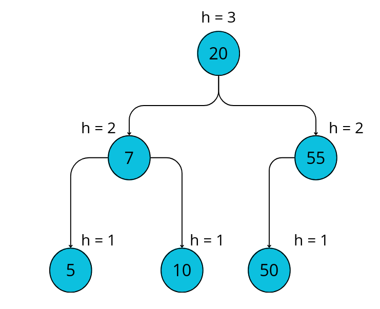
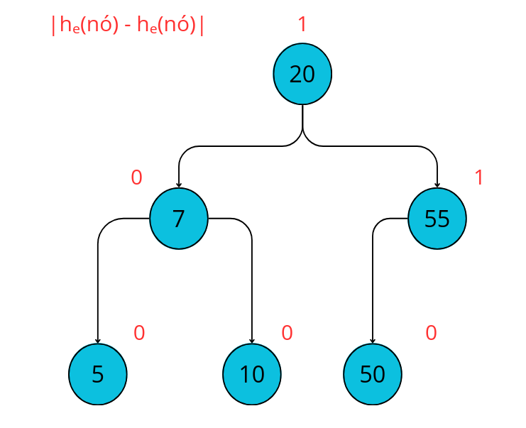
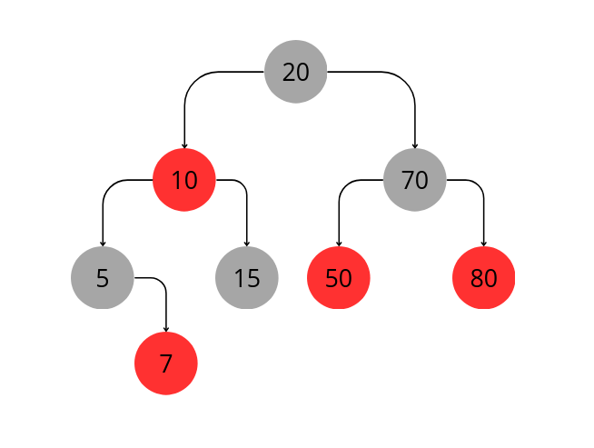
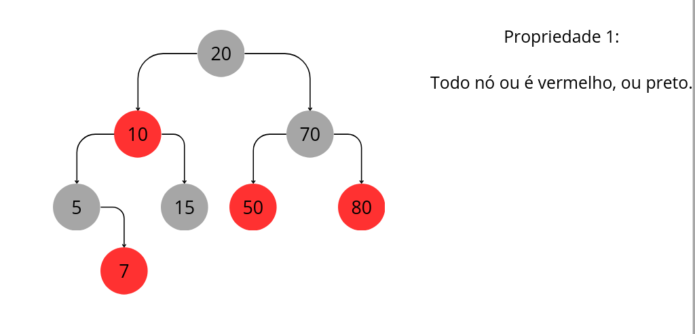
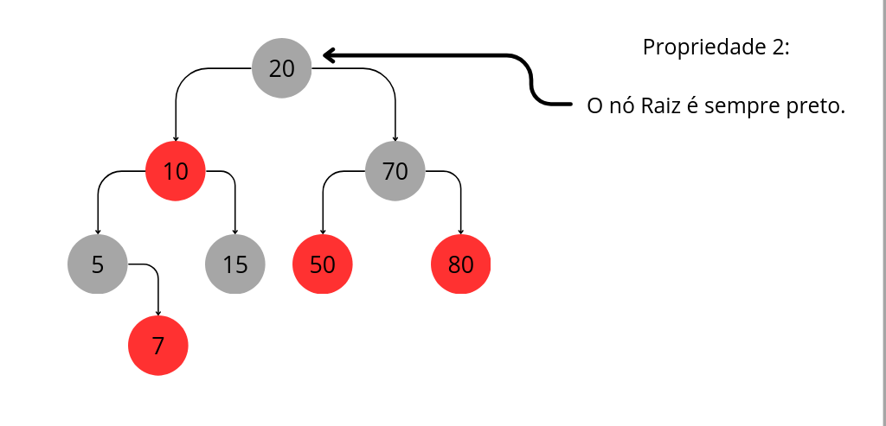
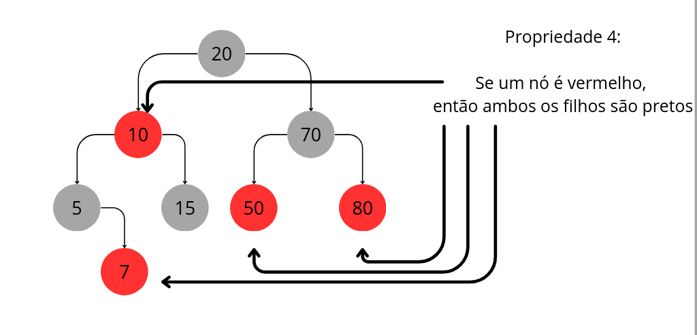
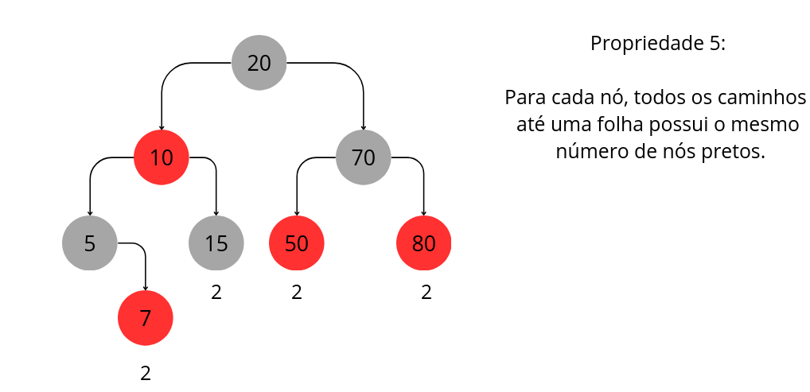

<div id="sumario" class="sumario-git">
    <h1>Dia 4</h1>
    <details open>
        <summary><a href="#introdução-a-árvores-binárias">Introdução a Árvores Binárias</a></summary>
        <ul>
            <li><a href="#definição">Definição</a></li>
            <li>
                <a href="#propriedades-das-árvores-binárias">Propriedades das Árvores Binárias</a>
                <ul>
                    <li><a href="#estrutura-recursiva">Estrutura Recursiva</a></li>
                    <li><a href="#altura">Altura</a></li>
                    <li><a href="#profundidade">Profundidade</a></li>
                    <li><a href="#grau">Grau</a></li>
                    <li><a href="#caminho">Caminho</a></li>
                    <li><a href="#número-máximo-de-nós-em-un-nível">Número Máximo de Nós em um Nível</a></li>
                    <li><a href="#exemplos">Exemplos</a></li>
                </ul>
            </li>
            <li>
                <a href="#classificações-de-árvores">Classificações de Árvores</a>
                <ul>
                    <li><a href="#árvore-estritamente-binária">Árvore Estritamente Binária</a></li>
                    <li><a href="#árvore-completa">Árvore Completa</a></li>
                    <li><a href="#árvore-cheiaperfeita">Árvore Cheia / Perfeita</a></li>
                </ul>
            </li>
            <li>
                <a href="#percursos">Percursos</a>
                <ul>
                    <li><a href="#pré-ordem">Pré-Ordem</a></li>
                    <li><a href="#em-ordem-simétrica">Em Ordem (Simétrica)</a></li>
                    <li><a href="#pós-ordem">Pós-Ordem</a></li>
                </ul>
            </li>
            <li><a href="#operações">Operações</a></li>
        </ul>
    </details>
    <details>
        <summary><a href="#árvore-binária-de-busca-bst">Árvore Binária de Busca (BST)</a></summary>
        <ul>
            <li><a href="#probiedades-da-bst">Propriedades da BST</a></li>
            <li><a href="#estrutura">Estrutura</a></li>
            <li><a href="#busca-na-bst">Busca na BST</a></li>
            <li><a href="#inserção-na-bst">Inserção na BST</a></li>
            <li><a href="#remoção-na-bst">Remoção na BST</a></li>
        </ul>
    </details>
    <details>
        <summary><a href="#árvore-avl">Árvore AVL</a></summary>
    </details>
    <details>
        <summary><a href="#árvore-rubro-negra">Árvore Rubro-Negra</a></summary>
    </details>
    <details>
        <summary><a href="#map">&lt;map&gt;</a></summary>
    </details>
    <details>
        <summary><a href="#set">&lt;set&gt;</a></summary>
    </details>
    <button class="toggle-button" id="toggle-button">
        Esconder Sumário
    </button>
</div>


# Dicionário (Map)

## Descrição

O Tipo Abstrato de Dados (TAD) **Dicionário**, também conhecido como *Map*, é uma das abstrações fundamentais da Ciência da Computação. Seu princípio é armazenar pares (chave, valor), permitindo recuperar um valor a partir de sua chave associada.

Diferentemente de estruturas sequenciais, como listas ou filas, o dicionário não é orientado por posição, mas por chave. O foco da abstração está na associação entre elementos, e não na ordem em que são inseridos.

Enquanto TAD, o dicionário descreve apenas o comportamento lógico da estrutura, independentemente de como os dados são organizados em memória. Assim, diferentes estruturas de dados podem implementar o mesmo TAD, oferecendo garantias distintas de desempenho.

---

## Operações Básicas

O TAD Dicionário é definido por um conjunto essencial de operações:

* `insert(k, v)` – associa o valor `v` à chave `k`.
* `search(k)` – retorna o valor associado à chave `k`.
* `remove(k)` – remove o par correspondente à chave `k`.
* `contains(k)` – verifica se a chave está presente.
* `size()` – retorna a quantidade de elementos armazenados.

A eficiência dessas operações depende diretamente da estrutura de dados escolhida para implementar o TAD.

---

# Hash Table

## Descrição

A **Hash Table (Tabela Hash)** é uma estrutura de dados projetada para implementar o TAD Dicionário com alta eficiência média. Seu princípio fundamental é o uso de uma **função hash**, responsável por transformar uma chave em um índice de um vetor.

Formalmente, seja uma função:

h(k) → {0, 1, ..., m-1}

onde `m` é o tamanho da tabela.

O ideal seria que cada chave fosse mapeada para um índice distinto. No entanto, como o domínio de chaves geralmente é maior que o tamanho da tabela, colisões são inevitáveis. A forma como essas colisões são tratadas define o comportamento e o desempenho da estrutura.

Em termos assintóticos:

* Caso médio: O(1)
* Pior caso: O(n)

---

## Como implementar

A implementação de uma hash table pode variar de acordo com a estratégia de tratamento de colisões. Podemos dividir as abordagens em dois grandes grupos: implementações sem colisão (modelo ideal) e implementações com colisão.

---

### Implementação 1 — Modelo Ideal (Sem Colisão)

Nesta abordagem teórica, assume-se que não existem colisões. Cada índice do vetor armazena diretamente um elemento.

```cpp
#include <iostream>
using namespace std;

class HashTableIdeal {
private:
    int* tabela;
    int capacidade;

    int hashFunction(int chave) const {
        return chave % capacidade;
    }

public:
    HashTableIdeal(int cap) : capacidade(cap) {
        tabela = new int[capacidade];
        for (int i = 0; i < capacidade; i++)
            tabela[i] = -1;
    }

    ~HashTableIdeal() {
        delete[] tabela;
    }

    void insert(int chave) {
        int indice = hashFunction(chave);
        tabela[indice] = chave;
    }

    bool search(int chave) const {
        int indice = hashFunction(chave);
        return tabela[indice] == chave;
    }
};
```

Essa abordagem é apenas didática, pois colisões inevitavelmente ocorrerão em cenários reais.

---

### Implementação 2 — Encadeamento Separado (Separate Chaining)

Cada posição da tabela contém uma lista de elementos que compartilham o mesmo índice hash.

```cpp
#include <iostream>
#include <vector>
#include <list>
using namespace std;

class HashTableChaining {
private:
    int capacidade;
    vector<list<pair<int,int>>> tabela;

    int hashFunction(int chave) const {
        return chave % capacidade;
    }

public:
    HashTableChaining(int cap) : capacidade(cap) {
        tabela.resize(capacidade);
    }

    void insert(int chave, int valor) {
        int indice = hashFunction(chave);
        tabela[indice].push_back({chave, valor});
    }

    bool search(int chave, int &valor) const {
        int indice = hashFunction(chave);
        for (const auto &par : tabela[indice]) {
            if (par.first == chave) {
                valor = par.second;
                return true;
            }
        }
        return false;
    }
};
```

Essa abordagem mantém complexidade média O(1), mas pode degradar para O(n) no pior caso.

---

## Complexidade Temporal

| Operação | Caso Médio | Pior Caso |
| -------- | ---------- | --------- |
| Insert   | O(1)       | O(n)      |
| Search   | O(1)       | O(n)      |
| Remove   | O(1)       | O(n)      |

A análise depende do fator de carga (α = n/m) e da qualidade da função hash.

---

## Hash Table na STL do C++

A biblioteca padrão do C++ fornece duas estruturas principais que implementam o TAD Dicionário:

### unordered_map

Implementado como tabela hash.

```cpp
#include <unordered_map>
#include <iostream>
using namespace std;

int main() {
    unordered_map<int, string> tabela;
    tabela[1] = "Um";
    tabela[2] = "Dois";
    cout << tabela[1] << endl;
}
```

* Complexidade média: O(1)
* Não mantém ordenação das chaves
* Realiza rehash automaticamente

---

### map

Implementado como árvore balanceada (tipicamente rubro-negra).

```cpp
#include <map>
#include <iostream>
using namespace std;

int main() {
    map<int, string> tabela;
    tabela[1] = "Um";
    tabela[2] = "Dois";
    cout << tabela[1] << endl;
}
```

* Complexidade garantida: O(log n)
* Mantém ordenação das chaves
* Não depende de função hash

---

## Onde usar Hash Tables

Hash tables são indicadas quando é necessário acesso rápido por chave e a ordenação não é relevante. São amplamente utilizadas em:

* Tabelas de símbolos em compiladores
* Implementação de caches
* Indexação em bancos de dados
* Estruturas internas de linguagens de programação

Quando a ordenação é necessária ou quando se deseja garantia assintótica mais forte no pior caso, árvores balanceadas podem ser preferíveis.


# Introdução a Árvores Binárias

## Definição 

Árvores são estruturas de dados **não lineares**, caracterizadas por uma organização hierárquica, na qual cada elemento pode estar ligado a vários outros, diferentemente de listas ou vetores, que possuem uma organização sequencial.

**Exemplos:**

<div class="figure" style="flex: 1; text-align: center;">
    
    <p style="margin-top: 0.5rem; text-align: center;">
        <em>Exemplo Básico de Árvore Binária</em>
    </p>
</div>

Uma **árvore binária** é formada por um número finito de elementos, chamados de **nós**.

- O primeiro nó da árvore é denominado **raiz**.

- A partir da raiz, os nós se ramificam.

- Os nós que não possuem filhos são chamados de **folhas**.

Cada nó de uma árvore binária pode possuir nenhum ou **no máximo dois filhos**:

- um filho à **esquerda**.

- um filho à **direita**.

Sendo assim, quando não está vazia, ela pode ser dividida em três **subconjuntos disjuntos**:
	
1. **Nó raiz**.
    
2. **Sub-árvore esquerda**.

3. **Sub-árvore direita**.
    
**Exemplo:**

<div class="figure" style="flex: 1; text-align: center;">
    
    <p style="margin-top: 0.5rem; text-align: center;">
        <em>Conjuntos da Árvore Binária</em>
    </p>
</div>

## Propriedades das Árvores Binárias

As árvores binárias possuem as seguintes **propriedades principais**:

### Estrutura Recursiva

Cada sub-árvore é, por si mesma, uma árvore binária. Isso torna a **estrutura recursiva**, em que cada nó pode ser considerado a raiz de uma nova árvore binária.

### Altura 

A **altura de uma árvore** é o comprimento do caminho entre a raiz e a folha mais profunda da árvore. Ela impacta diretamente na eficiência das operações.

### Profundidade

A **profundidade de um nó** é a distância entre esse nó e a raiz da árvore.

### Grau 

O **grau de um nó** é o número de subárvores (filhos) que ele possui. Em uma árvore binária, o **grau máximo de um nó é 2**.

O **grau de uma árvore** é definido como o maior grau entre todos os seus nós.

### Caminho

Um caminho é uma **sequência de nós** conectados entre si.

O **comprimento de um caminho** é o número de nós (ou arestas, dependendo da definição adotada) que o compõem.

### Número Máximo de Nós em un Nível
O número máximo de nós em um nível `n` de uma árvore binária é dado por: `2^n`

### Exemplos 
<!-- mostre exemplos e suas propriedades --->

- Exemplo 1

<div class="figure" style="flex: 1; text-align: center;">
    
    <p style="margin-top: 0.5rem; text-align: center;"><em>Árvore Degenerada</em></p>
</div>

Vamos analisar as propriedades dessa árvore.

<details>
<summary>Altura</summary>
    h = 3
</details>

<details>
<summary>Profundidade</summary>
  <p><strong>Profundidade 0:</strong> Nó A (raiz).</p>
  <p><strong>Profundidade 1:</strong> Nós B e C.</p>
  <p><strong>Profundidade 2:</strong> Nós D, E e F.</p>
  <p><strong>Profundidade 3:</strong> Nó G (nó mais profundo).</p>
</details>

<details>
<summary>Grau</summary>
  <p><strong>Grau 2:</strong> Nós A e C.</p>
  <p><strong>Grau 1:</strong> Nós B e F.</p>
  <p><strong>Grau 0 (Folhas):</strong> Nós D, E e G.</p>
</details>

<details>
<summary>Caminho mais longo</summary>
  Tem comprimento 3 e passa por 4 nós: A → C → F → G.
</details>

<details>
<summary>Número de Nós por Nível</summary>
  <p><strong>Nível 0:</strong> 1 nó (A). Máximo teórico: 2⁰ = 1. (Completo).</p>
  <p><strong>Nível 1:</strong> 2 nós (B, C). Máximo teórico: 2¹ = 2. (Completo).</p>
  <p><strong>Nível 2:</strong> 3 nós (D, E, F). Máximo teórico: 2² = 4. (Incompleto).</p>
  <p><strong>Nível 3:</strong> 1 nó (G). Máximo teórico: 2³ = 8. (Incompleto).</p>
</details>

---

- Exemplo 2

<div class="figure" style="flex: 1; text-align: center;">
    
    <p style="margin-top: 0.5rem; text-align: center;"><em>Árvore Balanceada</em></p>
</div>

Vamos analisar as propriedades dessa árvore.

<details> 
<summary>Altura</summary> 
    h = 2 
</details>

<details> 
<summary>Profundidade</summary> 
    <p><strong>Profundidade 0:</strong> Nó A (raiz).</p> 
    <p><strong>Profundidade 1:</strong> Nós B e C.</p> 
    <p><strong>Profundidade 2:</strong> Nós D, E, F e G (folhas).</p> 
</details>

<details> 
<summary>Grau</summary> 
    <p><strong>Grau 2:</strong> Nós A, B e C.</p> 
    <p><strong>Grau 0 (Folhas):</strong> Nós D, E, F e G.</p> 
</details>

<details> 
<summary>Caminho mais longo</summary> 
    Tem comprimento 2 e passa por 3 nós. Como a árvore é perfeitamente balanceada, todos os caminhos da raiz até as folhas possuem o mesmo tamanho (ex.: A → B → D ou A → C → G). 
</details>

<details> 
<summary>Número de Nós por Nível</summary> 
    <p><strong>Nível 0:</strong> 1 nó (A). Máximo teórico: 2⁰ = 1. (Completo).</p> 
    <p><strong>Nível 1:</strong> 2 nós (B, C). Máximo teórico: 2¹ = 2. (Completo).</p> 
    <p><strong>Nível 2:</strong> 4 nós (D, E, F, G). Máximo teórico: 2² = 4. (Completo).</p> 
</details>


## Classificações de Árvores

### Árvore Estritamente Binária

É uma árvore em que todos os nós possuem exatamente **nenhum ou dois filhos**.

A expressão que representa o **número de nós** de uma árvore estritamente binária é dada po: `2n - 1`.

**Exemplo**:

O exemplo dado no inicio desse máterial trata-se de uma árvore estritamente binária.

<div class="figure" style="flex: 1; text-align: center;">
    
    <p style="margin-top: 0.5rem; text-align: center;">
        <em>Exemplo de Árvore Estritamente Binária</em>
    </p>
</div>

### Árvore Completa

É uma árvore em que todos os nós com menos de dois filhos ficam no **último e penúltimo nível**.

**Exemplo**:

<div class="figure" style="flex: 1; text-align: center;">
    
    <p style="margin-top: 0.5rem; text-align: center;">
        <em>Exemplo de Árvore Completa</em>
    </p>
</div>

### Árvore Cheia/Perfeita

É uma árvore **estritamente binária e completa**.

**Exemplo**: O exemplo 2 dado anteriomente trata-se de uma árvore cheia.

## Percursos

### Pré Ordem

### Em Ordem (Simétrica)

### Pós Ordem

## Operações

Neste tipo de estrutura serão abordadas as seguintes operações:

- Consultar um nó na árvore.

- Inserir um nó na árvore.

- Remover um nó da árvore.

# Árvore Binária de Busca (BST)

## Propriedades da BST

1. Todos os nós de uma sub-ávore **direita** são **maiores** que o valor da raiz.

2. Todos os nós de uma sub-ávore **esquerda** são **menores** que o valor da raiz. 

Essa organização permite operações eficientes de **busca**, **inserção** e **remoção**, especialmente quando a árvore está **balanceada**, mantendo uma estrutura **hieráquica**.

## Estrutura

Na implementação da BST, podemos utilizar uma struct para
representar os nós da árvore. Cada nó contém três componentes principais: 

- Um valor, representado pela chave.
- Dois ponteiros, um para a subárvore à esquerda e outro para a subárvore à direita. 

A seguir, temos a definição da estrutura:

```c++
    struct arvore_t {
        int chave;
        arvore_t *esq;
        arvore_t *dir;
    };
```

## Busca na BST

**Função**:

```cpp
    arvore_t *buscar(arvore_t *arvore, int chave) {
        if (arvore == NULL) {
            return NULL;
        }

        if (chave < arvore->chave) {
            return buscar(arvore->esq, chave);
        } else if (chave > arvore->chave) {
            return buscar(arvore->dir, chave);
        } else {
            return arvore; // achou
        }
    }
```

Nesse exemplo de operação de busca, o valor procurado é comparado **recursivamente** com a chave do nó atual, começando pela raiz. 

- Se o valor for **menor** que a chave, a busca continua na sub-árvore **esquerda**.
- Se for **maior**, prossegue na sub-árvore **direita**.

Esse processo se repete até que o valor seja encontrado ou até alcançar uma folha(nó nulo), indicando que o valor não está presente na árvore.

**Complexidade**:

Para analisar a complixade dessa operação é importante saber a relação de altura da árvore (`h`) e o número de nós (`n`). 

- Uma árvore possui **altura máxima** quando cada nível possuir um único nó. Nesse caso, `h = n`.
- Já uma árvore completa possui **altura miníma**, dada por: `h = 1 + |log n|`.

A operação de busca depende do número de nós existentes no caminho da raiz até o nó procurado.

Se a árvore possui **altura máxima**, o nó procurado pode estar a uma distância de até `n` **da raiz**, e a complexidade da busca é `O(n)`.

Se a árvore possui **altura mínima**, o tempo de busca é `O(log n)`.

## Inserção na BST

**Função**:
```cpp
    arvore_t* inserir(arvore_t* arvore, int chave) {
        if (arvore == nullptr) {
            arvore = new arvore_t;
            arvore->chave = chave;
            arvore->esq = nullptr;
            arvore->dir = nullptr;
        }
        else if (chave < arvore->chave) {
            arvore->esq = inserir(arvore->esq, chave);
        }
        else if (chave > arvore->chave) {
            arvore->dir = inserir(arvore->dir, chave);
        }
        return arvore;
    }
```

Na operação de inserção em uma Árvore Binária de Busca, é essencial que suas propriedades sejam preservadas.

O algoritmo funciona de forma recursiva, comparando a chave a ser inserida com o valor do nó atual:

- Se a árvore (ou subárvore) estiver **vazia** (nullptr), um **novo nó é criado** e inserido nessa posição.

- Se a chave for **menor** que o valor do nó atual, a inserção continua na subárvore **esquerda**.

- Se a chave for **maior**, a inserção continua na subárvore **direita**.

Além disso, **todo novo nó inserido é sempre uma folha**, ou seja, não possui filhos no momento da inserção. Com o crescimento da árvore, esse nó poderá futuramente receber filhos, mantendo sempre as propriedades da BST.

**Complexidade**:

A operação de inserção em uma Árvore Binária de Busca percorre a árvore desde a raiz até uma folha, realizando comparações ao longo do caminho. Assim, o custo da operação é proporcional à altura da árvore. Na **árvore balanceada**, a e a inserção ocorre em tempo `O(log n)`.

## Remoção na BST

**Função**:

Na operação de remoção, devemos considerar três casos, nos quais o nó a ser removido possui:

1. **nenhum** filho.

2. **uma sub-árvore** não vazia

3. **duas sub-árvores** não vazias

```cpp
    arvore_t* remover(arvore_t* arvore, int chave) {
        if (arvore == nullptr)
            return nullptr;

        if (chave < arvore->chave) {
            arvore->esq = remover(arvore->esq, chave);
        }
        else if (chave > arvore->chave) {
            arvore->dir = remover(arvore->dir, chave);
        }
        else {
            // nó com zero ou um filho
            if (arvore->esq == nullptr) {
                arvore_t* temp = arvore->dir;
                delete arvore;
                return temp;
            }
            else if (arvore->dir == nullptr) {
                arvore_t* temp = arvore->esq;
                delete arvore;
                return temp;
            }

            // nó com dois filhos
            arvore_t* rightMin = find_min(arvore->dir);
            arvore->chave = rightMin->chave;
            arvore->dir = remover(arvore->dir, rightMin->chave);
        }

        return arvore;
    }

```

**Caso 1:**

Se chegamos a um ponteiro nulo, significa que:

- a chave não existe nessa subárvore

- nada precisa ser feito

**Caso 2:**

O filho do nó a ser removido substitui o nó.
Ligamos o pai do nó diretamente ao seu único filho.

**Caso 3:**

O nó a ser removido é substituído por um valor que preserva as propriedades da árvore. Para isso, pode-se escolher:

- o maior elemento da subárvore esquerda, ou

- o menor elemento da subárvore direita.

Nesta implementação, utiliza-se o menor valor da subárvore direita, pois:

- ele é maior que todos os elementos da subárvore esquerda;

- e menor que todos os elementos da subárvore direita.

O procedimento ocorre da seguinte forma:

- copia-se o valor do menor elemento da subárvore direita para o nó atual;

- remove-se o nó duplicado da subárvore direita, reduzindo o problema a um caso de remoção com zero ou um filho.


**Complexidade**:

A remoção percorre a árvore da raiz até o nó a ser removido, com custo proporcional à altura da árvore. Ou seja, `O(log n)` para árvore de altura miníma.

# Árvores Auto-balanceadas

Como dito anteriormente, muitas vezes as BST podem ter casos onde a inserção/remoção chega em complexidades `O(n)`. Para resolver isso, pelo custo de algumas linhas de código e lógica, foram criados métodos para manter a complexidade como `O(log n)`, sendo o **balanceamento** um deles.

Consideramos uma árvore como **balanceada** quando sua altura `h` é limitada de forma que: `h = O(log n)`.

Logo, chamamos uma árvore de **Árvore de Auto-balanceamento**, quando ela possui um algoritmo de balanceamento automático. Essas árvores são essenciais para "consertar" os possíveis problemas vistos anteriormente, portanto, veremos duas das mais utilizadas atualmente.

## Árvore AVL

O nome AVL surge das iniciais de seus criadores, Georgy Maximovich <strong>A</strong>delson-<strong>V</strong>elsky e Evgenii Mikhailovich <strong>L</strong>andis.

**Definição**

A Árvore AVL é a primeira estrutura de dados a implementar o conceito de árvore binária de busca auto-balanceável.
Além disso, para cada nó, tem-se a relação:

<code>| h<sub>e</sub>(nó) - h<sub>d</sub>(nó) | <= 1</code>

Onde h<sub>e</sub> é a altura do filho esquerdo do nó e h<sub>d</sub> é a altura do filho direito do nó. Chamaremos essa relação de **fator de balanceamento**.

**Exemplos:**

<div class="figure" style="flex: 1; text-align: center;">
    
    <p style="margin-top: 0.5rem; text-align: center;">
        <em>Exemplo de Árvore </em>
    </p>
</div>

Para verificar se esta BST é uma árvore AVL, temos que ver se ela obedece sua principal regra. Logo, veremos a altura dessa árvore (1) e verificamos o fator de balanceamento de todos os nós (2).

<details>
    <summary>1</summary>
    <div class="figure" style="flex: 1; text-align: center;">
        
        <p style="margin-top: 0.5rem; text-align: center;">
            <em>Cálculo da altura de cada nó</em>
        </p>
    </div>

    Agora basta aplicar a relação prevista na definição das árvores AVL para verificar se ela é uma AVL.
</details>


<details>
    <summary>2</summary>
    <div class="figure" style="flex: 1; text-align: center;">
        
        <p style="margin-top: 0.5rem; text-align: center;">
            <em>Aplicação da relação da AVL</em>
        </p>
    </div>

    Logo, como cada nó dessa BST tem seu fator de balanceamento adequado, essa árvore também é uma AVL.

</details>

### Operações

Assim como na árvore Rubro-Negra, não iremos detalhar a implementação exata, mas sim a lógica que garante a eficiência da estrutura.

**Rotação, Busca, Inserção e Remoção**

A operação de **Busca** é idêntica à de uma BST convencional, beneficiando-se da altura controlada para garantir rapidez.

O diferencial da AVL está nas operações de modificação (**Inserção** e **Remoção**). Ao adicionar ou remover um nó, podemos acidentalmente violar a regra do fator de balanceamento. Quando isso ocorre, o algoritmo percebe o "nó desbalanceado" e aplica uma operação de correção chamada **Rotação**.

Existem 4 cenários de desbalanceamento possíveis, que são corrigidos por rotações Simples ou Duplas.

* Na **Inserção**, basta uma única correção (rotação) para que a árvore inteira volte a ficar equilibrada.
* Na **Remoção**, a correção pode gerar um efeito cascata, exigindo ajustes sucessivos até a raiz.

Graças a esse rigoroso controle de altura, a Árvore AVL garante que todas as suas operações (Busca, Inserção e Remoção) tenham complexidade de tempo `O(log n)` no pior caso, tornando-a extremamente previsível e eficiente para pesquisas.


### Aplicações

Por conta do seu balanceamento rígido, a altura da árvore sempre será a menor possível, fazendo com que ela seja extremamente eficiente para realizar buscas, mas como possui muitas trocas entre seus nós, faz com que ela perca um pouco de eficiência para operações de modificação.

* **Bancos de dados em Memória** : Utilizar árvores AVL em bancos de dados em memória é extremamente eficiente, já que são sistemas onde os dados são carregados imediatamente (evita diversas trocas) e acessados milhares de vezes.

* **Jogos e Simulações** : Utilizar árvores AVL como estrutras de dados de colisão estática torna seu uso incrivelmente eficiente, já que não mudam de posição frequentemente.

## Árvore Rubro-Negra

O nome Rubro-Negra se dá pelo algoritmo de balanceamento desta árvore, onde separam cada nó com uma cor, Vermelho ou Preto.

**Definição**

Uma árvore Rubro-Negra possui a estrutura de uma BST, onde cada nó possui chave, filhos, pai e cor. Diferente da AVL que foca na altura estrita, a Rubro-Negra foca em regras de coloração para seu balanceamento.

Ela é definida por 5 **propriedades fundamentais**:

1) Todo nó ou é vermelho, ou preto.

2) O nó Raiz é sempre preto.

3) Toda folha (NIL) é considerada preta.

4) Se um nó é vermelho, então ambos os filhos são pretos.

5) Para cada nó, todos os caminhos até uma folha possui o mesmo número de nós pretos.


**Exemplo:**


<div class="figure" style="flex: 1; text-align: center;">
    
    <p style="margin-top: 0.5rem; text-align: center;">
        <em>Exemplo de Árvore Rubro-Negra</em>
    </p>
</div>

Para verificar se esta árvore é realmente uma árvore Rubro-Negra, basta ver se ela possui todas as propriedades fundamentais.

<details>
    <summary>Propriedade 1</summary>    
    <div class="figure" style="flex: 1; text-align: center;">
        
        <p style="margin-top: 0.5rem; text-align: center;">
            <em>Exemplo de Árvore Rubro-Negra</em>
        </p>
    </div>

        Neste caso, todos os nós são pretos e vermelhos, o que faz ela possuir a propriedade 1.
</details>

<details>
    <summary>Propriedade 2</summary>    
    <div class="figure" style="flex: 1; text-align: center;">
        
        <p style="margin-top: 0.5rem; text-align: center;">
            <em>Exemplo de Árvore Rubro-Negra</em>
        </p>
    </div>

        Neste caso, como o nó raiz é preto, ele satisfaz a propriedade 2.
</details>

<details>
    <summary>Propriedade 3</summary>    
    <div class="figure" style="flex: 1; text-align: center;">
        
        <p style="margin-top: 0.5rem; text-align: center;">
            <em>Exemplo de Árvore Rubro-Negra</em>
        </p>
    </div>

    Como esta propriedade é uma consequência, ao invés de um critério, não precisamos verificar nada.
</details>

<details>
    <summary>Propriedade 4</summary>    
    <div class="figure" style="flex: 1; text-align: center;">
        
        <p style="margin-top: 0.5rem; text-align: center;">
            <em>Exemplo de Árvore Rubro-Negra</em>
        </p>
    </div>
    
    Assumindo que todas as folhas (NIL) são pretas (propriedade 3), temos que todos os nós vermelhos possuem 2 filhos pretos. Logo, satisfazendo a propriedade 4.
</details>

<details>
    <summary>Propriedade 5</summary>    
    <div class="figure" style="flex: 1; text-align: center;">
        
        <p style="margin-top: 0.5rem; text-align: center;">
            <em>Exemplo de Árvore Rubro-Negra</em>
        </p>
    </div>
    
    Assumindo que todas as folhas (NIL) são pretas (propriedade 3), todos os caminhos até elas tem a mesma quantidade de nós pretos, satisfazendo a propriedade 5

    Logo, essa árvore do exemplo é de fato uma árvore Rubro-Negra.
</details>

### Operações

As operações de **Rotação** e **Busca** irão funcionar da mesma forma que a árvore AVL (embora as rotações tenham finalidades diferentes). Porém, adicionamos diversos casos de erro nas operações de **Inserção** e **Remoção**, de forma que a árvore mantenha as 5 propriedades fundamentais.

Embora pareça complexa, as árvores Rubro-Negro são as mais flexiveis em questão de uso. Isso acontece principalmente por exigir menos rotações durantes as inserções e remoções, tornando estatísticamente mais rápida para aplicações dinâmicas.

### Aplicações

Ao contrário das árvores AVL, as Rubro-Negro se destacam na eficiência de suas operações de modificação (inserção e remoção), já que necessitam de menos trocas, porém, sendo menos eficientes no quesito busca, já que podem permitir árvores mais altas que uma AVL.

* **Bibliotecas de linguagens** : Algumas bibliotecas como `java.util` de java, `STL` de C++ e `System.Collections.Generic` de C# tem diversos contêineres que são implementados utilizando árvores Rubro-Negras.

* **Gerenciadores de memória** : Alocadores de memória (malloc) frequentemente utilizam árvores Rubro-Negras para rastrear blocos de memória de forma eficiente.

# `<map>`

# `<set>`


