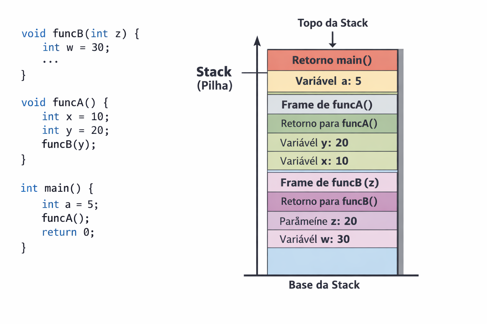
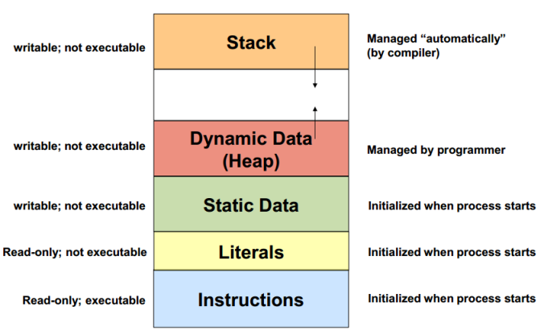
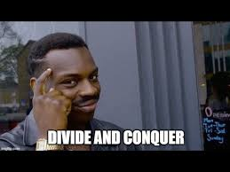

<div id="sumario" class="sumario-git">
    <h1>Dia 2</h1>
    <details>
        <summary><a href="#memória">Memória</a></summary>
        <ul>
            <li><a href="#stack"> Stack</a></li>
            <li><a href="#heap"> Heap</a></li>
            <li><a href="#variáveis-estáticas"> Variáveis Estáticas</a></li>
        </ul>
    </details>
    <details>
        <summary><a href="#introdução-à-estruturas-de-dados"> "Introdução" à Estruturas de Dados </a></summary>
        <ul>
            <li><a href="#tipos-abstrados-de-dados-tad"> Tipos Abstratos de Dados (TAD) </a></li>
            <li><a href="#definição-de-estruturas-de-dados"> Definição de Estruturas de Dados</a></li>
        </ul>
    </details>
    <details>
        <summary><a href="#por-que-estudar-algoritmos-e-estruturas-de-dados"> Por que Estudar Algoritmos e Estruturas de Dados </a></summary>
            <ul>
                <li><a href="#eficiência-e-escalabilidade"> Eficiência e Escalabilidade </a></li>
                <li><a href="#processos-seletivos-mercado-de-trabalho"> Processos Seletivos (Mercado de Trabalho)</a></li>
                <li><a href="#exemplo-prático-two-sum"> Exemplo Prático: Two Sum </a></li>
            </ul>
    </details>
  <button class="toggle-button" id="toggle-button">
      Esconder Sumário
  </button>
</div>
<br>

# Conceitos de Memória, Ordenação e Algoritmos

## Memória

Quando um programa é compilado sabemos que é necessário espaço na memória para que ele possa ser executado, mas afinal, de qual espaço estamos falando? Quando somos introduzidos aos tipos de dados de C/C++ aprendemos que `int` ocupa 4 bytes, `char` ocupa 1 byte e por aí vai. Mas será que esses dados ficam jogados de qualquer forma dentro da memória RAM? A resposta é **não**. A memória usada para rodar um programa pode ser dividida em duas partes.

### Stack

Essa parte da memória leva este nome por seguir o padrão [LIFO](https://pt.wikipedia.org/wiki/LIFO), que empilha memória conforme lê as linhas do programa. Ela é responsável por armazenar tudo cujo **tamanho** é sabido em **tempo de compilação** e cujo **tempo de vida** é ditado conforme o escopo.

<div style="text-align: center;"> </div>

Dentro da Stack cada função tem seu **StackFrame**, que é o espaço dedicado para as **variáveis locais** de cada função, cujo acesso é permitido apenas dentro daquele escopo.

### Exercício

> Ilustre a Stack do seguinte programa

```cpp
float hello() {
    std::cout << "hello world" << std::endl;

    return 12.5;
}

bool inverse(bool b) {
    return !b;
}

int main() {
    int a;

    std::cin >> a;

    if (inverse(true)) {
        int b = 1000;
    }

    return 0;
}
```

<!-- cada thread possue uma stack, mas como estamos trabalhando com programas de single thread... -->

### Atenção na tela

Que tal resolvermos esse [exercício](https://judge.beecrowd.com/en/problems/view/1176) juntos?
<!-- fazer a solução recursiva e... ué, pq dá erro? -->
<!-- desenhar a stack empilhando várias chamadas da fibonacci -->
<!-- stack overflow -->
<!-- cuidado com a profundidade da recursão em linguagens strict -->

### Heap

A região de memória em questão trabalha de forma complementar à **Stack**, armazenando todos os dados que tornariam o acesso menos performático nesta. Isso é, tudo que precisa ter um espaço reservado mas cujo tamanho só é conhecido em **tempo de execução**. Além disso, aqui temos mais liberdade de gerenciar a memória do programa, entretanto, a natureza dinâmica dessa abordagem faz com que ela seja naturalmente **menos performática**.

```cpp
int main() {
    int n;

    std::cin >> n;

    std::vector<int> vec(n, -1); // mora na stack, e seu conteúdo na heap

    int* a = &n;                 // mora na stack, e seu conteúdo também
    char* b = new char[n];       // mora na stack, seu conteúdo na heap

    delete[] b;                  // necessário desalocar manualmente

    return 0;
}
```

<!-- diferente da stack, a heap é compartilhada entre as threads -->

<!-- TODO: queria uma imagem boa para botar aqui -->

### Exercício

> Ilustre a Stack e Heap do seguinte programa
```cpp
#include <iostream>
#include <vector>
#include <string>

void func(int x) {
    int a = 10;
    int* p = new int(20);

    std::string s = "abc";

    std::vector<int> v(3, 5);

    static int counter = 0;

    delete p;
}

int main() {
    int n = 5;

    int arr[5] = {1,2,3,4,5};

    int* arr2 = new int[n];

    func(n);

    delete[] arr2;

    return 0;
}
```


<!-- stack - n, arr, arr2(conteúdo na heap)
    daí outro stackframe é criado acima de main
    stack - a, p(p* na heap), "s" ...
        como "s" é um literal pequeno fica na stack, mas se tiver 20/30 chars ficaria na heap(small string optimization - sso)
    ... v(conteúdo na heap)
   counter fica... -->

## Variáveis Estáticas

Além das duas regiões de memória citadas anteriormente, determinados elementos de um programa possuem uma característica particular, particular o suficiente a ponto de justificar um espaço na memória dedicado exclusivamente para eles. Essa característica é o `static`, e ela é responsável desvincular o tempo de vida de um elemento ao escopo de onde ele é declarado, tornando-o válido durante toda a execução do programa. Usemos um exemplo para elucidar melhor como isso funciona.

Podemos formalizar dizendo que `static` é um [Especificador de Classe de Armazenamento](https://en.cppreference.com/w/cpp/language/storage_duration.html), e existem outros além dele: `auto`, `extern`, `mutable`, etc.

<div style="text-align: center;"> </div>

No mais, apesar dessa representação não ser completamente fiel a como as coisas acontecem dentro da memória, se trata de uma abstração que favorece o entendimento de um programador sobre como o código dele funciona.

---

# Ordenação

Ordenação se trata de um dos problemas mais abordados na área da computação. Comummente é um exemplo bastante associado para introduzir a análise assintótica, mas além disso, também é um tópico que estimula de maneira criativa a busca por soluções para um problema. 

Dada uma lista `A` de tamanho `n`, sabemos que ela está ordenada quando a seguinte solução é satisfeita:

$$
{a_0 \leq a_1 \leq a_2 \leq ... \leq a_{n-2} \leq a_{n-1}}
$$

Retomando o conceito de análise assintótica, notamos que a verificação acaba em algum dos seguintes casos:

- Quando encontramos o primeiro elemento que não satisfaz a desigualdade, nesse caso retornamos `false`, pois `A` não está ordenada
- Quando chegamos ao fim da lista sem encontrar um elemento assim, nesse caso retornamos `true`, pois `A` está ordenada

### Exercício

>Implemente uma função que verifica se uma lista está ordenada ou não.

<details>
<summary>Spoiler!</summary>
No pior dos casos será necessário percorrer a lista toda para descobrir se ela é ordenada ou não. Sendo assim, sua complexidade é <b>O(n)</b>. Mas para os algoritmos a seguir vamos desconsiderar a verificação da ordenação, considerando no seu custo apenas a ordenação em si.
</details>

## Uma Abordagem Comum

Caso você precisasse ordenar um grupo de pessoas por altura, como faria? A única restrição é que só se pode mover uma pessoa por vez, e não pode exagerar nas trocas. Uma das abordagens mais comuns seria percorrer o grupo inteiro e verificar quem é a menor pessoa encontrada naquela iteração. Considere o exemplo a seguir:

```cpp
void ordenar(vector<int> &lista) {
    int tamanho = lista.size();

    for (int comeco = 0; comeco < tamanho - 1; comeco++) {
        int indice_do_menor = comeco;

        for (int atual = comeco + 1; atual < tamanho; atual++) {
            if (lista[atual] < lista[indice_do_menor]) {
                indice_do_menor = atual; 
            }
        }

        swap(lista[comeco], lista[indice_do_menor]);
    }
}
```

Vamos analisar em tempo real o que acontece quando executamos esse código.

## Atenção na tela!
<!-- Rodar o script de visualização -->

Agora vamos analisar a complexidade desse algoritmo, partindo de um exemplo do pior cenário. Considere a lista `[7,6,5,4,3,2,1]`.
## Atenção no quadro!
<!-- T(7) = 7 + 6 + 5... -->
<!-- T(4) = 4 + 3 + 2... -->
<!-- T(n) = \sum_{i=1}^{n} i-->
<!-- Criança insuportável chamada friedrich gauss -->
<!-- Mostrar q sempre vai precisar de n(n+1)/2 iterações -->
<!-- Mostrar a ideia dos pares -->
<!-- = O(n²) -->

<details>
<summary>Spoiler!</summary>
Temos $7 + 6 + 5 + 4 + 3 + 2 + 1$ iterações. Logo <b>O(n²)</b>.
</details>

<details>
<summary>Spoiler 2!</summary>
Esse algoritmo tem nome. <b>Selection Sort</b>.
</details>

Note que a abordagem usada anteriormente é dependente de conhecermos o estado da lista de forma ampla, a partir de um elemento em diante. E isso é necessário pois toda troca é "semi-definitiva", isso pois um dos elemento não vai sair mais daquela posição. Mas será que precisamos mesmo que toda a alteração feita tenha que ser definitiva?

Antes de responder isso, que tal pensarmos no escopo que precisamos ter noção para tomar uma decisão. E se só olhassemos apara o elemento vizinho? Perderíamos o escopo do `Selection Sort`, certo? Mas isso necessariamente é ruim?

Considere o código a seguir:

```cpp
void sort(vector<int>& lista) {
    int tamanho = arr.size();

    for (int i = 0; i < tamanho - 1; i++) {
        for (int j = 0; j < tamanho - i - 1; j++) {
            if (lista[j] > lista[j + 1]) {
                swap(lista[j], lista[j + 1]);
            }
        }
}
```

Perceba que o `Selection Sort` ordenava diretamente, ou seja, se preocupando que o menor elemento estivesse no começo da lista. O que as duas abordagens vistas até o momento têm em comum?
<!-- Ambas acumulam a lista parcialmente ordenada em uma das pontas -->

## Atenção na tela
<!-- Rodar o script de visualização -->

<details>
<summary>Spoiler!</summary>
O método que acabou de ser mostrado consiste no <b>Bubble Sort</b>
</details>

### Exercício
Implemente a `swap` para poder rodar esses algoritmos.
<!-- Questionar:
        - assinatura(para inteiros),
        - por que precisa ter referência?
        - desenhar a pilha de memória
        - fazer versão para chars
        - polimorfizar -->

<!-- void swap_ints(int& x, int& y) -->
<!-- void swap_chars(char& x, char& y) -->

 <!--
 template<typename T> void swap(T& left, T& right) {
	T tmp(left);
	left = right;
	right = tmp;
} -->

<!-- tangente sobre iteradores/endereços de memória
#include <iostream>

using namespace std;

int main() {
	int arr[4] = {3,8,5,12};

	cout << arr << endl;
	cout << *arr << endl;

	cout << arr + 1 << endl;
	cout << *(arr + 1) << endl;

	cout << arr[0] << endl;
	cout << *(arr + 0) << endl;

    //generalizando...
    //a[i] = *(a+i)
    //     = *(i+a)
    //     = i[a]
	return 0;
}-->

Perceba que os algoritmos que vimos até o momento são todos **O(n²)**, mas será que ordenar sempre se trata de algo custoso assim? Com essa abordagem, sim. Mas e se a gente pensasse um pouco mais como [Júlio César](https://pt.wikipedia.org/wiki/J%C3%BAlio_C%C3%A9sar) ou [Napoleão Bonaparte](https://pt.wikipedia.org/wiki/Napole%C3%A3o_Bonaparte)?

<div style="text-align: center;"> </div>

## Atenção no quadro
Vamos ordenar `[8,6,4,2,5,1,2,7]` com uma abordagem diferente.

### Exercício

>Qual a complexidade do algoritmo?

<!-- quando n < 2 a lista já está ordenada, logo O(1) -->
<!-- caso contrário, temos merge(mergesort(left), mergesort(right))-->
<!-- qual a complexidade da merge? ela precisa passar por todos os elementos das 2 listas, logo linear -->
<!-- qual a complexidade da mergesort nesse caso? é intuitivo pensar que T(n/2) para cada lista, ou seja, 2T(n/2) -->
<!-- Logo T(n) = { O(1), se n < 2. O(n) + 2T(n/2), c.c. } -->
<!-- Qual complexidade pertence a qual função? merge linear & mergesort log -->

```cpp
void merge(vector<int>& arr, int left, int mid, int right){
    int n1 = mid - left + 1;
    int n2 = right - mid;

    // Create temp vectors
    vector<int> L(n1), R(n2);

    // Copy data to temp vectors L[] and R[]
    for (int i = 0; i < n1; i++)
        L[i] = arr[left + i];
    for (int j = 0; j < n2; j++)
        R[j] = arr[mid + 1 + j];

    int i = 0, j = 0;
    int k = left;

    // Merge the temp vectors back 
    // into arr[left..right]
    while (i < n1 && j < n2) {
        if (L[i] <= R[j]) {
            arr[k] = L[i];
            i++;
        }
        else {
            arr[k] = R[j];
            j++;
        }
        k++;
    }

    // Copy the remaining elements of L[], 
    // if there are any
    while (i < n1) {
        arr[k] = L[i];
        i++;
        k++;
    }

    // Copy the remaining elements of R[], 
    // if there are any
    while (j < n2) {
        arr[k] = R[j];
        j++;
        k++;
    }
}

void mergeSort(vector<int>& arr, int left, int right){
    if (left >= right)
        return;

    int mid = left + (right - left) / 2;
    mergeSort(arr, left, mid);
    mergeSort(arr, mid + 1, right);
    merge(arr, left, mid, right);
}
```
<!-- chamar como mergeSort(arr, 0, arr.size() - 1); -->

### Exercício

> Dada uma lista de inteiros positivos descubra qual o perímetro do maior triângulo que pode ser formado por esses valores. Caso não seja possível formar um triângulo, retorne `-1`.

<!-- bool triangle(const int& a, const int& b, const int& c) {
    return a + b > c && b + c > a && c + a > b;
    // necessário checar todas as possibilidades pq não tenho garantia dos valores estarem ordenados
}

int maxPerimeter(vector<int> &arr) {
    int n = arr.size();
    int ans = -1;

    for(int i = 0; i < n; i++) {
        for(int j = i + 1; j < n; j++) {
            for(int k = j + 1; k < n; k++) {
                if(triangle(arr[i],arr[j],arr[k])) {
                    ans = max(ans, arr[i] + arr[j] + arr[k]);
                }
            }
        }
    }

    return ans;
}

int main() {
    vector<int> arr = {6, 1, 6, 5, 8, 4};
    cout << maxPerimeter(arr);
    return 0;
} -->

<!-- qual a complexidade da abordagem acima? -->

<!-- int maxPerimeter(vector<int> &arr) {
    int n = arr.size();

    mergesort(arr, 0, n-1);

    for(int i = 0; i < n - 2; i++) {
        // só preciso checar a desigualdade uma vez agora que sei que estão ordenados
        if(arr[i] < arr[i + 1] + arr[i + 2]) {
            return arr[i] + arr[i + 1] + arr[i + 2];
            // nem preciso ver os valores seguintes, pois sei que vão ser menores ou iguais ao atual
        }
    }

    return -1;
} -->

<!-- ordenação + busca => O(n*log(n)) + O(n) => O(n*log(n)) -->

> Dadas 2 strings, diga se elas são anagramas.

<!-- void merge(vector<string>& arr, int left, int mid, int right) {
    int n1 = mid - left + 1;
    int n2 = right - mid;

    vector<string> L(n1), R(n2);

    for (int i = 0; i < n1; i++)
        L[i] = arr[left + i];
    for (int j = 0; j < n2; j++)
        R[j] = arr[mid + 1 + j];

    int i = 0, j = 0, k = left;

    while (i < n1 && j < n2) {
        if (L[i] <= R[j]) {
            arr[k++] = L[i++];
        } else {
            arr[k++] = R[j++];
        }
    }

    while (i < n1)
        arr[k++] = L[i++];

    while (j < n2)
        arr[k++] = R[j++];
}

void mergeSort(vector<string>& arr, int left, int right) {
    if (left >= right)
        return;

    int mid = left + (right - left) / 2;
    mergeSort(arr, left, mid);
    mergeSort(arr, mid + 1, right);
    merge(arr, left, mid, right);
} -->


---

# Sorting em algoritmos

Já dá pra imaginar diversos usos pra esses algoritmos de ordenação, né? Mas com certeza tem muitos mais usos do que você imagina. Os algoritmos que nós vamos focar em atualmente são de uma linha chamada _greedy_ (gulosos). Neles, a partir de algum tipo de ordenação ou organização das nossas informações, tentamos sempre alcançar a melhor solução global através da tomada de decisões menores consideradas "ótimas" - ou seja, pra alcançar uma solução ótima, tomamos sempre a decisão ótima naquele momento. Talvez isso ainda soe confuso, mas vamos aprender mais sobre isso com exemplos e situações problema.

É importante saber que, no entanto, quando estamos resolvendo questões como essas e queremos um algoritmo de ordenação, não precisamos fazê-lo do zero! Já pensou ter que _codar_ um `Merge Sort` sempre que você quiser ordenar um conjunto, um array ou um vetor? Mesmo com a ideia concreta na sua cabeça, você ainda pode traduzir isso errado pro código: Erros de indexação, segmentação, ou até chamadas erradas de diferentes funções podem causar uma grande dor de cabeça na hora de debugar um código que deveria ser algo prático (já que é tão importante!)

Por isso, usamos a funções já implementadas e otimizadas da STL - Standard Template Library (Biblioteca Modelo Padrão)! 

(Mas mesmo que usemos funções já prontas para ordenar, lembre-se de tentar entender como esses algoritmos que passamos funcionam!! Esse entendimento é algo essencial não só para você saber _codar_ um sort do zero caso precise, mas também para o seu desenvolvimento na área da computação e entendimento mais profundo de futuros algoritmos e estruturas de dados que se embasam em princípios parecidos :) )

Essa função de _sort_ é implementada com o Intro Sort - que usa alguns _sorts_ que não vimos (como o quicksort e o heapsort), mas também usa o insertion sort em casos específicos, devido ao seu melhor caso linear!

A sintaxe que usaremos para adicioná-los no código é a seguinte:

```cpp

sort(array, array + n) // para arrays

sort(vector.begin(), vector.end()) // para vectors


```


note que também é possível ordenar a partir de uma função personalizada! uma das maneiras de fazer isso é criando essa função como uma que retorna um booleano

```cpp

bool comparar(int a, int b) {
	return a > b;
}
```

e depois passando ela como o terceiro argumento da função de _sort_!

```cpp

sort(arr, arr+n, comparar);

sort(vector.begin(), vector.end(), comparar);

```

Agora sim estamos preparados para aprender sobre algoritmos!


## Algoritmos Greedy & Adjacentes

Uma maneira simples de pensar em estratégias _greedy_ ou gulosas é imaginar uma solução em que você pode sempre escolher a melhor decisão atualmente - o que resultaria na melhor decisão global. Ou seja, fazer decisões estratégicas levaria ao sucesso.

Mas aí você pode se perguntar, "como conseguimos decidir qual a melhor escolha a se fazer?". É isso que a questão quer que a gente descubra! Não tem uma regra exata, mas geralmente inclui ordenar conforme algum parâmetro ou característica - mas isso só a prática pode nos dizer. Vamos ver a seguir que existem diversas ideias e maneiras diferentes de montar um algoritmo guloso


## Ideias greedy intuitivas

Digamos que você esteja jogando o seu jogo de RPG MMO favorito. Ao avançar de nível, você se encontrou em uma sala com vários dragões - cada um com uma força e um bônus específicos. Assim, caso você tenha força o suficiente para matar um dragão, você consegue ganhar todos os pontos bônus do dragão e adicioná-los à sua força, melhorando suas chances de matar algum outro dragão. Dadas essas informações, como você sabe se você consegue derrotar todos os dragões e seguir para a próxima sala?


<details>
<summary><b>Spoiler!</b></summary>

A ideia mais intuitiva - e correta - é ordenar pela força do dragão: Caso você seja mais forte do que ele, você ganha pontos a mais de força para tentar derrotar o próximo - e mais forte - dragão. Caso você não consiga derrotar o dragão de agora, é impossível você derrotar qualquer outro que ainda está vivo (eles são todos mais fortes!!).
<p/>

Assim, se você chegar ao fim da sua lista de dragões, você consegue derrotar todos e seguir para o seu próximo desafio! Caso contrário, você não consegue sair da sala e será derrotado 💔
<p/>

Fácil, não foi? Não se preocupe, nem todos são assim! hehe
Assim como qualquer "família" de algoritmos, questões que pedem algoritmos gulosos podem variar de mais fáceis até muito difíceis! Vamos exercitar nosso pensamento antes de seguir para outras estratégias gulosas.

</details>

<!-- dragons(codeforces)-->


### Para treinarmos juntos

Agora, vamos imaginar que você vai para um festival de filmes do seu estudio favorito de animação, o studio ghibli. Então, você quer ir para o máximo possível de sessões! ...mas alguns dos filmes tem conflito de horário. Sabendo que você só pode ir a um filme por vez, e só pode ir ver um outro filme no momento em que a sua sessão atual acaba, como podemos contar o máximo de filmes que você pode assistir na sua tarde?

Antes de qualquer coisa, é sempre interessante tentar visualizar o que o problema quer. Desenhando uma reta, podemos representar o início e o final de cada filme como pontos ligados entre si - Assim, podemos tentar fazer sentido das entradas e saídas de teste. Você tem já tem alguma ideia do que precisamos fazer?

// inserir aqui imagem que ainda vou fazer

Bom, como já demos a dica de que estamos lidando com algoritmos de ordenação, o nosso instinto é ordenar a nossa série de números de alguma forma. Mas de qual forma?

Uma ideia que pode vir à nossa cabeça é de ordenar pela hora que o filme começa. Assim, sempre estaremos escolhendo o filme que começa mais cedo, nos dando a oportunidade de ver mais filmes!

... mas isso não leva em consideração a duração de um filme :(

Um filme pode começar mais cedo, mas durar quase o dia todo. Assim, tem chance de você só conseguir ver um único filme enquanto outros filmes mais curtos passam.

Uma outra opção seria ordenar por duração! Essa ideia até poderia nos levar a uma saída interessante, mas aí teríamos que manter registros das horas em que estamos livres ou ocupados sempre - o que pioraria muito a nossa complexidade assintótica. Já pensou verificar sempre se é possível ver um filme ou não antes de vê-lo? essa verificação poderia levar O(n) por si só!


<details>
<summary><b>Spoiler!</b></summary>
A saída dessa questão é ordenar pelo fim do filme! Note que, para escolher o nosso próximo filme gulosamente, - contanto que ainda possamos ir para o filme - a hora de início não importa! Mesmo que um filme comece mais cedo, queremos sempre ir para uma sessão que termine o mais cedo possível, aumentando a nossa possibilidade de ver mais filmes na nossa tarde!

<p/>

o código fica mais ou menos assim:
<p/>

```cpp
bool comparar (pair<int, int> a, pair<int, int> b) {
    if (a.second == b.second) {
        return a.first < b.first;
    }

    return a.second < b.second;
}

int main () {

    int n;

    cin >> n

    pair<int, int> pares[n]; // criando um array de pares

    for (int i = 0; i < n; i++) {
        cin >> pares[i].first >> pares[i].second; // recebendo cada valor
    }

    sort(pares, pares + n, comparar); // ordena com base nos horários finais dos filmes

    int total = 0; // variável que conta quantos filmes vou assistir

    int atual = pares[i].second; // primeiro horário de término de um filme

    int i = 1;

    for (int i = 1; i < n; i++) {
        
        if (pares[i].first >= pares[atual]) { // se eu ainda posso ver esse filme
            total++; // vejo o filme
            atual = i; // todos os próximos filmes deverão ser após esse
        }

    }

    cout << total << "\n"; // printo o total de filmes que consegui assistir!

    return 0;
    
}


```

uma maneira inteligente de não precisar passar a função _custom_ é receber o segundo número antes, já que a função de comparação de um pair compara primeiro o primeiro objeto


```cpp

int main () {

    int n;

    cin >> n

    pair<int, int> pares[n]; // criando um array de pares

    for (int i = 0; i < n; i++) {
        cin >> pares[i].second >> pares[i].first; // recebendo cada valor
    }

    sort(pares, pares + n); // ordena com base nos horários finais dos filmes

    int total = 0; // variável que conta quantos filmes vou assistir

    int atual = pares[i].second; // primeiro horário de término de um filme

    int i = 1;

    for (int i = 1; i < n; i++) {
        
        if (pares[i].first >= pares[atual]) { // se eu ainda posso ver esse filme
            total++; // vejo o filme
            atual = i; // todos os próximos filmes deverão ser após esse
        }

    }

    cout << total << "\n"; // printo o total de filmes que consegui assistir!

    return 0;
    
}


```


</details>

<!-- movie festival(codeforces)-->


### Para tentar sozinho

Agora que nós já entendemos como funcionam as soluções greedy mais intuitivas, que tal tentar um exercício sozinho?


Digamos que magali tem um conjunto de melancias que ela quer muito comer - Mas, por incrível que pareça, sua fome não é insaciável! Ela só consegue comer N quilos de melancia. Por alguma razão, Magali também sabe quantas sementes tem em cada melancia que ela tem em casa.

Por outro lado, Quinzinho, que quer começar uma plantação de melancias, pediu que ela entregasse todas as sementes para ele no fim de seu lanche da tarde. Magali, então, pediu a sua ajuda para calcular a maior quantidade de sementes que ela pode dar a Quinzinho, assumindo que as sementes de cada melancia específica estão uniformemente distribuídas. Como você pode fazer isso?

Como eu sinto que fiz um trabalho não tão bom explicando, espero que essa imagem ajude:


<!-- watermelons(mfp) - pesquisar site -->

<details>
<summary><b>Curiosidade!</b></summary>
(Note que, se não pudermos cortar as melancias, esse problema vira o famoso _"problema da mochila"_, um problema que não é greedy, bem mais avançado e muuuuuito além do escopo desse curso, mas interessante se você quiser conhecer essa situação problema)
</details>


Agora que você já exercitou os seus conhecimentos de ideias gulosas simples, vamos tentar ver e desenvolver alguns algoritmos mais diferentes que também cumprem esse dever!


## Outras ideias greedy


Muitas vezes, ao nos deparar com problemas de programação mais simples, nós conseguimos imaginar uma saída trivial. Pense na seguinte situação: você está trabalhando em um caixa de supermercado, e tem diversas notas de valores diferentes. Um cliente te paga com uma nota maior, e precisa que você o reembolse com o seu devido troco. Mas como notas estão mais escassas hoje em dia, o seu chefe quer que você economize: pague ele com exatamente 2 notas de qualquer valor. será que você consegue juntar duas das suas notas pra fazer isso?

Uma possibilidade que temos é tentar todas as somas de todos os números da nossa lista!

```cpp
for (int i = 0; i < n; i++) {
	for (int j = 0; j < n; j++) {
		if (i == j) continue;
		if (arr[i] + arr[j] == m) { // achamos nosso resultado!
			cout << "as notas são de " << arr[i] << " e " << arr[j] << " reais\n";
			return 0;
		}
	}

}
```

Usando os nossos conhecimentos sobre complexidade assintótica, podemos verificar que a complexidade do algoritmo acima é n²

E isso não é necessariamente ruim. mas já pensou, se você tiver muitos números muito, muito grandes? esse programa pode levar muuuuuuito tempo pra rodar. Por isso, complexidades quadraticas (ou cúbicas, exponenciais) são, de maneira geral, algo que tentamos evitar ao máximo possível através de diferentes técnicas e otimizações.

O que a gente acabou de usar pra resolver isso aqui é uma técnica que vai na direção da "força bruta" (ou _brute force_), já que comparamos todos os pares possíveis de números sem pensar muito em tomar decisões boas.

...mas o objetivo desse curso é fomentar não só as suas capacidades de resolver um problema, mas suas habilidades de resolvê-lo de maneira _ótima_, que não é algo necessariamente trivial. Então vamos tentar pensar mais um pouco.


Atualmente, se você for analisar o nosso algoritmo um pouco mais a fundo, dá pra perceber que estamos fazendo ainda mais comparações do que temos números de pares. isso é porque estamos verificando 2 vezes para cada par!

```cpp
m = 8
   1  2
   |  |
   v  v
[  3  6  1  3  7  ]

    1     2
    |     |
    v     v
[  3  6  1  3  7  ]

   1        2
   |        |
   v        v
[  3  6  1  3  7  ]

   1           2
   |           |
   v           v
[  3  6  1  3  7  ]

   2  1
   |  |
   v  v
[  3  6  1  3  7  ] // aqui estamos comparando o 3 e o 6 de novo!!

      1  2
      |  |
      v  v
[  3  6  1  3  7  ]
```


Uma maneira simples de consertar isso é mudando de onde o nosso inteiro j começa! Podemos fazer pensando no seguinte: ao passar pelo nosso vetor pela primeira vez, já teremos feito todas as n-1 combinações com o primeiro número. Qualquer outra combinação que fizermos com ele, então, já terá sido feita! Só estamos permutando a ordem de soma. Assim, conseguimos cortar o número de comparações pela metade!

for (int i = 0; i < n; i++) {
	for (int j = i+1; j < n; j++) {
		if (i == j) continue;
		arr[i] + arr[j] == m ? cout << i << " " << j << "\n" : continue;
	}

}

...mas em termos assintóticos, isso ainda não significa muita coisa, lembram? ainda que de maneira mais "otimizada", ainda estamos fazendo todas as comparações possíveis - "brutando" a nossa solução

E se a gente tentasse um approach diferente?

Acabamos de mencionar várias vezes que ordenar vetores é muito útil, então vamos tentar colocar isso em prática e pensar um pouco sobre.

```cpp
[  1  3  3  6  7  ]
```

qual é o maior troco que eu posso entregar com essas notas? E qual o menor troco que eu posso entregar?

Digamos que eu tenha escolhido dois números quaisquer dentre os ordenado para entregar um troco, mas a soma ainda esteja muito alta. o que eu posso fazer pra tentar aproximar a minha soma do m desejado?

eu posso diminuir algum dos meus números escolhidos - ou seja, mover algum para a esquerda !

e caso a soma esteja muito baixa? eu movo algum dos meus números para a direita!


# Two Pointers

Essa ideia que a gente tentou alcançar de maneira intuitiva é chamada de "two pointers"! Um ponteiro é um conceito que vamos ver mais pra frente no curso, mas podemos imaginá-lo, nesse caso, como uma seta ou um índice para o número que estamos considerando (além de que, na maioria das vezes, nem usamos ponteiros na implementação desse algoritmo!)

A ideia é a seguinte:

Após ordenar os números, temos sempre certeza de que todo número à esquerda será menor, enquanto que todo número à direita será maior. Assim, inicializamos as nossas setas nos dois extemos da nossa estrutura de dados. Caso a soma dos nossos números seja maior do que queremos, movemos o segundo ponteiro para a esquerda. Caso a soma dos números seja pequena demais, movemos o primeiro ponteiro para a direita. Assim, tentamos sempre nos aproximar da soma esperada! Se as duas setas, a qualquer momento, apontarem para um mesmo número, nós não conseguiremos atingir a nossa soma.

Convencidos da nossa ideia? Tá tudo bem, eu também não estaria. Porque sempre movemos a primeira seta para a direita quando o número está pequeno ao invés de poder mover a segunda também? Vamos tentar provar isso de uma maneira mais formal para tentar te convencer de que esse é o caso!


Digamos que estamos com as nossas setas apontando para os números a e b.

```cpp
     |     |
     v     v
[... a ... b ...]
```

Agora vamos provar que, caso a + b > m e o nosso algoritmo tenha sido seguido fielmente, não devemos mover a segunda seta para a esquerda, mas sim a primeira.

Para isso, vamos analisar cada um dos casos para concluir com certeza de que o nosso algoritmo funciona! (essa etapa é importante para conseguirmos nos convencer da corretude do que fizemos.)

Caso b seja o maior número da nossa lista, ele será o último. logo, é impossível mover a nossa seta para a direita.

Caso não, esitem números à esquerda de b. vamos denotar o número imediatamente à direita de b de b'. Então nosso vetor tem uma cara parecida com essa:

```cpp
     |     |
     v     v
[... a ... b b' ..]
```

dá pra perceber que, para chegar nesse estado (já que seguimos as nossas regras até aqui), temos 2 opções:


ou viemos de uma configuração como essa (1)

```cpp
     |        |
     v        v
[... a ... b  b' ..]
```


ou existe um a' < a e viemos de uma configuração como essa (2)

```cpp
     |        |
     v        v
[... a' a ... b  b' ...]
```


caso viemos da configuração 1, já comparamos a + b' e deu errado! (a + b' > m) logo, não faz sentido comparar os mesmos dois números de novo.

caso viemos da configuração 2
já que a nossa segunda seta aponta pra b, em algum momento viemos do b'.
para algum a" < a', ocorreu que a" + b' > m
assim, como a' > a", a' + b' > a" + b' > m
logo, não faz sentido avançar a seta para a direita de novo, visto que a soma será maior que a desejada de qualquer forma

```cpp
            |        |
            v        v
[... a" ... a' a ... b  b' ...]
```


a prova para a primeira seta não voltar para a esquerda é análoga!

```cpp
     |     |
     v     v
[... a ... b ...]
```

caso o a seja o primeiro número (não há nenhum número menor que ele), não é possível mover a nossa seta para a esquerda.

caso haja um número a' à esquerda de a, temos que ele será menor que a, pela condição da ordenação. Logo, o vetor parecerá com isso.

```cpp
         |     |
         v     v
[... a'  a ... b ...]
```

da mesma forma, podemos ter vindo de duas configurações diferentes para a atual, já que só movemos uma seta por vez:


ou de uma configuração como essa (1)

```
     |         |
     v         v
[... a'  a ... b  b' ...]
```


ou de uma configuração como essa (2)

```cpp
         |        |
         v        v
[... a'  a ... b  b' ...]
```

no caso (1), nós já comparamos a' com b, (e temos que a' + b < m) então não adianta testar a mesma coisa mais uma vez.

no caso (2), já que a nossa primeira seta aponta para a, em algum momento viemos do a'.
A partir disso, temos que, para algum b" > b', chegamos à conclusão que a' + b" < m, e movemos a primeira seta para a direita.
Logo, como b < b", é lógico que a' + b < a' + b" < m.
Dessa forma, a comparação entre esses dois números não é necessária e as condições que estabelecemos sempre vão nos guiar para a resposta certa!

```cpp
         |        |
         v        v
[... a'  a ... b  b' ... b" ...]
```

Espero que agora você esteja convencido!

Agora vamos analisar o código pra entender saber o que estamos fazendo

```cpp
int p1 = 0, p2 = n-1;

while (p1 != p2) {

	if (arr[p1] + arr[p2] == m) {
		cout << "as notas são de " << arr[i] << " e " << arr[j] << " reais\n";
		return 0;
	}
	
	else if (arr[p1] + arr[p2] > m) {
		p2--;
	
	}
	
	else { // a única opção restante é arr[p1] + arr[p2] < m
		p1++;
	}

}

cout << "a soma não é possível";
```

O _two pointers_ é um algoritmo muito comum na área de programação competitiva, mas essa modelagem não se prende a só isso sempre! esse nome é um nome que pode se referir a várias implementações diferentes, desde que incluam a ideia de guardar índices e avançá-los estrtegicamente (de forma _gulosa_) para atingir uma boa solução.

vamos ver mais um exemplo de uso de two pointers!

# Para treinarmos juntos

Aqui, você tem t minutos e quer ir à biblioteca para ler o máximo possível de livros! Existem livros mais grossos e mais finos, então cada livro leva um tempo a_i para ser lido. Mas eles já estão organizados em uma ordem que faz sentido para o leitor, então você não quer embaralhar essa ordem e se confundir mair. Então, a única coisa que você pode fazer é escolher em qual livro você começa. Qual a maior quantidade de livros que você pode ler em t minutos?

 aplicá-lo de diferentes formas? Sigam para o vjudge do minicurso para tentar fazer alguns exercícios de two pointers!


Primeiro, vamos tentar entender de fato a questão: Ela quer que você escolha um subarray contíguo da sua lista de livros para ler todos eles - mas a soma não pode passar de t! E já que não podemos mudar a ordem dos livros, aquela ideia de ordenar os livros por tempo gasto e pegar sempre os menores vai pro beleléu :(

De novo, poderíamos testar todas os intervalos possíveis e "brutar" a questão, mas queremos uma saída eficiente! Então como já demos spoiler e você sabe que estamos falando de two pointers, alguma ideia lhe vem à mente?

<p/>
<p/>
<p/>
<p/>

Primeiramente, podemos perceber que estamos tentando montar o intervalo mais extenso possível dentro desse nosso vetor de valores com soma igual a ou menor o nosso t. Então, podemos tentar passar uma única vez iterando pela nossa lista de valores, verificando o maior intervalo possível que pode ser construído começando em cada valor!


Mas agora tentando simplificar um pouco o nosso problema: dado um intervalo que estamos avaliando, você concorda que, caso a soma seja menor que t, podemos verificar se conseguimos terminá-lo mais à frente? Se todos os nossos livros juntos somarem 20, que é menor que o nosso t = 30, podemos verificar se ainda é possível ler mais um livro!


E se você também pensar mais um pouquinho, fica claro que o contrário também ocorre: se a soma for grande demais, não dá para começar o nosso intervalo no lugar onde ele está atualmente!! Ainda para um t = 30, se levamos 50 minutos para ler nossa lista atual de livros, não podemos ler todos eles - teremos, então, que começar nosso intervalo mais à frente, cortando alguns livros.


Então nessa nossa modelagem do problema, podemos inicializar os nossos dois ponteiros no início, ao invés de separados como no problema passado. Assim, quando a soma do nosso intervalo for menor que o t estabelecido, podemos tentar avançar o final do nosso intervalo. No entanto, quando a soma for grande demais, devemos avançar o ponteiro do início, para tentar diminuir a soma dos nossos tempos.


```cpp
t = 7

  | fim
  v
  | inicio
  v
[ 5  3  1  2  1  3 ]  soma = 5, qtd = 1

     | fim
     v
  | inicio
  v
[ 5  3  1  2  1  3 ]  soma = 8

     | fim
     v
     | inicio
     v
[ 5  3  1  2  1  3 ]  soma = 3, qtd = 1

        | fim
        v
     | inicio
     v
Mas, como já mencionamos, ideias gulosas se apresentam de formas diferentes. Agora vamos 
[ 5  3  1  2  1  3 ]  soma = 4, qtd = 2

           | fim
           v
     | inicio
     v
[ 5  3  1  2  1  3 ]  soma = 6, qtd = 3

              | fim
              v
     | inicio
     v
[ 5  3  1  2  1  3 ]  soma = 7, qtd = 4

                 | fim
                 v
     | inicio
     v
[ 5  3  1  2  1  3 ]  soma = 10


                 | fim
                 v
        | inicio
        v
[ 5  3  1  2  1  3 ]  soma = 7, qtd = 4
```


Note que devemos manter uma variável de soma, na qual vamos subtrair ou adicionar valores dependendo do avanço dos nossos ponteiros, como uma soma acumulada! Caso não fizéssemos isso e precisássemos passar por todo o intervalo sempre, voltaríamos a O(n²).


No entanto, note também que podemos fazer perguntas similares às que fizemos no exemplo passado: porque avançamos a seta da frente quando a soma está pequena e o de trás quando está grande demais?


Porque a nossa estratégia é tentar avaliar o maior subarray que conseguimos somar para cada espaço! Você percebe que, se atingirmos um valor pequeno demais e queiramos voltar para trás, estaremos avaliando o mesmo intervalo de novo? pegue o exemplo de cima!
```cpp
     | fim
     v
  | inicio
  v
[ 5  3  1  2  1  3 ]  soma = 8
```

quando estamos nessa posição, já avaliamos que a soma é grande demais, logo, avançamos a seta do início

```cpp
     | fim
     v
     | inicio
     v
[ 5  3  1  2  1  3 ]  soma = 3, qtd = 1
```

quando a soma passa a ser pequena demais, caso voltássemos a primeira seta, estaríamos voltando à situação anterior e ficaríamos presos em um loop


Agora, em relação à seta final nunca voltar para trás... Eu menti para vocês 😁

Não sobre ela nunca voltar pra trás, - isso é verdade mesmo - mas sobre estarmos sempre verificando o maior subintervalo possível para cada "casinha". Mas vou te mostrar agora porque que não adianta mover a seta final para trás quando a soma ficar grande demais. Imagine o seguinte:

```cpp
t = 9
              | fim
              v
     | inicio
     v
[ 5  3  1  2  1  50 ]  soma = 7, qtd = 4
```

Nesse exemplo, podemos tentar avançar o final, porque ainda temos espaço para tentar mais um livro!

```cpp
t = 9
                 | fim
                 v
     | inicio
     v
[ 5  3  1  2  1  50 ]  soma = 7, qtd = 4
 [0][1][2][3][4][5]
```

Mas assim que avançamos, ficamos com uma soma imensa: 57. E, caso avancemos o início, não vamos conseguir formar nenhum intervalo começando nos índices 2, 3 ou 4 devido ao nosso 50 na última casa!
Então, nesse caso, poderíamos tentar voltar a segunda seta para trás, para ir verificando a maior soma que ainda é possível em todos os índices.


```cpp
t = 9
              | fim
              v
     | inicio
     v
[ 5  3  1  2  1  50 ]  soma = 7, qtd = 4
 [0][1][2][3][4][5]
Mas, como já mencionamos, ideias gulosas se apresentam de formas diferentes. Agora vamos 

              | fim
              v
        | inicio
        v
[ 5  3  1  2  1  50 ]  soma = 4, qtd = 3
 [0][1][2][3][4][5]
```
E assim por diante.

Mas você percebe que, independente de quantos intervalos antes do número 50 eu tentar avaliar, a quantidade de livros que você vai ler será sempre menor do que 4?

Antes de eu avançar a seta para o 50, esperançosa pela ideia de ler mais um livro nos meus 2 minutos restantes, eu tinha um intervalo de que ía do índice 1 até o índice 4. Então qualquer subintervalo que eu tentar montar que ainda não inclua o 50 vai ser obrigatoriamente menor do que ele, porque termina no mesmo lugar e começa mais à frente! Por isso, nós não precisamos avaliar o maior subintervalo para cada índice sempre: Só os que podem ser maiores do que o nosso maior atual 😁

Então o nosso código poderia ficar mais ou menos assim:

```cpp
int soma = 0, qtd = 0, fim = 0, inicio = 0;

while (final != n) {


	if (soma <= t) {
		qtd = max(qtd, fim - inicio+1); // conto o intervalo válido
		fim++;
		soma+= livros[fim]; // incremento a soma e o índice final
	}
	
	else if (inicio == fim) { // precisamos colocar esse caso para a nossa seta do início
				  // nunca passar a nossa seta do fim!!
		fim++;
		soma+= livros[fim];
	}
	
	else if (soma > t) {
		soma -=livros[inicio]; // subtraio 
		inicio++; // incremento o índice inicial
	}


}


```


Vamos tentar aplicá-lo de diferentes formas? Sigam para o vjudge do minicurso para tentar fazer alguns exercícios de two pointers!


<!-- questoes: sum of two values (codeforces), books (codeforces), 


-->


https://www.geeksforgeeks.org/dsa/merge-sort/
https://www.geeksforgeeks.org/dsa/maximum-perimeter-triangle-from-array/
https://github.com/Chanda-Abdul/Several-Coding-Patterns-for-Solving-Data-Structures-and-Algorithms-Problems-during-Interviews/blob/main/%E2%9C%85%20%20Pattern%2002%3A%20Two%20Pointers.md
