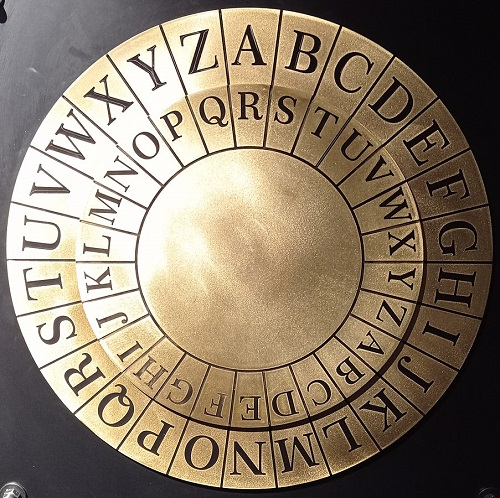

<div id="sumario" class="sumario-git">
    <h1>Sumário</h1>
    <ul>
    <details>
        <summary><a href="#introdução-aos-inteiros">Introdução aos inteiros</a></summary>
        <ul class="section-content">
            <li><a href="#contextualização" >Contextualização</a></li>
            <li><a href="#ue-questões"> Ue, questões..? </a></li>
            <li><a href="#definição-dos-números"> Definição dos... Números? </a></li>
            <summary><a href="#definição-dos-naturais">Definição dos Naturais</a>
            </summary>
            <ul class="section-content">
              <li><a href="#os-axiomas-de-peano"> Os Axiomas de Peano </a></li>
              <li><a href="#ordinais-de-john-von-neumann"> Ordinais de John von Neumann </a></li>
            </ul>
            <li><a href="#definição-dos-inteiros">Definição dos Inteiros</a></li>
        </ul>
    </details>
    <details>
        <summary><a href="#divisibilidade-e-primos">Divisibilidade e Primos</a></summary>
        <ul class="section-content">
            <li><a href="#relação-de-divisibilidade-e-o-teorema-da-divisão">Relação de Divisibilidade e o Teorema da Divisão</a></li>
            <details>
            <summary><a href="#teorema-fundamental-da-aritmética">Teorema Fundamental da Aritmética</a></summary>
            <ul class="section-content">
              <li><a href="#qualquer-número-é-primo-ou-composto-por-uma-fatoração-de-primos">Qualquer número é primo, ou composto por uma fatoração de primos</a></li>
              <li><a href="#a-fatoração-acima-é-única">A Fatoração acima é Única</a></li>
              <li><a href="#juntando-as-peças">Juntando as peças</a></li>
              </ul>
            </details>
            <details>
            <summary><a href="#múltiplos-e-divisores-comuns">Múltiplos e Divisores comuns</a></summary>
            <ul class="section-content">
              <li><a href="#mmc">MMC</a></li>
              <li><a href="#mdc">MDC</a></li>
              <li><a href="#algoritmo-de-euclides-e-o-teorema-de-bezout">Algoritmo de Euclides e o Teorema de Bezout</a></li>
            </ul></details>
        </ul>
    </details>
    <details>
        <summary><a href="#relações-de-congruência">Relações de Congruência</a></summary>
        <ul class="section-content">
            <li><a href="#conceitualização">Conceitualização</a></li>
            <li><a href="#relações-de-congruência-na-programação">Relações de congruência na programação</a></li>
            <li><a href="#aplicações-e-definição-formal">Aplicações e definição formal</a></li>
            <summary><a href="#propriedades">Propriedades</a></summary>
            <ul class="section-content">
              <li><a href="#propriedades-relacionais">Propriedades Relacionais</a></li>
              <li><a href="#propriedades-operacionais">Propriedades Operacionais</a></li>
            </ul>
            <summary><a href="#congruência-linear-e-inversos-modulares">Congruência Linear e Inversos Modulares </a></summary>
            <ul class="section-content">
            <li><a href="#como-encontrar-um-inverso-modular"> Como encontrar um Inverso Modular</a></li>
            </ul>
        </ul>
    </details>
    <details>
  <summary><a href="#criptografia">Criptografia</a></summary>
    <ul class="section-content">
        <li><a href="#contextualização-histórica">Contextualização histórica</a></li>
        <li><a href="#criptografia-assimétrica">Criptografia Assimétrica</a></li>
        <li><a href="#criptografia-rsa">Criptografia RSA </a></li>
    </ul>
  </details>
</ul>

  <button class="toggle-button" id="toggle-button">
  
      Esconder Sumário
  
  </button>
  
  </div>

# Introdução aos Inteiros 

## Contextualização

Nosso objetivo no dia de hoje é aprender de onde que surgiram algumas noções algébricas que são utilizadas desde o seu fundamental, mas de uma forma mais aprofundada, além de entender como elas se relacionam a conceitos importantíssimos na programação.

Note que teremos alguns simbolos diferentes do que vocês devem ter visto, então, sempre perguntem caso sintam dúvidas!

## Ue, questões..?

Antes de começar, iremos conversar um pouco e discutir certas questões sobre o que são os números. Peço para que não olhem as definições do site ainda.

1) O que você acha que são os números naturais?

2) O que você acha que são os números inteiros?

3) Esses números (naturais e inteiros) servem para o quê?

Algumas delas podem ser dificeis ou faceis dependendo de quem veja essas perguntas, porém, elas escondem tópicos complexos. No fim, alguns podem definir o 1 como "números sem resto decimal" e o 2 como "números sem resto decimal que podem ser negativos", mas percebem que sempre voltamos na mesma questão?

4) Que questão é essa? (eu vou parar com isso, eu juro)
<details>
<summary>resposta: SPOILER!</summary>
    O QUE SÃO NÚMEROS???
</details>

Nesse minicurso, para poupar vocês, iremos dar tudo mastigadinho para contextualizar e iremos construir do zero cada um desses números utilizando os Axiomas de Peano e os modelos de von Neumann (mas de uma forma um pouco simplificada).

## Definição dos... Números?

Sim, isso é bem feio de ler, mas para criar os números naturais, precisamos saber o que são números (mesmo que seja bem trivial).

Note que iremos ver o que são conjuntos no dia 4, mas irei dar um spoiler para construir de forma similar a forma que os matemáticos Peano e von Neumann construíram. 


## Definição dos Naturais


Iremos começar o dia definindo o conjunto dos números naturais. Porém, iremos poupar um pouco
vocês disso e apenas mostrar por cima o sistema de von Neumann e alguns axiomas de Peano, já que não temos tanto tempo
para nos aprofundar nessa parte.
Além disso, (coloquem na conta de Heitor) serei hipócrita e irei falar um pouco sobre a história da criação dos naturais, depois disso nós iremos construir nossas coisas se baseando na perspectiva deles.

### Os Axiomas de Peano

Estamos em 1889, no fim do século XIX, a matemática está em crescimento (mas prestes a estar em uma era de medo :o), mas estamos com alguns problemas nas teorias dos números naturais. Basicamente, o matemático Giuseppe Peano notou que a teoria dos números tinha um grande problema: A falta de rigor matemático. Durante essa época, a teoria dos naturais era baseada apenas em intuição, e Peano notou que isso poderia levar a ambiguidades e contradições. 

Após isso, inspirado pelos trabalhos de Euclides (axiomatização da geometria), Peano resolveu fazer o mesmo para a aritmética, mostrando que as operações básicas (adição, subtração, multiplicação etc) poderiam ser deduzidas em um conjunto pequeno de premissas, ou axiomas que não precisassem de prova. Então, Peano publicou "Arithmetices principia, nova methodo exposita", onde continham seus 5 axiomas e 3 objetos primitivos, sendo eles:

```haskell
-- Objetos
  -- apenas o número 0
  -- apenas o conjunto dos naturais N (sim, é o N e não o ℕ)
  -- apenas uma função sucessor (Succ()) (pega um numero e retorna o sucessor dele)

-- Axiomas
  -- 1) O 0 existe.
  0 ∈ N

  -- 2) O sucessor existe.
  (∀n ∈ N)[Succ(n) ∈ N]

  -- 3) O 0 não é sucessor.
  (∀n ∈ N)[0 != Succ(n)]

  -- 4) Injetividade dos sucessores.
  (∀n, m ∈ N)[Succ(n) = Succ(m) → n = m]

  -- 5) Axioma da Indução
  --Não irei escrever, mas é a indução que vocês viram ontem.
```

Porém, mesmo com esses axiomas, ainda temos aquela mesma dúvida de antes, "O que são números?", von Neumann irá resolver isso e ainda ajudar a deixar esses axiomas mais "fortes" e "robustos".

### Ordinais de John von Neumann

Agora estamos no começo do século XX, o momento onde começa a Crise dos Fundamentos da Matemática, a matemática até aquele momento era vista como a ciência "perfeita" e "rigorosa", mas, foi o momento onde surgiram diversos paradoxos, como o paradoxo de Russel, que foi o mais famoso (uma analogia dele seria "se um barbeiro que barbeia todos os homens de uma vila que não barbeiam si mesmos, quem barbeia o barbeiro?). Basicamente, a solução para a crise seria criar um sistema de axiomas "perfeito", onde não teriam erros e paradoxos, logo, a solução foi útilizar a querida Teoria dos conjuntos ZFC (Zermelo-Fraenkel com o axioma da escolha), onde não iremos nos aprofundar.

Com isso, por volta de 1923, John von Neumann pensou: "como eu posso consertar os paradoxicos lógicos dos números?" e também "Como eu posso fazer isso respeitando os Axiomas de Peano", como a teoria dos conjuntos ZFC estava em alta por ser "simples" e "completa", von Neumann buscou formalizar ela para resolver esses paradoxos, dando uma base firme para a criação da Teoria dos Números.

Nessa teoria, definimos cada natural como o "conjunto dos naturais que os precedem". Confuso? Um pouco. Então iremos mostrar de forma visual:

```haskell
0 ≝ Ø --antes do 0 não tem ninguém
1 ≝ {0} ≝ { Ø } -- antes do 1 tem o 0
2 ≝ {1, 0} ≝ { { Ø } , Ø } -- antes do 2 tem o 1 e o 0
```

Em termos formais, temos:

```haskell

Succ(n) ≝ n ∪ {n}

```

Com isso, temos não só como construir os naturais de forma "simples", mas estamos prontos para criar o conjunto dos inteiros!

## Definição dos Inteiros

Antes de iniciar isso, tenho duas perguntas:

1) Alguém já sabe como definir os inteiros?

2) Alguém consegue explicar como ela funciona?

Sim, eu sei como funciona, tanto que fiz esse material, mas o ponto é que a partir daqui, temos MUITAS definições possíveis, algumas mais fortes que outras, e hoje, irei mostrar uma das favoritas e iremos criar ela do zero:

A nossa definição de inteiros vai utilizar alguns conceitos interessantes sobre classes de equivalência:

Sejam n, m, i, k ∈ Nat e a relação de equivalência (∼).
Sejam, então, as tuplas (n, m), (i, k) :: Nat X Nat.
Definimos a relação (∼):
```haskell
(∼) :: (Nat × Nat) × (Nat × Nat) → Prop

(n, m) ∼ (i, k) ↔ n + i = k + m.

[(n, m)] = {(k, i) : (k, i) ∈ Nat × Nat e (n, m) ∼ (k, i)}

```

Um pouco dificil de entender, mas, vamos analisar essa definição.

Vamos pegar como exemplo a tupla (2, 3). a classe [(2, 3)] será o conjunto de todas as tuplas que
tem a relação 2 + k = 3 + i para quaisquer k e i naturais, ou seja, (2, 3), (3, 4), (4, 5), ..., e
também, caso não tenha notado, essa classe [(2, 3)] representa o inteiro -1.

Sendo assim, temos que o conjunto dos inteiros é o conjunto de todas as classes de congruência (∼).
Exemplos:

```haskell
[(3, 2)] := 1

[(5, 2)] := 3

[(0, 42)] := −42
```


# Divisibilidade e Primos

## Relação de divisibilidade e o Teorema da divisão

Agora que definimos o nosso escopo, estamos interessados em construir relações para ele, sendo
o nosso objetivo principal encontrar jeitos de relacionar cada número inteiro. Iniciaremos com as
seguintes relações:

``` haskell
(+) :: Int x Int → Int
(*) :: Int x Int → Int
(−) :: Int → Int
( | ) :: Int x Int → Prop
```

Já estamos acostumados com os três primeiros, porém, essa última pode ser um pouco confusa caso vista pela primeira vez.

Sejam a, b ∈ Int com a ̸= 0, temos que a|b significa ”a divide b”, quase como se fosse uma divisão,
mas retornaria ”true” ou ”false” caso o resultado seja inteiro, ou não. Sendo essa operação o nosso
tópico principal.
Definimos a|b da seguinte forma:

```haskell
a|b ↔ (∃k :: int)[k * a = b]
```

Alguns podem ter notado que essa relação na verdade não é ”quase como se fosse uma divisão”, como dito antes,
mas sim, o nosso primeiro passo para construir a própria divisão.

Como o objetivo era ”relacionar cada inteiro”, vamos ”reformular” essa relacão de modo em que
caso tenhamos 2 inteiros, nós conseguimos extrair uma relação entre os dois:

```haskell
(∀a, b :: int)(∃!q, r :: int)[0 ≤ r < |b| ⇒ a = q * b + r]
```

Chamamos essa proposição de o Teorema da Divisão. Caso os simbolos feios tenham deixado
dificil entender, esse teorema diz que conseguimos relacionar quaisquer dois inteiros de uma única forma.

Note que, quando temos que r = 0, o teorema da divisão é muito similar a nossa relação de divisibilidade,
o motivo disso é que olhamos esse ”r” como o ”resto” da divisão entre a e b, e caso você se
lembre do seu 5 ano do fundamental, quando temos resto 0, é quando um inteiro é divisor de outro.

Exemplos:
```haskell
a := 42, b := 9:
42 = 4 * 9 + 6 (q = 4, r = 6)

a := 5, b := 2:
5 = 2 * 2 + 1 (q = 2, r = 1)

a := 4, b := 5
4 = 0 * 5 + 4 (q = 0, r = 4)
```
Logo, chamaremos de div e mod as relações onde:
```haskell
a div b = div(a, b) = q.
a mod b = r.
```
Com isso, estamos preparados para trabalhar em alto nível.

## Teorema Fundamental da Aritmética

Iremos começar montando nossos planos para construir o Teorema Fundamental da Aritmética:
1) Definir o que são primos.
2) Mostrar que qualquer número é um primo ou composto por uma fatoração de primos
3) Mostrar que essa fatoração é única.


### O que são Primos?

Primeiramente, iremos definir o que são números primos (viu o que eu fiz? >:))

Seja p um número primo. Temos que o p tem as seguintes características:
```haskell
(I) p ∈ Int
(II) p > 1.
(III) p não tem divisores além de 1 e ele mesmo.
```

Podemos também reescrever o (II) como:

```haskell
p primo ↔ (∀a ∈ Int)[a != 1 & a != p ⇒ a ∤ p]
```

Ou reduzindo a complexidade para:

```haskell
p primo ↔ (∀a < p)[a > 1 ⇒ a ∤ p]
```

OU REDUZINDO MAIS AINDA PARA:

```haskell
p primo ↔ (∀a primo)[a ≤ √p ⇒ a ∤ p]
```

Brincadeiras a parte, iremos utilizar qualquer uma das duas primeiras reescritas como uma ”definição”, 
a terceira é conhecida como o Crivo de Eratóstenes, antes de utilizar ele, vocês precisarão demonstrar :). Obs: vocês também precisam definir o que é uma raiz quadrada >:).

Analogamente, chamaremos os números que ”não são primos” como números compostos.

### Qualquer número é primo, ou composto por uma fatoração de primos
Irei demonstrar em uma linguagem um pouco mais "low level":

```haskell
-- Iremos mostrar que (∀n > 1)(∃p primo)[p | n]
Seja n :: Int>1, Inducao forte em n.
Passo base: -- n = 2
Imediato [2 primo e 2|2]
Passo Indutivo:      --Hipotese: (∀k)[1 < k < n ⇒ (∃p primo)[p | k]]

Caso n primo:
Imediato [n | n]
Caso n composto:
Sejam a, b tq n = a*b
Logo, a > 1, n > b [Teorema ?]
Logo, pela Hipotese, a e b sao primos, ou compostos por primos.
Logo, n  ́e composto por primos [Transitividade]
```

Note que escrevi [Teorema ?] na linha 10, tente descobrir qual teorema eu usei e demonstre-o.

### A fatoração acima é única

```haskell
--Iremos mostrar a unicidade dessa fatoração.
Seja n composto. Suponha que n tenha duas fatoracoes distintas.
Sejam s e t tq, sem perda de generalidade, s ≤ t.
Logo, temos que n = p₁ * p₂ * ... * pₛ, onde cada p sao primos que estao em ordem crescente
Analogamente, temos que n = q₁ * q₂ * ...qₜ, onde cada q sao primos que estao em ordem crescente.
Como p₁ | n, temos que p₁|q₁ * q₂ * ... * qₜ.
Logo, seja h tq p₁ = qₕ  [Lema ?]
Logo, p₁ ≥ q₁ [h ≥ 1]. -- chamarei esse passo de h1.
Logo, q₁ ≥ p₁ [h1]
Logo, p₁ = q₁
Analogamente, temos que p₂ * p₃ * ... * pₛ = q₂ * q₃ * ... * qₜ. [p₁ = q₁]
Analogamente, para cada pₖ e qₖ com 1 < k < s, pₖ = qₖ.
Caso s < t:
Logo, 1 = qₛ₊₁ * qₛ₊₂ * ... * qₜ.
Contradicao [qₖ primo para cada 1 < k < t].
Logo, s = t e pₖ = qₖ para cada 1 < k < t
```
Similar a última demonstração, encontre o [Lema ?] e o demonstre.

### Juntando as peças
Juntando tudo isso, para qualquer inteiro positivo a, ou ele é um primo, ou pode ser escrito como uma fatoração
de primos, onde essa fatoração é única, a menos da ordem de seus fatores.

Podemos ver da seguinte forma:

Para qualquer n > 1, podemos escrever n como:

```haskell
n = p₁ᵏ¹ * p₂ᵏ² * ... * pᵣᵏʳ
```

Onde, para i = 1, 2, ... , r, cada kᵢ é um inteiro positivo e cada pᵢ é um número primo, tal
que p₁ < p₂ < ... < pᵣ.

SIM MATEMATICOS, EU SEI QUE ISSO FICARIA MUITO MAIS BONITO COM UMA PRODUTÓRIA.

Chamamos essa forma de forma canônica.
Note que, o nosso objetivo de ”relacionar dois inteiros quaisquer” já foi cumprido. Esse teorema
é extremamente poderoso e é a ”base para a matemática básica que vemos nas escolas". A partir
disso, podemos iniciar tópicos um pouco mais complexos.

## Múltiplos e Divisores comuns
Sim, de fato iremos ver isso.

O Teorema Fundamental da Aritmética nos permite especificar cada divisor/múltiplo comum de
quaisquer números inteiros, então, iremos analisar como as operações de MMC e MDC nos
permitem trabalhar melhor com números primos.

### MMC
O MMC (Mínimo Múltiplo Comum), como o nome já diz, á a operação que vê o menor número
que é divisível por outros dois (ou mais). Definimos da seguinte forma:

```haskell
MMC(a, b) = min(c : a|c & b|c)
```

Uma definição um pouco diferente do que estamos acostumados, mas que não é tão dificil de
se compreender, já que ela (literalmente) pega o menor fator "c", onde a | c e b | c.

### MDC

Agora, iremos ver o ”mais interessante” que é o MDC. Como o nome já diz, o MDC (Máximo
Divisor Comum) não foge muito do padrão. Similar ao seu irmão mais novo (MMC), podemos
utilizar a seguinte definição:

```haskell
MDC(a, b) = max(c : c|a & c|b)
```

Onde ela pega o maior fator "c" onde a divide c e b divide c.

Note que, unindo as duas operações, temos que:
```haskell
MDC(a, b) * MMC(a, b) = a * b
```

### Algoritmo de Euclides e o Teorema de Bezout

Podemos utilizar o seguinte algoritmo para calcular o MDC de 2 números:
```haskell
MDC(c, 0) = c
MDC(a, b) = MDC(b, r)
```
Onde o r é o resto da divisão de a por b.
Chamamos esse algoritmo de ”Algoritmo de Euclides”. A ”extratégia” do uso desse algoritmo é continuar
dividindo o número ”na esquerda” pelo ”da direita” até encontrar o MDC na forma MDC(c.0) para simplificar como apenas ”c”.

O interessante surge quando Bezout constrói seu mais famoso teorema:

(∀a, b ∈ Int=0)(∃s, t ∈ Int)[MDC(a, b) = a * s + b * t]

Em outras palavras, podemos colocar MDC(a, b) como uma combinação linear de a e b.
Agora, juntando isso com o Algoritmo de Euclides, temos o Algoritmo Estendido de Euclides (nome criativo).
Nele, buscamos encontrar o ”r” (como no Algoritmo de Euclides), mas, voltamos para encontrar
a combinaçãoo linear. Confuso? Sim. Útil? MUITO!!
Exemplo:

```haskell
MDC(252, 198)
252 = 1*198 + 54 -> 54 = 252 - 1*198 (I)
198 = 3*54 + 36  -> 36 = 198 - 3*54 (II)
54 = 1*36 + 18   -> 18 = 54 - 1*36 (III)
36 = 2 * 18 + 0
calc:
18 = 54 - 1*36 [III]
18 = 54 -1*(198 - 3*54) [II]
18 = -198 + 4*54
18 = -198 + 4*(252 - 1*198) [I]
18 = 4*252 -5*198
Logo, MDC(252, 198) = s*252 + t*198 onde s = 4 e t = -5.
```

Se fosse apenas isso, não teria sentido em ver isso agora, porém, esse algoritmo tem diversos usos na área de Aritmética Modular.
Já pararam para pensar em qual é o menor valor possivel para o MDC?
De fato é beeem contraditório, já que na operação buscamos o valor máximo, mas,
temos que o menor valor é o 1, já que o 1 divide qualquer número. Essa parte fica interessante quando a gente faz a seguinte pergunta:

Quando que o MDC de dois números resulta em 1?

Spoiler, ocorre quando nenhum número (além do 1) divide os outros dois (wooow). Nesse caso,
falaremos que os dois números são ”primos entre si” ou ”coprimos”. Essa informação sobre primos e coprimos será extremamtente útil na área de Aritmética Modular, mais especificamente em teoremas um pouco mais avançados como os teoremas de Fermat.

# Relações de congruência 

## Conceitualização
No Brasil, usamos o sistema de 24 horas, mas, coloquialmente, chamamos o horário das 18h por “6 da tarde”, ou o horário das 17h por “5 da tarde”. De onde exatamente saíram esse 6 e esse 5? Você pode argumentar que são 6 horas após o meio-dia (12h), ou seja, 12 + 6 = 18h, e você estaria correto, isso se trata de uma relação de congruência! 
O relógio de ponteiro só vai até as 12, mas mesmo assim conseguimos ler através dele as 24 horas do dia. Relações de congruência funcionam como relógios, da mesma forma que podemos dizer que 18h equivale a 6h (da tarde) no formato de 12h, dizemos que 18 ≡ 6 (mod 12). As relações de congruência estão diretamente ligadas aos comportamentos “cíclicos” de como enxergamos o mundo, outros exemplos são os dias da semana, dias no mês ou até mesmo as bases numéricas (como a base 10 que usamos)! Tente identificar relações de congruência nos exemplos dados.

## Relações de congruência na programação
Na computação, utilizamos vastamente relações de congruência para as mais diversas finalidades.
O operador ‘%’ (módulo) retorna o resto de uma divisão, o que é a base para as relações de congruência. Utilizando nosso exemplo do relógio, podemos utilizar o operador ‘%’ para descobrir que horário no relógio é equivalente a nossa entrada no formato 24h.
```python
# Exemplo 1: Ciclos de 12 horas (relógio)

# Qual horário corresponde as 18h?
print(18 % 12)  # Saída: 6 → 18 ≡ 6 (mod 12)

# Qual horário corresponde as 23h?
print(23 % 12)  # Saída: 11 → 23 ≡ 11 (mod 12)
``` 
Para checar se dois números são congruentes (em relação a um módulo m), basta checar se o resto que eles deixam na divisão por m é o mesmo.
```python
# Exemplo 2: Checando se dois números são congruentes em relação a um módulo

a = 38
b = 14
m = 12
print(a % m == b % m)  # True, pois 38 ≡ 14 ≡ 2 (mod 12)

```
Uma aplicação mais concreta e amplamente utilizada é descobrir se um número é par ou ímpar. Se dividirmos qualquer número por 2, existem apenas duas possibilidades: ou o resto é 0, ou o resto é 1. 
```python
# Exemplo 3: Restos deixados na divisão por 2
print(8 % 2) # Saída: 0
print(9 % 2) # Saída: 1
print(255 % 2) # Saída: 1
print(1798 % 2) # Saída: 0
```
Os números pares são as classes de equivalência de 0 módulo 2 (mais sobre isso futuramente), podemos abusar desse fato para classificar pares e ímpares facilmente, se deixa resto 0 significa que é par, se deixa resto 1, significa que é ímpar.
```python
# Exemplo 4: função para verificar se um número é par

def eh_par(numero):
   if numero % 2 == 0:
      return true # O número é par
   if numero % 2 == 1:
      return false # O numéro não é par (ou seja, é impar) 
```
 Da mesma forma que fizemos no exemplo acima, podemos usar o exemplo 2 para definir uma função recebe 2 números e um módulo, e retorna se aqueles números são congruentes em relação aquele módulo.
```python
# Exemplo 5: função para verificar se dois números são congruentes 
# em relação a um módulo

def congruente(a, b, m):
   if (a % m) == (b % m):
      return true
   else:
      return false:
```

## Aplicações e Definição formal
A ideia principal por trás das relações de congruência é mostrar que dois números são equivalentes numa divisão por um número m se, ao serem divididos por m, eles deixam o mesmo resto. Por exemplo quando dividimos 6 por 4, obtemos resto 2 (6 mod 4 = 2), e da mesma forma, quando dividimos 10 por 4 também obtemos resto 2 (10 mod 4 = 2), assim, dizemos que 6 equivale a 10 (ou que 6 é congruente a 10) numa divisão por 4. Esse conceito tem diversas aplicações práticas, como:

1. **Criptografia**
 - Algoritmos como RSA usam congruências modulares para codificar/decodificar mensagens (ex: cálculo de c ≡ m^e mod n para cifragem). [Idéia: implementar em python um algorítmo de cifra de césar simples]
2. **Validação de documentos**
 - Dígitos verificadores do CPF, cartões de crédito ou até contas bancárias utilizam congruências modulares
3. **Hash tables**
 - Funções hash utilizam o operador '%' para mapear chaves em índices de arrays
4. **RNG (Random Number Generator)**
 - ...

### Definição Formal
Dados a,b e m inteiros, e m > 0, dizemos que:
a ≡ b (mod m) se e somente se m \| (a - b)
Exemplos:
```haskell
- 15 ≡ 3 (mod 12), pois 12 \| (15 - 3)
- 6 ≡ 2 (mod 4), pois 4 \| (6 - 2)
- 19 ≡ 5 (mod 7), pois 7 \| (19 - 5)
```
## Aritmética Modular

### Propriedades
Agora, vamos ver algumas propriedades fundamentais das relações de equivalência, e demonstrar que elas valem.
#### **Propriedades relacionais**
Vamos começar com algumas propriedades da relação em si.

**Reflexividade:** a ≡ a (mod m)


<details>
<summary> Resposta:SPOILER! </summary>
<div markdown="1">
```haskell
-- Podemos demonstrar essa propriedade por contradição. 
Assuma que a propriedade é falsa, ou seja:
a /≡ a (mod m) -- [onde '/≡' é a negação de '≡']
-- Podemos transformar essa proposição através de definições que já vimos de tal forma:
a /≡ a (mod m) -> m ∤ (a - a) -- [pela definição de congruência que vimos a pouco]
m ∤ (a - a) -> ∄k, k * m = (a - a) -- [pela definição do operador '\|' que vimos no começo dessa aula]
-- A partir daqui, basta desenvolver um pouco a equação para chegar numa contradição:
∄k, k * m = (a - a) -> ∄k, k * m = 0    
-- Sabemos que qualquer número multiplicado por 0 resulta em 0, 
-- isso contradiz a proposição que concluímos 
-- a partir da assunção original que fizemos. 
Logo, por prova indireta, a ≡ a (mod m).
```
</div>
</details>

**Simetria:** a ≡ b (mod m) → b ≡ a (mod m)

<details>
<summary> Resposta:SPOILER! </summary>
<div markdown="1">
```haskell
Seja a ≡ b (mod m) 
-- Como na propriedade anterior, vamos transformar essa proposição
a ≡ b (mod m) -> m \| (a - b)
m \| (a - b) -> ∃k, k * m = (a - b)
-- Agora, vamos desenvolver essa equação a nosso favor
k * m = (a - b) -> -1 * k * m = -1 * (a - b) 
-1 * k * m = -1 * (a - b) -> (-k) * m = -a + b
(-k) * m = -a + b -> j * m = b - a -- [Com j = -k]
Logo,
∃j, j * m = (b - a) 
Pela definição de \|, temos
∃j, j * m = (b - a) -> m \| (b - a)
Pela definição de congruência, temos
m \| (b - a) -> b ≡ a (mod m)
Que é o que queriamos demonstrar.
```
</div>
</details>

**Transitividade:** a ≡ b (mod m) e b ≡ c (mod m) → a ≡ c (mod m)

<details>
<summary> Resposta:SPOILER! </summary>
<div markdown="1">
```haskell
Seja a ≡ b (mod m), e  b ≡ c (mod m)
-- Já sabe o que fazer né? Transformar a proposição utilizando as definições
Podemos escrever:
a ≡ b (mod m) -> m \| (a - b)
m \| (a - b) -> ∃k, k * m = (a - b)
Analogamente:
b ≡ c (mod m) -> m \| (b - c)
m \| (b - c) -> ∃k, k * m = (b - c)
-- Temos que pensar um pouco fora da caixa agora,
-- precisamos chegar que a ≡ c (mod m). Para isso
-- precisamos obter b em função de a
Temos que:
k * m = (a - b) -> -b = k * m - a -> b = -k * m + a
-- Agora, basta substituir b na outra equação
Logo:
k * m = (b - c) -> k * m = (-k * m + a) - c -> k * m + k * m = a - c
k * m + k * m = a - c -> 2 * (k * m) = (a - c) -> (2 * k) * m = (a - c)
(2 * k) * m = (a - c) = j * m = a - c -- Com j = 2 * k
-- Agora é so transformar de volta pra forma de congruência 
Pela definição de \|, temos
∃j, j * m = (a - c) -> m \| (a - c)
Pela definição de congruência, temos
m \| (a - c) -> a ≡ c (mod m)
Que é o que queriamos demonstrar.
```
</div>
</details>


#### **Propriedades operacionais**
Agora é sua vez, como exercício, tente demonstrar as seguintes propriedades. Lembre-se, você pode utilizar as propriedades
que já foram demonstradas acima.

> *Se a ≡ b (mod m) e c ≡ d (mod m), então:*
1. Adição: a + c  ≡ b + d (mod m)
2. Subtração: a - c ≡ b - d (mod m)
3. Multiplicação: a * c ≡ b * d (mod m)

> *Desafio!*
1. Se c * a ≡ c * b (mod m), então a ≡ b (mod n/MDC(c, n))
2. Se c * a ≡ c * b (mod m) e MDC(c, m) = 1, então a ≡ b (mod m)
3. Se c * a ≡ c * b (mod p) e p ∤ c, onde p é primo, então a ≡ b (mod p)

### Congruência Linear e Inversos Modulares

Similar as funções lineares que vocês devem ter visto recentemente em ME, MBM, Cálculo, uma congruência linear é uma equação na seguinte forma:

a * x ≡ b (mod m)

E como ocorre em qualquer equação, nós podemos resolver ela (encontrar o x onde a congruência acontece). Porém, note que caso b = 1, nós temos uma situação bem conhecida na matemática:

a * x ≡ 1 (mod m)

Chamamos o "x" de "inverso modular de a no módulo m", ou apenas de "inverso de a mod m". Essa informação nos permite manipular equações e montar sistemas. Note que existem alguns casos onde alguns números não possuem inversos, por exemplo:

2x ≡ 1 (mod 4)

Não nos aprofundaremos nisso, mas temos o seguinte Teorema sem nome: "O elemento a tem inverso módulo
m se, e somente se, a e m não têm fatores primos em comum ". Note que, como consequência do último teorema, temos o seguinte: "se m for primo, todos os elementos não nulos possuem inversos" 

#### Como encontrar um inverso modular

"ah, é só sair multiplicando até achar"

encontre o x em 5x ≡ 1 (mod 10007).

Ok, é possivel fazer isso com números pequenos, mas para valores grandes isso se torna inviável. 

Voltando um pouco no tempo, nós temos uma ferramente muito útil para esse momento, e ele é o Teorema de Bezout! Ele diz que MDC(a, b) = at + bs para algum t e s inteiros. Como o nosso outro teorema diz que "a tem inverso modulo m apenas se eles não tem fatores primos em comum", podemos ver ele como "a tem inverso módulo m apenas de MDC(a, m) = 1" (caso não se lembre, foi visto anteriormente no módulo de MDC). Logo, calculemos:


```haskell
MDC(a, m) = at + ms         [teorema de bezout]
1 = at + ms                 [a e m não tem fatores primos em comum]
1 ≡ at + ms    (mod m)      [1 ≡ 1 (mod m), como 1 = at + ms, então 1 ≡ at + ms (mod m)]
1 ≡ at         (mod m)      [ms ≡ 0 (mod m)]
```

Logo, utilizando conceitos vistos no passado, podemos utilizar o Algoritmo Estendido de Euclides para encontrar os inversos modulares, apenas encontrando o "t" que aparece no MDC(a, m) = at + ms.

#### Exercícios

1. Faça um "esquema" que mostre o passo à passo de como se calcula o inverso modular.
2. Faça um pseudocódigo que aplique esse "esquema".
3. Calcule os inversos de 3 mod 7 e 42 mod 11.

> *Desafio!*
4. Implemente um código na linguagem que você preferir que calcule o inverso modular de algum número a no módulo m. (dica: fazer isso e rodar o código para resolver a questão 3 é beeem divertido!)
5. Resolva os desafios do último tópico utilizando inversos modulares.

# Criptografia

## Contextualização histórica
Historicamente, "esconder" mensagens sempre foi uma necessidade: passar informações para aliados de maneira segura, - sem a possibilidade delas serem roubadas - era imprescindível durante episódios como guerras ou conflitos. Nesse contexto, foram desenvolvidas técnicas para que essas mensagens pudessem passar despercebidas ou ininteligíveis diante do olho inimigo, mas claras para os destinatários.

A esteganografia, por exemplo, já é utilizada há milhares de anos. O seu nome vem das palavra gregas "steganos", que significa "coberta", e "graphein", que significa "escrever" - e, como as definições sugerem, a prática se reduz a encobrir a existência dessas mensagens por completo, de forma que elas passem despercebidas a um olho destreinado.

Durante as Guerras Persas, (cerca de 500-450 AC!) o governante Histieu de Mileto já se utilizava da esteganografia: prisioneiro do rei da Pérsia e na necessidade de passar mensagens para o seu exército na Grécia, ele raspou a cabeça de um mensageiro, tatuou a mensagem em seu couro cabeludo, e esperou o cabelo crescer de novo. Com a mensagem encoberta, o mensageiro poderia viajar sem nenhum problema pelas terras e, quando chegasse em seu destino, rasparia a sua cabeça de novo para informar as ações que deveriam ser tomadas pelos gregos.

Ainda que completamente inaplicável em grande escala (convenhamos, nem todos temos tempo o suficiente de esperar cabelo crescer para mandarmos mensagens. Ou espaço o suficiente em nossos couros cabeludos.), essa ação já mostrava a aplicação da esteganografia para passar mensagens de maneira segura (e ineficiente). Mas não para por aí! Ainda na Grécia, tabuletas de cera eram raspadas, escritas sobre e depois cobertas com cera de novo para passarem despercebidas. Já na China antiga, mensagens eram escritas em tiras finas de seda e amassadas e cobertas por cera - os mensageiros, então, engoliam as bolinhas para transportá-las.

Mas o problema com essas práticas era claro: assim que alguém prestasse mais atenção, pensasse em raspar a cera de uma tábua ou checasse a cabeça de alguém, ía tudo pro beleléu.

Então, à medida que a "comunicação secreta" continuou a evoluir, outra forma de passar essas mensagens foi desenvolvida - a criptografia ("cryptos", também do grego, significa "escondido"). Assim, ao invés de tentar acobertar uma mensagem, os esforços seriam direcionados para esconder o seu significado - processo conhecido como cifragem ou encriptação. Ou seja, uma mensagem seria embaralhada ou modificada com base em uma regra ou em um protocolo pré-definido, de forma que a pessoa que vai receber a mensagem consiga fazer um outro processo para desembaralhar essa mensagem e torná-la inteligível (o que ficaria difícil para alguém que não é o destinatário da mensagem fazer). Durante esse processo, é utilizada uma chave - ela que será a responsável por manter a mensagem secreta, mesmo que o algoritmo seja conhecido!

Uma das criptografias mais conhecidas é a chamada "Cifra de César", usada durante as Guerras da Gália pelo Império Romano. Nela, Júlio César (ou o seu representante) simplesmente substituía cada letra da mensagem pela letra 3 casas depois no alfabeto (nesse caso, a chave seria 3!).

*imagem cifra de césar*

<div style="text-align: center;">   </div>

Uma outra ferramenta que pode facilitar a nossa visualização é o disco de cifra! Infelizmente não temos um exemplo presencial pra mostrar pra vocês, mas as duas rodas possibilitariam o deslocamento relativo das letras de maneira circular, facilitando a etapa da encriptação!

<div style="text-align: center;">   </div>

Diversas variações dessa cifra existem - e enquanto sim, só existem 25 diferentes possibilidades triviais de chaves, não se engane! Há cerca de 400,000,000,000,000,000,000,000,000 chaves diferentes caso o alfabeto seja rearranjado; Se levássemos um segundo para checar cada uma das possibilidades, esse processo duraria cerca de um bilhão de vezes o tempo de vida do universo!

Com a modernização da área, foram criados diversos outros sistemas de criptografia, cada vez mais modernos e seguros - um deles sendo a Criptografia RSA (Rivest-Shamir-Adleman), que estudaremos um pouquinho mais a fundo a seguir!

## Criptografia Assimétrica

Até então, todas as formas de criptografia eram simétricas, - ou seja, o processo de “decriptação” era objetivamente o inverso da “encriptação”. Assim, ambos usavam a mesma chave - o que facilitaria o roubo de informações, já que a chave deveria ser transportada para que o conteúdo pudesse ser revelado! Justamente para tentar mitigar esse problema, Whitfield Diffie e Martin Hellman (dois Cientistas da Computação e pesquisadores de Stanford) idealizaram uma maneira diferente de transportar mensagens secretas: a Criptografia Assimétrica.

Na criptografia assimétrica, ao invés de apenas uma chave, duas chaves são necessárias: uma pública, para a encriptação, e uma privada, para a decriptação. Dessa forma, cada usuário disponibiliza a sua chave pública, de maneira que qualquer um pode criptografar mensagens para ele, e mantém em segredo a sua chave privada, para que ele seja o único capaz de descriptografar o que lhe foi enviado. O maior objetivo, então, seria facilitar ao máximo a primeira etapa e dificultar ao máximo a segunda (a não ser que a chave secreta esteja em sua posse!). Ou seja, o problema da necessidade de transportar a chave de maneira segura (para que a mensagem não seja roubada) some!

<div style="text-align: center;">   </div>

Para explicar mais claramente essa ideia, vamos imaginar que Alice precisa mandar uma mensagem para Bob. Então, ambos terão disponibilizado suas chaves públicas e escondido suas chaves privadas. Mas vamos também imaginar que Eve quer bisbilhotar as mensagens que eles estão mandando entre si, esse processo precisa ser feito da maneira mais segura possível.

Para Alice criptografar uma mensagem e enviá-la para Bob, ela vai usar a chave pública oferecida por ele para deixar a mensagem ininteligível. Eve, por mais que ela queira descobrir o que foi mandado, não vai conseguir fazer com que a mensagem passe a ser compreensível, porque ela não tem a chave secreta! Bob, assim que receber a mensagem, vai usar a chave secreta que ele tem para decriptar a mensagem.

Até simples de entender, né? Mas um processo que possibilitasse essa propriedade demorou anos a ser desenvolvido! Foi apenas em 1977 que Ron Rivest, Adi Shamir e Leonard Adleman foram capazes de publicar suas descobertas e uma nova forma de criptografar: a chamada Criptografia RSA.

## Criptografia RSA

A segurança desse sistema se baseia tanto na infinidade dos números primos quanto na dificuldade para a fatoração de números extensos em primos - então os primos escolhidos por Alice seriam tão, tão extensos que teriam centenas de casas decimais!!

Antes de entrarmos em exemplos com números de verdade, vamos ver o processo idealizado pelos três cientistas: Inicialmente, Alice escolhe os dois primos ***p*** e ***q***, e um número e que seja coprimo a (***p***-1)x(***q***-1) (que representa o valor da função totiente de euler! mas isso não vem ao caso agora); A chave pública consistirá, então, no produto ***n*** entre ***p*** e ***q*** e no número e. Bob, então, pegaria a sua mensagem e transformaria-na em um número ***m*** (por meio de recursos como a tabela ASCII!). O algoritmo geral levaria o garoto a transformar sua mensagem em um texto cifrado ***C*** = ***m***^***e***(mod ***n***).

Em geral, é muito difícil reverter c para a sua mensagem original sem nenhuma informação adicional devido à natureza de funções módulo: elas são imprevisíveis! Você não consegue ir “testando” números diferentes para m e basear seus chutes seguintes nos anteriores (como seria feito em uma busca binária!), já que um resultado maior não necessariamente implica em um m maior. Assim, qualquer espião ou fofoqueiro teria dificuldade em retornar à mensagem original.

Na volta, precisaremos do valor de outro número: ***d***, o inverso modular multiplicativo daquele e que publicamos anteriormente! Ou seja, temos que: ***d*** x ***e*** ≡ 1(mod(***p***-1)(***q***-1)). Conseguimos resolver essa equação usando o algoritmo estendido de euclides, que vimos anteriormente nesta aula!

Logo, pelas propriedades de inverso multiplicativo, nós conseguimos reverter a cifra para a nossa mensagem original! então, ***m*** = ***c***^***d***(mod ***n***).

Para deixar as coisas um pouco mais tangíveis, vamos exemplificar com números pequenos. Alice escolheu ***p*** = 17, ***q*** = 11 e ***e*** = 7. Portanto, serão publicados ***e*** e ***n*** = ***p*** x ***q*** = 187. Caso Bob queira mandar apenas uma letra ‘X’ para Alice, ele precisa transformar essa letra em um número para que ele possa ser encriptado - e, ao checar a tabela ASCII, Bob chega à conclusão que sua mensagem ***m*** = 88. Usando a fórmula vista anteriormente, ***c*** = 887(mod 187). Através de propriedades modulares (aquelas que vimos mais cedo!), podemos chegar aos seguintes resultados:

```haskell
88⁷ (mod 187) = [88⁴ (mod 187) ✕ 88² (mod 187) ✕ 88¹(mod 187)] (mod 187)
88¹ = 88 = 88 (mod 187)
88²  = 7,744 = 77 (mod 187)
88⁴ = 59,969,536 = 132 (mod 187)
88⁷ = 88¹ ✕ 88² ✕ 88⁴ = 88 ✕ 77 ✕ 132 = 894,432 = 11 (mod 187)
```
Então Bob chega à conclusão que a mensagem encriptada tem o valor 11!


Alice, para decriptar a mensagem, precisa encontrar o valor de ***e*** - e, para isso, irá utilizar os valores de suas chaves privadas ***d***, ***p*** e ***q***!. Assim, como temos que ***d*** e ***e*** são inversos modulares, podemos aplicar o algoritmo estendido de euclides para descobrirmos o valor de ***d***:

```haskell
d * 7 ≡ 1(mod(17-1)*(11-1))
d * 7 ≡ 1(mod 16*10)
d * 7 ≡ 1(mod 160)

```
ou seja, temos que, para algum ***d*** e algum outro inteiro k, 7*d + 160k = 1

pelo algoritmo de euclides:
```haskell
160 = 22 * 7 + 6
7 = 1 * 6 + 1
6 = 6 * 1 + 0
```

Agora, para realizar os passos extras do algoritmo estendido, isolamos cada resto do passo anterior e substituímos os valores!:
```haskell
1 = 7 - 1*6
1 = 7 - 1 * (160 - 22*7)
1 = 7 - 160 + 22*7
1 = 23 * 7 + 160 * (-1)
```

No fim, para descobrir o que Bob teria enviado para ela, alice aplica ***m*** = ***c***^***d*** (mod 187).
```haskell
M= 11²³(mod 187)
M = [11¹ (mod 187) ✕ 11² (mod 187) ✕ 11⁴ (mod 187) ✕ 11¹⁶(mod 187)] (mod 187)
M = 11 ✕ 121 ✕ 55 ✕ 154 (mod 187)
M = 88 = X em ASCII
```

A mensagem foi enviada, transportada e entregue de maneira segura! Alice pode, finalmente, ler a letra ‘X’ que Bob lhe enviou.

No entanto, vale ressaltar que os números escolhidos para esse exemplo são pequenos demais para serem seguros. Na realidade, são utilizados números que usam até 2048 bits para serem representados! E, mesmo assim, esse sistema é considerado relativamente desatualizado, já que sua segurança depende da fatoração de um número grande em dois primos, e os avanços em hardware têm sido muito extensos nos últimos anos! Assim, os usos mais seguros desse sistema de criptografia incluem, em geral, a utilização da criptografia RSA junto a outros sistemas de criptografia.

---

<script>
const dataDia3 = new Date('2025-03-12');
const agora = new Date();

if (agora < dataDia3) {
    document.body.innerHTML = '<h1 style="text-align:center; margin-top:20%;">Página Indisponível</h1>' +
                              '<p style="text-align:center;">Esta página estará disponível a partir de ' + dataDia3.toLocaleDateString() + '.</p>';
}
</script>

