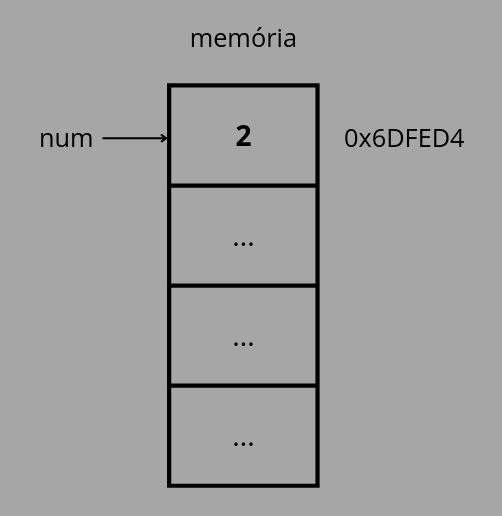
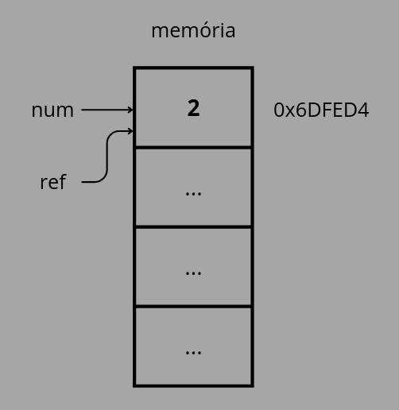
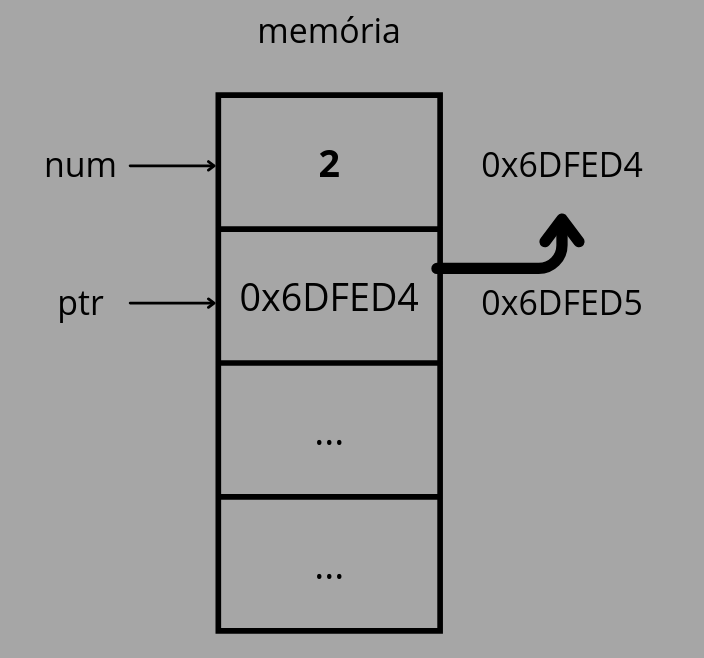
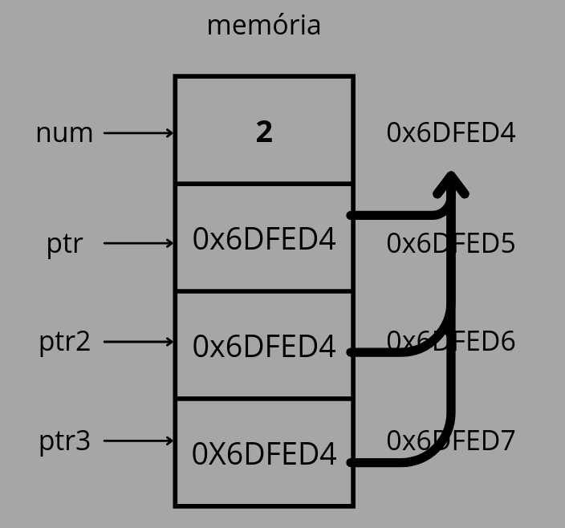

<div id="sumario" class="sumario-git">
    <h1>Sumário</h1>
    <ul>
    <details>
        <summary><a href="#introdução-aos-inteiros">Introdução aos inteiros</a></summary>
        <ul class="section-content">
            <li><a href="#contextualização" >Contextualização</a></li>
            <li><a href="#ue-questões"> Ue, questões..? </a></li>
            <li><a href="#definição-dos-números"> Definição dos... Números? </a></li>
            <summary><a href="#definição-dos-naturais">Definição dos Naturais</a>
            </summary>
            <ul class="section-content">
              <li><a href="#os-axiomas-de-peano"> Os Axiomas de Peano </a></li>
              <li><a href="#ordinais-de-john-von-neumann"> Ordinais de John von Neumann </a></li>
            </ul>
            <li><a href="#definição-dos-inteiros">Definição dos Inteiros</a></li>
        </ul>
    </details>
    <details>
        <summary><a href="#divisibilidade-e-primos">Divisibilidade e Primos</a></summary>
        <ul class="section-content">
            <li><a href="#relação-de-divisibilidade-e-o-teorema-da-divisão">Relação de Divisibilidade e o Teorema da Divisão</a></li>
            <details>
            <summary><a href="#teorema-fundamental-da-aritmética">Teorema Fundamental da Aritmética</a></summary>
            <ul class="section-content">
              <li><a href="#qualquer-número-é-primo-ou-composto-por-uma-fatoração-de-primos">Qualquer número é primo, ou composto por uma fatoração de primos</a></li>
              <li><a href="#a-fatoração-acima-é-única">A Fatoração acima é Única</a></li>
              <li><a href="#juntando-as-peças">Juntando as peças</a></li>
              </ul>
            </details>
            <details>
            <summary><a href="#múltiplos-e-divisores-comuns">Múltiplos e Divisores comuns</a></summary>
            <ul class="section-content">
              <li><a href="#mmc">MMC</a></li>
              <li><a href="#mdc">MDC</a></li>
              <li><a href="#algoritmo-de-euclides-e-o-teorema-de-bezout">Algoritmo de Euclides e o Teorema de Bezout</a></li>
            </ul></details>
        </ul>
    </details>
    <details>
        <summary><a href="#relações-de-congruência">Relações de Congruência</a></summary>
        <ul class="section-content">
            <li><a href="#conceitualização">Conceitualização</a></li>
            <li><a href="#relações-de-congruência-na-programação">Relações de congruência na programação</a></li>
            <li><a href="#aplicações-e-definição-formal">Aplicações e definição formal</a></li>
            <summary><a href="#propriedades">Propriedades</a></summary>
            <ul class="section-content">
              <li><a href="#propriedades-relacionais">Propriedades Relacionais</a></li>
              <li><a href="#propriedades-operacionais">Propriedades Operacionais</a></li>
            </ul>
            <summary><a href="#congruência-linear-e-inversos-modulares">Congruência Linear e Inversos Modulares </a></summary>
            <ul class="section-content">
            <li><a href="#como-encontrar-um-inverso-modular"> Como encontrar um Inverso Modular</a></li>
            </ul>
        </ul>
    </details>
    <details>
  <summary><a href="#criptografia">Criptografia</a></summary>
    <ul class="section-content">
        <li><a href="#contextualização-histórica">Contextualização histórica</a></li>
        <li><a href="#criptografia-assimétrica">Criptografia Assimétrica</a></li>
        <li><a href="#criptografia-rsa">Criptografia RSA </a></li>
    </ul>
  </details>
</ul>

  <button class="toggle-button" id="toggle-button">
  
      Esconder Sumário
  
  </button>
  
  </div>


## TAD x ED

Na aula de hoje, vamos nos aprofundar em um dos conflitos conceituais mais importantes da Computação: Tipos Abstratos de Dados (TAD) x Estruturas de Dados (ED). Compreender corretamente esses 
conceitos é fundamental para expandirmos nossa noção sobre algoritmos e entendermos como o mundo das estruturas de dados funciona.

## O que são Tipos Abstratos de Dados?

TAD, ou Tipo Abstrato de Dado, é formalmente definido como um conjunto de objetos aliado à um conjunto de operações. Na prática, é uma _interface conceitual_ que define o comportamento para um conjunto de dados. A especificação de um TAD determina, principalmente, duas informações principais: como o conjunto de dados se comporta e o conjunto de regras (ou operações) que podem ser realizadas sobre ele. Algumas das operações mais comuns de serem citadas são:

- Criação da estrutura

- Inclusão de um elemento

- Exclusão de um elemento

- Acesso a um elemento

- Verificar vazio

Dessa maneira, o TAD priva o acesso aos dados e restringe a manipulação deles apenas através das operações. Perceba que o TAD, contudo, não é responsável por especificar como essas operações vão ser implementadas ou como os dados vão ser armazenados na memória. O foco aqui está na abstração, ou seja, em definir um guia comportamental e não uma especificação prática para o conjunto de dados.

### Exemplo prático: TAD Ponto

Para entender melhor o conceito de TAD, vamos trabalhar com a definição de um novo TAD arbitrário chamado `Ponto`, que define uma estrutura responsável por representar pontos e armazena duas coordenadas X e Y. Para ele, vamos, tal qual solicitado na definição do conceito, definir algumas operações básicas, como:

- `create(x, y)` - Cria um novo ponto com as coordenadas x e y;

- `delete(p)` - Deleta o ponto;

- `set_coord(p, x, y)` - Seta as coordenadas x e y para um ponto p;

- `distance(p1, p2)` - Calcula a distância entre dois pontos;

Inicialmente, vamos utilizar para a implementação desse TAD uma estrutura já bem conhecida por vocês:

```cpp
//.cpp

struct Ponto {
    float x;
    float y;
}

Ponto* create(float x, float y) {
    Ponto* p = new Ponto;
    p->x = x;
    p->y = y;
    return p;
}

void delete_ponto(Ponto* p) {
    delete p;
}

[...]
```

Perceba, porém, que a definição do `TAD Ponto` não especifica uma implementação fixa, ou seja, nós podemos explorar outras alternativas na representação prática do TAD:

```cpp

int ponto[2]; //Utilizando, por exemplo, o array clássico, ponto[0] = x , ponto[1] = y.

--------------------------

std::vector<float> coord_x; //Ou utilizando dois vetores separados
std::vector<float> coord_y;

--------------------------

```

Ou, da maneira mais convencional, através do uso de classes:

```cpp

class Ponto { // Utilizando classes
    private:
    int x;
    int y;

    public:
    Ponto(int x, int y);

    void set_coord(int nx, int ny);

    float distance(const Ponto& outro) const;

    int get_x() const;
    int get_y() const;
}

```

Perceba que a liberdade que a abstração nos dá vem com um preço: garantir que o funcionamento da estrutura e o comportamento das operações se mantenha intacto. Porém, mantendo essas condições, podemos explorar a nossa criatividade para a implementação dos mais diversos TAD's.

## O que são Estruturas de Dados?

Dentro desse contexto, as Estruturas de Dados são estruturas concretas que organizam, armazenam e manipulam dados na _memória_ do computador, permitindo a realização de operações sobre dados de maneira adequada e correta. A Estrutura de Dado, diferente do TAD, se preocupa principalmente com a maneira como os dados são representados e organizados _internamente_, estabelecendo uma relação lógica e visando a eficiência dos dados, se atentando para aspectos como:

1. Uso eficiente de memória;
2. Tempo de execução;

As estruturas de dados são as responsáveis por *materializar* as implementações dos Tipos Abstratos de Dados, ou seja, transformam uma abstração conceitual em uma implementação prática.

## Ponteiros

Calma, não se assuste.

Antes de nos aprofundarmos em algumas estruturas de dados conhecidas, vamos rever alguns pontos importantes sobre ponteiros.

Sabemos que esse tópico é meio chatinho para algumas pessoas, porém é de extrema importância. Não iremos abordar tanta coisa sobre ponteiros, apenas entender por cima como eles funcionam e aplicar na criação de estruturas de dados mais complexas.

Basicamente, ponteiros são variáveis que guardam endereços de objetos na memória. Mas... O que realmente são endereços?


##### Endereços de Memória e Referências

Suponha que temos algum valor em nosso código, por exemplo, uma variável inteira `num = 2`.

Quando declaramos essa variável `num`, armazenamos ela em um pequeno espaço na nossa memória para não perdê-la durante a execução do programa. O endereço da variável `num` seria uma representação numérica de onde ela está armazenada.


<div class="figure" style="flex: 1; text-align: center;">
    
    <p style="margin: 0.5rem auto 0; text-align: center;"><em>Representação visual<br /></em></p>
  </div>


Em C++ utilizamos o operador `&` para "recolher" o endereço de alguma variável.

```cpp
int main(){

    int num = 2;

    printf("%d", &num); 
    
                // Saída: endereço da variavel, ou nesse caso, "0x6DFED4".
    return 0;
}

```

Nesse sentido, também podemos utilizar o operador `&` como um "alias" de outras variáveis, ou seja, caso ele seja alterado, o valor original também será:

```cpp

int main(){

    int num = 2;
    int &ref = num;    //faz referência ao num

    printf("%d", num);
    printf("%d", ref);    //a saída dos dois será 2.

    
    //caso você altere a ref:

    ref = 3;

    printf("%d", num);
    printf("%d", ref);     // a saída dos dois será 3.


    return 0;
}

```
Visualmente, a declaraçao de `int &ref = num` seria como se criassemos uma variável `ref` "dentro da casinha do `num`", onde eles compartilhariam o mesmo endereço e valor.

<div class="figure" style="flex: 1; text-align: center;">
    
    <p style="margin: 0.5rem auto 0; text-align: center;"><em>Representação visual<br /></em></p>
  </div>

##### Agora sim, Ponteiros

Como dito anteriormente, ponteiros são simplesmente variáveis que guardam endereços de objetos na memória, ou seja, falamos que eles "apontam" para um objeto na memória. Todos os ponteiros tem um tipo associado que especifica o tipo do objeto que estará "apontando". Utilizamos também o prefixo (*) na declaração de ponteiros, como visto no exemplo abaixo:

```cpp

int main() {

    int num = 2; // apenas uma declaração de um inteiro.

    int* ptr;    // apenas uma declaração de um ponteiro de inteiro.
    int *ptr2;   // outra declaração de um ponteiro de inteiro.

    return 0;
}

```

```cpp
int main() {

    int num = 2;


    int *ptr = &num;    // atribui o endereço de "num" para "ptr". 

    int *ptr2 = ptr; // atribui o endereço em "ptr" (ou seja, o endereço de "num") para "ptr2".

    printf("%d", ptr2);      // print do endereço de num (0x...).
    printf("%d", *ptr2);     // print do valor em num (2).

    return 0;
}

```

Voltando para o exemplo do `num = 2`, mudaremos um pouco o nosso objetivo. Dessa vez queremos armazenar o endereço de `num` em outra variável.

Para isso, usaremos o ponteiro de inteiro `ptr`, que como definimos mais cedo, é uma variável que armazena endereços. Após isso, igualaremos ao endereço de `num` utilizando o prefixo "&" para armazená-la.

```cpp

int main() {

    int num = 2; 

    int* ptr = &num;   

    return 0;
}

```

Nesse caso, ao invés de ter uma variável "na mesma casinha" de `num`, temos uma nova variável `ptr` que armazena o endereço de `num`.

<div class="figure" style="flex: 1; text-align: center;">
    
    <p style="margin: 0.5rem auto 0; text-align: center;"><em>Representação visual<br /></em></p>
  </div>

Analogamente, caso seja necessário, podemos também igualar o valor do ponteiro `ptr` à outros ponteiros de mesmo tipo, o que seria o mesmo que igualar ao endereço de `num`.

```cpp

int main() {

    int num = 2; 

    int* ptr = &num;   
    
    int* ptr2 = ptr;

    int* ptr3 = &num; // ptr3 == ptr2 == ptr1

    return 0;
}

```

Lembrando que, mesmo que os ponteiros apontem para o mesmo endereço, não significa que eles estão no mesmo espaço de memória, como visto abaixo:

<div class="figure" style="flex: 1; text-align: center;">
    
    <p style="margin: 0.5rem auto 0; text-align: center;"><em>Representação visual<br /></em></p>
  </div>


## Tipos lineares de dados!


### Array

Ontem, para entendermos sobre ordenação, vimos um pouco sobre heap, stack, alocação estática e alocação dinâmica.
Hoje nos aprofundaremos um pouco mais nessa parte e veremos estruturas de dados e suas implementações!

// insira aqui diferenca ED x TADs

// agora comecaremos as TADs


Array

Vocês provavelmente já estão acostumados a usar essa estrutura de dados, né?
É uma das primeiras estruturas que aprendemos a usar, já que ela é muito simples: ela consegue guardar _N_ instâncias de um tipo primitivo (inteiro, booleano, double, etc.)

Mas como isso acontece?

```cpp

int n = 10;

int arr[n];

```

Quando você declara um array dessa forma, o computador "entende" que você quer alocar 10 espaços de inteiros na sua memória - nesse caso, na stack (lembre-se que esse N que declara o tamanho pode variar!).
Como vimos ontem, o acesso à stack é extremamente rápido, mas tem tamanho limitado. Então o array é uma estrutura muito otimizada e rápida para usarmos, mas não podemos abusar da nossa querida stack criando um array de tamanho 10⁹, como talvez possamos nos sentir inclinados a fazer.


Vamos analizar as particularidades e complexidades assintóticas de cada operação sobre um array

Como a estrutura é guardada toda junta na memória (e considerando que você tem acesso ao endereço inicial de memória), todo o acesso é O(1).

```cpp

cout << arr[5]

```

Isso acontece porque, tendo o ponto inicial da nossa estrutura, podemos só adicionar a quantidade de "casinhas" (equivalente à quantidade de bits que o tipo guardado no array ocupa) que vamos pular e chegar ao endereço que queremos acessar. Por isso, qualquer operação de acesso ou atualização é constante, o que se torna muito bom para nós!

Note também que não é possível fazer uma remoção ou uma anexação ao pé da letra do nosso array, porque o tamanho é fixo! Então mesmo se eu quiser muito adicionar mais um número ao meu array de tamanho 10, eu não vou conseugir :( . Isso é uma das maiores diferenças dessa estrutura para várias outras que usamos e vemos por aí. Por isso, ao criar um array, você precisa ter *certeza* do número máximo de coisas que você vai guardar.

Diferentemente do que vamos ver um pouco mais adiante, o array é nativo ao c++ (e ao c também!), então ele está fora da nossa biblioteca *STL*. Mas o que isso significa, na prática? Nós não temos funções específicas para a nossa estrutura como veremos para as outras. Mas isso veremos daqui a pouco!

De forma geral, é uma estrutura rápida e que te faz ter muito controle e noção do que você está fazendo o tempo todo. Eu pessoalmente acredito na soberania do array em todas as situações que o vector não é estritamente necessário (como em assuntos como grafos e, às vezes, na chamada de funções - mas não vamos ver nada disso aqui!), mas isso é para *você* decidir ao longo dessas aulas!

Então, vamos seguir adiante para o vector!


### Vector

Agora já entramos no mundo da STL! o vector, ou vetor, é outra das estruturas mais populares e comumente utilzadas por toda a base usuária do C++ - mas ele não é nada mais que um array "embalado" (ou "encapsulado", para os mais chiques).

// colocar o ah ehhhhh

```cpp

vector<int> vetor;

vector<int> vetor2(10);

```

Ele funciona da mesma forma que um array funcionaria, mas com alguns grandes diferenciais: O espaço que é alocado quando declaramos a estrutura é separado na Heap (então temos mais espaço!), e o seu tamanho é variável.

Vamos pensar no vector como um struct do C: É uma caixa que guarda alguns atributos e indica onde estão guardados os nossos valores. Então poderíamos imaginar essa implementação como algo assim:

// desenho com atributos vem aqui


Esses atributos podem parecer meio desnecessários, mas são *extremamente* úteis para quase todas as funcionalidades do vector - eles que dão as informações necessárias para a realocação de espaço de memória.

Primeiramente, temos o valor capacity. Ele indica o tamanho do array alocado dinamicamente - a quantidade de objetos que podemos guardar ao total nessa estrutura. A seguir, temos o atrtipoibuto "end"; ele, por outro lado, vai indicar o "final lógico" da nossa lista. Ou seja, podemos ter quantidades diferentes nesses valores, desde que a capacidade seja maior ou igual ao número de objetos comportados atualmente (capacity >= end). O último valor é um ponteiro, que, como vimos anteriormente, aponta para o primeiro endereço de memória que guarda as nossas _data_ . Esse controle que temos a partir dessas informações é que vai nos permitir alocar tamanhos menores ou maiores de memória dependendo da situação em que nos encotramos.

Uma possível implementação desses atributos de um vetor é essa aqui (feita por mim em 2024 e adaptada para vocês entenderem melhor).

```cpp
class vector {

	private:

  		int end;      		// indica o tamanho "real" do vetor, o final lógico
  		int capacity; 		// indica a capacidade do vetor
  		int * storage;        	// ponteiro para onde os valores estão
  		
 	 // [...]
  
};


```
<details>
<summary> <b>Curiosidade</b> </summary>
Note que, em classes no C++, nós podemos deixar coisas "privadas" - o que significa que estamos escondendo ela do usuário! Temos funções que retornam o tamanho e a capacidade do vector (.size(), .capacity()), mas uma pessoa qualquer não consegue mudar o valor de m_end e confundir a nossa lógica, ou deletar o m_storage e apagar todos os nossos dados (vocês aprenderão um pouco mais sobre POO e o princípio do encapsulamento quando pagarem P1!).
</details>

OK! Agora que modelamos tudo que será necessário para o nosso vetor, vamos ver um pouquinho sobre as principais funções e suas especificidades e complexidades!


*Acesso*
Como a nossa estrutura é implementada a partir de arrays (no qual um bloco contíguo de memória nos é reservado), o acesso ao número em cada índice também é imediato! Assim, podemos recuperar o valor de algum objeto em tempo constante, ou O(1). A função implementada pode ficar algo tão simples quanto isso:
tipo

```cpp

int & at(int idx){
    if(idx < 0 or idx >= size()){			 // retorna erro caso o índice for negativo (impossível) ou passar do tamanho lógico
      throw std::out_ofter_range("Index out of range!");
    }
    return m_storage[idx];				// retorna o valor
  }
  
int & operator[](int idx) {
   return m_storage[idx];				// retorna o valor
  }

```


#### Redimensionamento

Assim que declaramos um vector da STL, um "construtor" é chamado. Ele vai "preparar" o chão pra o que vem por aí - setar o tamanho lógico pra zero e pode alocar ou não algum espaço inicial (isso depende da implementação! Na STL, não é alocado nenhum espaço de cara). Ele pode parecer algo assim:

```cpp

  vector(){
    end = 0;
    capacity = 2;
    storage = new int[2];
  }

```

Mas se inicializamos o nosso array dinâmico como algo tão pequeno, como vamos usar ele para guardar uma quantidade grande de objetos? É aqui que entra a mágica do _redimensionamento_ !

A função `reserve()`, como o nome sugere, "reserva" uma quantidade de espaço para o nosso vetor - aumenta a sua capacidade, o que nos vai ser bem útil daqui a pouco. De maneira geral, ela vai ser usada quando queremos inserir itens e a nossa estrutura já está cheia - isso é, o nosso end e o nosso capacity já estão iguais - ou quando sabemos quantos objetos vamos inserir ao total.

O argumento passado pela chamada da função é exatamente o tamanho do novo bloco de memória que vamos reservar pra o nosso novo array. Então a primeira coisa que devemos fazer é verificar se essa capacidade nova é maior que a capacidade atual - caso não, não faz sentido usar essa função, já que ela é feita para aumentar a capacidade do nosso vetor! Depois disso, vamos alocar o novo e maior array, copiar todos os valores antigos para o novo e desalocar o array antigo.

Então o código dessa função poderia ser algo assim:


```cpp

void reserve(int new_cap){

    if (new_cap <= capacity) { // se a capacidade nova é menor, não fazemos nada
      return;
    }

    else {
      pointer temp = new value_type[new_cap];	// aloca espaço novo
      
      std::copy(begin(), end(), temp);		// copia os valores antigos para o novo espaço
      
      delete[] storage;				// liberar a memoria antiga
      
      storage = temp;				// fazer m_apontar pra a nova memoria ampliada
      
      capacity = new_cap;			// aumentar a capacidade
    }
  }

```

conseguem imaginar a complexidade dessa operação?

<details>
<summary> <b>Spoiler</b> </summary>
A complexidade é O(n)! (nesse caso, O(new_cap)). Ela está escondida na função de copy, que copia todos os n valores, um a um, para o novo array.
</details>

Mas essa função não é tããão utilizada no dia a dia por nós - só por trás dos panos.


#### Inserção

A inserção em um vetor pode ser feita com funções como `push_back()` ou `emplace_back()`, e vai receber o objeto que você quer adicionar na sua lista.

```cpp
vector<int> vetor;
vetor.push_back(10)
```

Esse valor, como indica o nome da função, vai ser sempre inserido no fim da nossa lista - ou seja, estamos aumentando o final lógico em 1. Em uma análise trivial, poderíamos apenas valorar storage[end] com o valor que nos é passado, aumentar o valor lógico e seguir em frente.

```cpp

void push_back(valor) {
	storage[end] = valor;
	end++;
}

```

...Mas isso pode resultar em um erro se a capacidade do nosso vetor já for igual à quantidade de valores guardados: Estaremos acessando um espaço fora do permitido - o que vai gerar uma falha de segmentação. Para evitar isso, podemos usar a função `resize()` que vimos antes.

```cpp

  void push_back(const_reference value) {

    if (size() >= capacity()) {
      reserve( 2 * capacity());
    }

    m_storage[m_end++] = value;
  }

```

Assim, já que a função de `resize()` é O(n), `push_back` no pior caso também é O(n).

Como você pode observar na implementação acima, sempre que "estouramos" o tamanho, reservamos duas vezes a capacidade atual. Assim, se fizermos push_back muitas vezes, sempre que chegarmos a uma potência de 2, teremos que copiar todos os valores um a um. Logo, a complexidade de algo como o código abaixo, ainda que pareça linear, é O(n * log2n)!

```cpp
cin >> n;
int a;

for (int i = 0; i < n; i++){

	cin >> a;
	vetor.push_back(a);
}

```
Ainda que nlogn, em geral, não seja significativamente maior do que tempo linear, ainda temos uma maneira inteligente de contornar isso! Nesse caso, como já sabemos a quantidade de números que vamos inserir, podemos reservar todo esse espaço ao invés de deixar o push back ir aumentando logaritmicamente:

```cpp

cin >> n

vector<int> vetor;
vetor.reserve(n);

for (int i = 0; i < n; i++){
	cin >> a;
	vetor.push_back(a);
}

```

Nesse código, a complexidade será linear!

É interessante também mencionar que existem várias outras maneiras de declarar vectors (que "chamam" outros construtores) que podem reservar a quantidade certa de memória durante a sua criação!

```cpp
vector<int> vetor(n); // cria um vetor de n espaços
vector<int> vetor2(n, 0) // cria um vetor de n espaços e preenche todos eles com 0
```


#### Deleção

Muitas vezes, é de nosso interesse deletar algum número em um vetor. Caso o número seja o último, temos até uma função feita pra esse caso especificamente (o `pop_back()`)!

No caso em que isso não ocorre, - o número que queremos deletar é no meio do vetor - nós não podemos simplesmente deixar um buraco no vetor, ou marcar o espaço como "não utilizado". Toda a nossa lógica de acesso a objetos depende da continuidade do nosso bloco de memória. Então a única solução que temos é, infelizmente, mover todos os números após o objeto removido para a esquerda e diminuir o nosso tamanho em um.

Então a nossa função de deleção poderia parecer algo assim:

```cpp

void erase(int idx){
    if(idx < 0 or idx >= size()){
      throw std::out_of_range("Erase - Index out of range!"); // não é possível remover um número que tenha o índice negativo ou maior que o final lógico!
    }

    for(size_type i = idx; i < size() - 2; ++i){ // movendo todos os objetos para a "esquerda", um a um
      storage[i] = storage[i+1];
    }
    
    end--; // diminuindo o final lógico
  }


```

Como vocês provavelmente imaginam, a complexidade dessa operação também é O(n), devido à necessidade de mover todos os objetos de índices seguintes ao indicado.

Note também que sempre que vemos essas implementações, parece que estamos _"babyproofing"_ uma casa: fazendo condicionais para pegar cada caso de borda, cada exceção. Mas é exatamente assim que as estruturas na STL são pensadas: elas precisam ser robustas de forma que o usuário desinformado (nós!) não consiga quebrá-las. E é por isso que é algo tão bom quando estamos programando! É algo previsível, meticulosamente testado, que garatidamente vai retornar erros ao invés de nos deixar acabar com a estrutura que estamos tentando acessar.

### Lista Encadeada

Mas bom, essas são as estruturas de dados que vamos ver por enquanto! Vamos partir para os diferentes TADs?

<!-- implementationrrr-->


# Tipos abstratos de dados e suas implementações

## TAD Lista (List)

## TAD Fila (Queue)

### Descrição

O Tipo Abstrato de Dados (TAD) Fila, conhecido na literatura como Queue, é uma das estruturas conceituais mais importantes da Ciência da Computação. Seu princípio fundamental é a política de acesso FIFO (First-In, First-Out), segundo a qual o primeiro elemento inserido é também o primeiro a ser removido. Esse comportamento reflete diversos processos naturais e computacionais, tornando a fila um modelo essencial para a organização temporal de dados.

Enquanto TAD, a fila descreve o comportamento lógico da estrutura, independentemente de como ela é implementada em memória, como já vimos antes no estudo da diferença entre TAD e ED.

Em uma fila, os elementos são inseridos em uma extremidade, usualmente chamada de final, e removidos da outra extremidade, chamada de início. Não há acesso direto ou aleatório aos elementos intermediários, o que reforça a ideia de processamento sequencial e ordenado (temporal).

### Operações Básicas

O TAD Fila é definido por um conjunto restrito, porém suficiente, de operações fundamentais. A operação de inserção, tradicionalmente denominada enqueue, adiciona um novo elemento ao final da fila. A operação de remoção, chamada dequeue, remove e retorna o elemento que se encontra no início da fila, respeitando a ordem FIFO.

Além dessas operações centrais, é comum que a fila ofereça uma operação de consulta ao primeiro elemento, geralmente chamada de front ou peek, que permite observar o elemento do início sem removê-lo. Operações auxiliares, como a verificação de fila vazia (isEmpty) e a obtenção do número de elementos armazenados (size), também são amplamente utilizadas, especialmente em contextos algorítmicos e de implementação.

Em implementações com capacidade limitada, como aquelas baseadas em vetores estáticos, pode ainda existir a operação isFull, responsável por indicar se a fila atingiu sua capacidade máxima.

### Como implementar

A implementação de uma fila pode variar significativamente, desde estruturas simples até abordagens mais sofisticadas. A escolha da implementação impacta diretamente aspectos como uso de memória, desempenho e flexibilidade, embora o comportamento externo do TAD permaneça o mesmo.

#### Implementação 1

Uma das implementações mais diretas da fila utiliza vetores (arrays). Nessa abordagem, dois índices são mantidos: um para indicar a posição do início da fila e outro para indicar a posição do final. A inserção ocorre no índice do final, enquanto a remoção ocorre no índice do início.

Em sua forma mais simples, essa implementação apresenta um problema clássico: o desperdício de espaço. À medida que elementos são removidos do início, posições iniciais do vetor tornam-se inutilizadas, mesmo que ainda exista espaço disponível no final.

```cpp
#include <iostream>
using namespace std;

class FilaEstatica {
private:
    int* dados;
    int inicio;
    int fim;
    int capacidade;

public:
    FilaEstatica(int cap) {
        capacidade = cap;
        dados = new int[capacidade];
        inicio = 0;
        fim = 0;
    }

    ~FilaEstatica() {
        delete[] dados;
    }

    bool isEmpty() const {
        return inicio == fim;
    }

    bool isFull() const {
        return fim == capacidade;
    }

    void enqueue(int valor) {
        if (isFull()) {
            cout << "Fila cheia" << endl;
            return;
        }
        dados[fim++] = valor;
    }

    int dequeue() {
        if (isEmpty()) {
            cout << "Fila vazia" << endl;
            return -1;
        }
        return dados[inicio++];
    }
};
```

#### Implementação 2

Para resolver o problema de desperdício de memória da implementação anterior, introduz-se a fila circular. Nessa abordagem, o vetor é tratado de forma lógica como circular, permitindo que os índices retornem ao início do vetor quando atingem o limite máximo.

A fila circular garante melhor aproveitamento do espaço disponível e mantém todas as operações básicas com complexidade de tempo constante, O(1). Essa implementação é amplamente utilizada em sistemas que exigem eficiência e previsibilidade, como buffers e sistemas embarcados.

```cpp
#include <iostream>
using namespace std;

class FilaCircular {
private:
    int* dados;
    int inicio;
    int fim;
    int tamanho;
    int capacidade;

public:
    FilaCircular(int cap) {
        capacidade = cap;
        dados = new int[capacidade];
        inicio = 0;
        fim = 0;
        tamanho = 0;
    }

    ~FilaCircular() {
        delete[] dados;
    }

    bool isEmpty() const {
        return tamanho == 0;
    }

    bool isFull() const {
        return tamanho == capacidade;
    }

    void enqueue(int valor) {
        if (isFull()) {
            cout << "Fila cheia" << endl;
            return;
        }
        dados[fim] = valor;
        fim = (fim + 1) % capacidade;
        tamanho++;
    }

    int dequeue() {
        if (isEmpty()) {
            cout << "Fila vazia" << endl;
            return -1;
        }
        int valor = dados[inicio];
        inicio = (inicio + 1) % capacidade;
        tamanho--;
        return valor;
    }
};
```

### Fila na STL do C++

A biblioteca padrão do C++ fornece uma implementação pronta do TAD Fila por meio do contêiner std::queue, definido no cabeçalho <queue>. Essa implementação segue rigorosamente a semântica FIFO e abstrai completamente os detalhes internos da estrutura.

Internamente, o std::queue é um adaptador de contêiner, geralmente implementado sobre estruturas como std::deque ou std::list. O programador interage apenas com as operações essenciais, como inserção no final, remoção do início e acesso ao elemento frontal, reforçando o conceito de TAD e incentivando boas práticas de encapsulamento.

### Onde usar Filas

#### Overview

Filas são amplamente empregadas em sistemas computacionais sempre que há necessidade de processamento ordenado por tempo de chegada. Elas surgem naturalmente em contextos nos quais múltiplas entidades competem por um recurso compartilhado ou aguardam processamento sequencial.

Exemplos clássicos incluem escalonamento de processos em sistemas operacionais, gerenciamento de buffers de entrada e saída, controle de requisições em servidores e algoritmos de busca em grafos.

#### Exemplo prático 1

Em sistemas operacionais, filas são utilizadas para organizar processos prontos para execução. O escalonador do sistema mantém uma fila de processos aguardando tempo de CPU, garantindo que cada processo seja atendido de forma justa, de acordo com a política de escalonamento adotada.

Nesse contexto, a fila assegura previsibilidade e organização, sendo fundamental para o funcionamento correto do sistema.


## TAD Pilha (Stack)

Assim como a fila, a pilha é de extrema importância na Ciência da Computação como um TAD crucial à modelagem de situações específicas. Seu maior princípio é a ideia do "LIFO" (Last In, First Out) - os primeiros elementos a sair da nossa estrutura de dados são sempre aqueles que chegaram por último. Podemos imaginar esse TAD como vários objetos e ideias do dia a dia: um dispenser de gurdanapos de uma lanchonete - A única maneira de adicionar guardanapos é empurrando pela única entrada, que também serve de saída - ou até uma rua sem saída bem estreita - onde um carro, caso não tenha sido o último a entrar, não consegue sair imediatamente! Em geral, é como uma pilha de objetos de fato, na qual você só pode retirar o objeto no topo (se não a pilha cai!)

// imagem de um dispenser de guardanapos
// imagem de um carro uma rua sem saída bem estreita

De maneira geral, existem muitas aplicações para essa modelagem (bem mais do que imaginamos), e vamos ver isso logo após a implementação.

### Modelagem e operações básicas

Como sabemos que um TAD independe da estrutura de dados, vamos imaginar a explicação em um array devido à simplicidade. Mas lembre-se, ela também pode ser implementada sobre outras EDs! As suas funções devem apenas corretamente guardar e atualizar as variáveis extras que vamos criar que nos ajudam a definir quais operações são possíveis. Na STL, por exemplo, ela é implementada com uma estrutura de dados mais sofisticada chamada _deque_

No caso de um array estático simples, deveremos guardar apenas duas informações a mais: O final e o tamanho da nossa pilha. Diferentemente da fila, que sofre alterações dos dois lados, a pilha só pode sofrer remoções ou inserções a partir de uma mesma posição: a última. Dessa forma, podemos "empacotar" nosso array junto a essas duas variáveis para a modelagem da nossa _stack_ .

Note que estamos usando a mesma ideia vista no vector de um "final lógico", já que a nossa pilha tem uma capacidade constante mas está vazia.

```cpp
class queue {
	
	private:
	int size;
	int end;
	int * storage;

}

```

Podemos imaginar o seu construtor como algo assim:

```cpp

queue(int n) {
	size = n;
	storage = int[n];
	end = 0;
}
```

Obs.: Assim como implementado em diversos outros lugares, estamos usando aqui um intervalo fechado aberto - ou seja, o lugar no qual o nosso _end_ aponta para é o primeiro lugar livre, em que podemos adicionar objetos!


#### Acesso

Uma coisa interessante desse tipo abstrato é justamente a nossa falta de acesso ao resto da nossa pilha. Como só podemos inserir e remover do topo, só temos acesso à função `top()` ao invés de conseguir fazer mais através do uso dos colchetes [ e ]. Assim, ela é a nossa única maneira de acessar qualquer informação da pilha - e enquanto não fizermos outra operação, não conseguimos saber de nenhum outro número!

Como você já deve imaginar, o acesso dessa forma é O(1).

```cpp
int top() {
	return storage[end-1];
}
```

#### Inserção

Como já vimos, a inserção só pode ser realizada no topo da nossa pilha, pela função `push()`. E o que ela fará é bem previsível: Caso a nossa estrutura não esteja cheia, ela irá adicionar o elemento no topo da pilha e aumentar o contador de tamanho; Caso contrário, o seu comportamento vai depender, de novo, da estrutura que é realizada sobre - E em nosso caso, não poderá fazer nada, já que é um tamanho estático. Caso fosse um vector ou um deque, poderíamos alocar um espaço maior para incluir mais espaços!

O código de uma operação pode parecer com isso:

```cpp

push(int novo) {

if (end == size-1) {
	throw std::out_of_range("Erase - Index out of range!");
}

storage[end] = novo; // insere como o mais novo número na lista
end++;
}

```

E sua complexidade também é O(1)

// inserir imagem


#### Remoção

De maneira similar, só podemos remover o objeto do topo, através do `pop()`. Então o código dessa operação acaba extremamente simples (e também O(1))

```cpp

void pop() {
	end--;
}

```
Imagino que você veja isso e fique um pouco confuso, já que não fizemos nada com o nosso array _storage_! Mas no fim das contas, o que vale para nós é o que. Não temos nenhuma maneira de "apagar" uma das "casas" do nosso array sem mudar a alocação de memória - então podemos só esquecer o valor ali, já que qualquer inserção que for usar esse endereço substituirá o valor! É como se ele fosse um lixo de memória.

// inserir imagem

### Aplicações

De maneira geral, os códigos para a implementação da pilha são bem simples e fáceis de entender, né? Então já que entendemos tudo que precisamos saber sobre pilhas, vamos fazer algumas questões em conjunto e depois seguir para o vjudge para testarmos nossos conhecimentos individualmente!

#### Para fazermos juntos

// colocar questao aqui

#### Para fazer sozinho

Agora que você já entendeu como essas TADs funcionam, siga para o vjudge para fazer as questões!

<!-- vjudge!! -->


<script>
const dataDia3 = new Date('2025-03-12');
const agora = new Date();

if (agora < dataDia3) {
    document.body.innerHTML = '<h1 style="text-align:center; margin-top:20%;">Página Indisponível</h1>' +
                              '<p style="text-align:center;">Esta página estará disponível a partir de ' + dataDia3.toLocaleDateString() + '.</p>';
}
</script>

